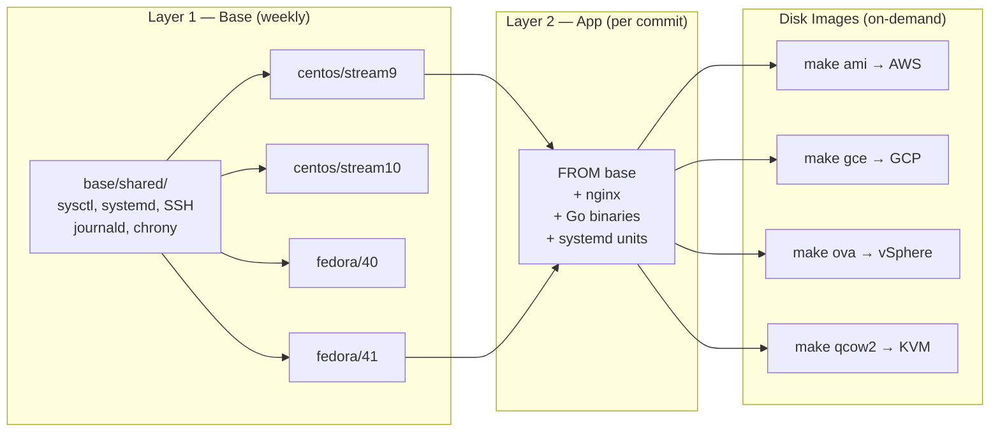
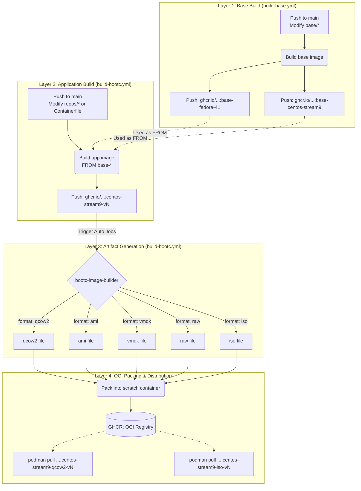

# bootc-testboot

Production-ready **bootc Image-Based OS** — using OCI container images to build, deploy, and update bootable operating systems on AWS, GCP, and VMware.

## Architecture

**2-Layer image design:**



### Supported Base Distros

| Distro | Image | Lifecycle |
|--------|-------|-----------|
| CentOS Stream 9 | `centos-bootc:stream9` | ~2027 |
| CentOS Stream 10 | `centos-bootc:stream10` | ~2030 |
| Fedora 40 | `fedora-bootc:40` | ~2025 |
| Fedora 41 | `fedora-bootc:41` | ~2026 |

> Ubuntu bootc is not production-ready. See [docs/014](docs/014-ubuntu-bootc-status.md).

## Quick Start

```bash
# 1. Build base image (choose distro)
make base BASE_DISTRO=centos-stream9

# 2. Run tests
make test

# 3. Build application image (on chosen base)
make build BASE_DISTRO=centos-stream9

# 4. Create disk images
make ami      # AWS AMI
make gce      # Google Compute Engine
make ova      # VMware OVA
make qcow2    # KVM/libvirt
```

## Project Structure

```
base/
  shared/                  Production tuning (sysctl, systemd, SSH, journald, chrony)
  fedora/40/Containerfile  Base image: Fedora 40
  fedora/41/Containerfile  Base image: Fedora 41
  centos/stream9/          Base image: CentOS Stream 9
  centos/stream10/         Base image: CentOS Stream 10
repos/
  hello/                   Go app: HTTP server + systemd unit
    main.go, go.mod, main_test.go
systemd/
  hello.service            Systemd unit files (all apps)
configs/
  builder/config.toml      bootc-image-builder (user, partition, kernel)
  builder/bootc-poc.ovf    OVF descriptor template for OVA packaging
  os/nginx.conf            Reverse proxy config
  tmpfiles.d/              App writable directory definitions
scripts/
  create-image.sh          Unified disk image builder (ami|gce|vmdk|qcow2|raw|vhd)
  create-ova.sh            VMDK + OVF → OVA packaging
Containerfile              Layer 2: application image
Makefile                   All operations
```

## Adding a New App

1. Create `repos/myapp/` with `main.go`, `go.mod`
2. Add unit file: `systemd/myapp.service`
3. Add tmpfiles if needed: `configs/tmpfiles.d/myapp.conf`
4. Add `COPY` + `enable` in `Containerfile`:
   ```dockerfile
   RUN systemctl enable myapp
   ```
5. Add upstream + location in `configs/os/nginx.conf`
6. `make build` — auto-discovers `repos/*/` and builds all binaries

## CI Architecture (Distribution Model)

The CI/CD pipeline is designed around a **4-Layer Artifact Distribution Registry**:



> For deploying these generated distribution images manually to AWS, GCP, or VMware, refer to [Manual Deployments Guide](docs/015-manual-deployments.md).

## Base Image Tuning

All base images include production hardening:

| Config | What |
|--------|------|
| `sysctl-tuning.conf` | `somaxconn=65535`, `file-max=2M`, `tcp_tw_reuse=1` |
| `systemd-limits.conf` | `DefaultLimitNOFILE=65535`, `DefaultTasksMax=65535` |
| `journald.conf` | Persistent, compressed, `500M` max, `30d` retention |
| `sshd-hardening.conf` | No root, no password, `MaxAuthTries 3` |
| `chrony-custom.conf` | NTP sync, `makestep 1.0 3` for cloud VMs |

## Key Concepts

- `/usr` is **read-only** at runtime — changes via Containerfile rebuild only
- `/etc` is **mutable** with 3-way merge on upgrade
- `/var` is **persistent** — app data survives OS rollback
- `bootc upgrade` pulls new image, `bootc rollback` swaps back (~2 min)

## Learning Docs

| Doc | Topic |
|-----|-------|
| [000](docs/000-architecture-overview.md) | Architecture Overview |
| [001](docs/001-what-is-bootc.md) | What is bootc? |
| [002](docs/002-architecture-and-ostree.md) | Architecture & OSTree |
| [003](docs/003-filesystem-layout.md) | Filesystem Layout |
| [004](docs/004-building-bootc-images.md) | Building bootc Images |
| [005](docs/005-users-groups-ssh.md) | Users, Groups & SSH |
| [006](docs/006-secrets-management.md) | Secrets Management |
| [007](docs/007-bootc-image-builder.md) | bootc-image-builder |
| [008](docs/008-upgrade-and-rollback.md) | Upgrade & Rollback |
| [009](docs/009-registries-and-offline.md) | Registries & Offline |
| [010](docs/010-relationships.md) | Related Projects |
| [011](docs/011-poc-walkthrough.md) | POC Walkthrough |
| [012](docs/012-runbook.md) | Operations Runbook |
| [013](docs/013-base-distro-comparison.md) | Base Distro Comparison |
| [014](docs/014-ubuntu-bootc-status.md) | Ubuntu bootc Status |
