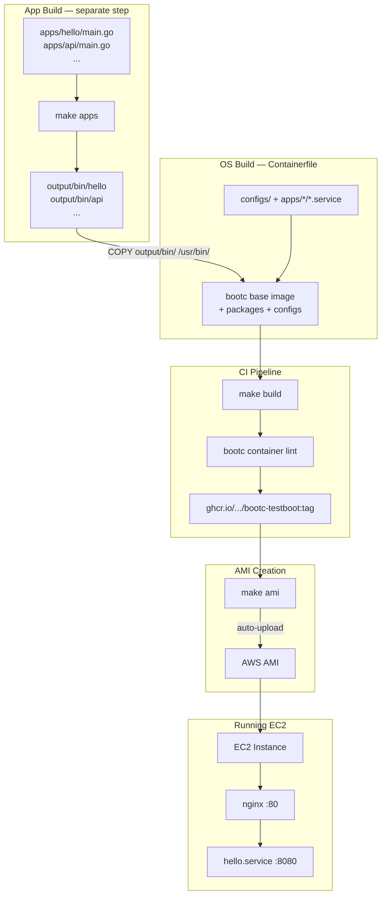

# bootc-testboot

POC for **bootc Image-Based OS** -- using OCI container images to build, deploy, and update bootable operating systems on AWS EC2.

## What is this?

Instead of baking AMIs with Packer (15-30 min per change), we use a single **Containerfile** to define the entire OS: kernel, packages, configs, and application binaries. The same container tooling (podman, GHCR, CI/CD) you already use for app images now manages the OS itself.

```
apps/ -> make apps -> output/bin/ -> Containerfile -> GHCR -> bootc-image-builder -> AMI -> EC2
                                                                                      |
                                                                 bootc upgrade  <------+--- bootc rollback
```

## Architecture



## Quick Start

```bash
# Run tests
make test

# Build apps to output/bin/, then build the bootc image
make build

# Create AMI (requires privileged EC2 builder + AWS credentials)
make ami

# After launching EC2 from the AMI:
make verify          # health checks
make os-status       # bootc status
```

Pushing to GHCR is handled automatically by GitHub Actions on merge to `main`. No local login/push needed.

## Project Structure

```
apps/
  hello/                 Go HTTP server + systemd unit (POC app)
    main.go              GET / -> JSON, GET /health -> ok
    main_test.go
    go.mod
    hello.service        DynamicUser=yes, StateDirectory=hello
    hello-tmpfiles.conf
output/                  (gitignored) build artifacts
  bin/                   pre-built Go binaries
configs/
  nginx.conf             Reverse proxy to app services
  sshd-hardening.conf    Drop-in: no root login, no password
  containers-auth.json   Registry credential helper config
scripts/
  create-ami.sh          bootc-image-builder wrapper
  upgrade-os.sh          Production-safe upgrade (download/apply/check)
  rollback-os.sh         Rollback + reboot
  verify-instance.sh     Post-boot health checks
Containerfile            Single-stage: COPY pre-built binaries + configs
Makefile                 All operations: apps, build, test, push, ami, ops
config.toml              bootc-image-builder customizations
```

## Adding a New App

1. Create `apps/myapp/` with `main.go`, `go.mod`, `myapp.service`
2. Add COPY + enable lines in the `Containerfile`:
   ```dockerfile
   COPY apps/myapp/myapp.service /usr/lib/systemd/system/myapp.service
   RUN systemctl enable myapp
   ```
3. Add upstream + location in `configs/nginx.conf`
4. `make build` -- the `apps` target auto-discovers `apps/*/` and builds all binaries to `output/bin/`

No need to modify the Makefile or Go build logic -- any directory under `apps/` with a `main.go` is automatically compiled.

## Learning Docs

Start with the architecture overview, then work through the numbered docs:

| Doc | Topic |
|-----|-------|
| [000](docs/000-architecture-overview.md) | Architecture Overview (diagrams) |
| [001](docs/001-what-is-bootc.md) | What is bootc? |
| [002](docs/002-architecture-and-ostree.md) | Architecture & OSTree |
| [003](docs/003-filesystem-layout.md) | Filesystem Layout (/usr, /etc, /var) |
| [004](docs/004-building-bootc-images.md) | Building bootc Images |
| [005](docs/005-users-groups-ssh.md) | Users, Groups & SSH Keys |
| [006](docs/006-secrets-management.md) | Secrets Management |
| [007](docs/007-bootc-image-builder.md) | bootc-image-builder (AMI creation) |
| [008](docs/008-upgrade-and-rollback.md) | Upgrade & Rollback |
| [009](docs/009-registries-and-offline.md) | Registries & Offline Updates |
| [010](docs/010-relationships.md) | Relationships with Other Projects |
| [011](docs/011-poc-walkthrough.md) | POC Walkthrough (step-by-step) |
| [012](docs/012-runbook.md) | Operations Runbook |

## Key Concepts

- `/usr` is **read-only** at runtime -- all changes via Containerfile rebuild
- `/etc` is **mutable** with 3-way merge on upgrade
- `/var` is **persistent** and **not rolled back** -- app data survives OS rollback
- `bootc upgrade --download-only` for safe pre-staging
- `bootc rollback` = swap bootloader pointer (~2 min)
- Never use `rpm-ostree install` on a bootc host

## References

- [bootc Introduction](https://bootc-dev.github.io/bootc/intro.html)
- [bootc Filesystem](https://bootc-dev.github.io/bootc/filesystem.html)
- [bootc Upgrades](https://bootc-dev.github.io/bootc/upgrades.html)
- [bootc Building Guidance](https://bootc-dev.github.io/bootc/building/guidance.html)
- [bootc-image-builder](https://github.com/osbuild/bootc-image-builder)
