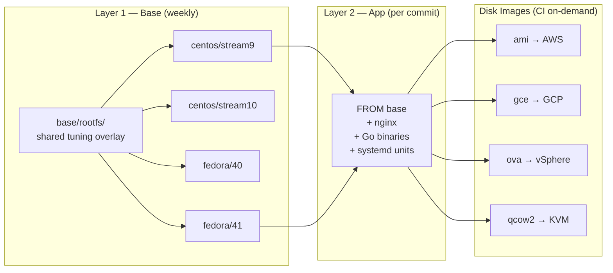
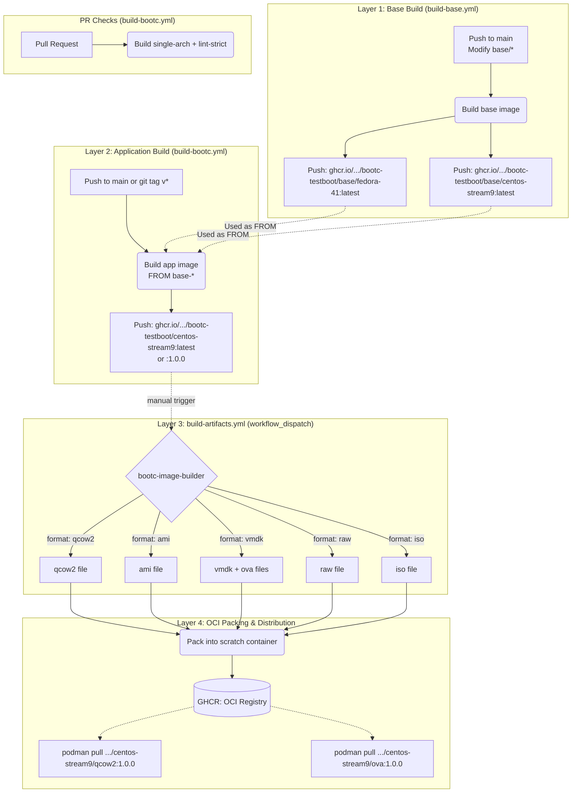

# bootc-testboot

Production-ready **bootc Image-Based OS** — using OCI container images to build, deploy, and update bootable operating systems on AWS, GCP, and VMware.

## Architecture

**2-Layer image design:**


```mermaid
flowchart LR
    subgraph layer1 ["Layer 1 — Base (weekly)"]
        BaseRootfs["base/rootfs/\nshared tuning overlay"]
        CentOS9["centos/stream9"]
        CentOS10["centos/stream10"]
        Fedora40["fedora/40"]
        Fedora41["fedora/41"]
        BaseRootfs --> CentOS9 & CentOS10 & Fedora40 & Fedora41
    end

    subgraph layer2 ["Layer 2 — App (per commit)"]
        AppBuild["FROM base\n+ nginx\n+ Go binaries\n+ systemd units"]
    end

    subgraph disk ["Disk Images (CI on-demand)"]
        AMI["ami → AWS"]
        GCE["gce → GCP"]
        OVA["ova → vSphere"]
        QCOW2["qcow2 → KVM"]
    end

    CentOS9 & Fedora41 --> AppBuild
    AppBuild --> AMI & GCE & OVA & QCOW2
```

### Supported Base Distros

| Distro | Image | Lifecycle |
|--------|-------|-----------|
| CentOS Stream 9 | `centos-bootc:stream9` | ~2027 |
| CentOS Stream 10 | `centos-bootc:stream10` | ~2030 |
| Fedora 40 | `fedora-bootc:40` | ~2025 |
| Fedora 41 | `fedora-bootc:41` | ~2026 |

> Ubuntu bootc is not production-ready. See [docs/010](docs/bootc/010-ubuntu-bootc-status.md).

## Quick Start (Local Development)

```bash
# 1. Build base image (choose distro)
make base BASE_DISTRO=centos-stream9

# 2. Run tests
make test

# 3. Build application image (on chosen base)
make build BASE_DISTRO=centos-stream9

# 4. Lint the image
make lint
```

> Disk images (AMI, VMDK, OVA, QCOW2, ISO) are built exclusively in CI via
> `workflow_dispatch` on [`build-artifacts.yml`](.github/workflows/build-artifacts.yml). The default **base distro** is **all** (all four distros); override to a single distro when needed. See [CI Architecture](#ci-architecture-distribution-model) below.

## Project Structure

```
base/
  rootfs/                  Shared rootfs overlay (COPY in all base Containerfiles)
  fedora/40/Containerfile  Base image: Fedora 40
  fedora/41/Containerfile  Base image: Fedora 41
  centos/stream9/          Base image: CentOS Stream 9
  centos/stream10/         Base image: CentOS Stream 10
bootc/
  apps/
    hello/                 In-house app OS Configuration Module
      rootfs/
        usr/lib/systemd/system/hello.service
        usr/lib/tmpfiles.d/hello.conf
  services/
    nginx/                 Third-party service OS Configuration Module
      rootfs/
        etc/nginx/nginx.conf
builder/                   Artifact build configs (per format)
  qcow2/config.toml       QCOW2 builder customizations
  vmdk/config.toml         VMDK builder customizations
  ova/bootc-testboot.ovf   OVF template for OVA packaging (EFI)
repos/
  hello/                   Mock App Source Repository (Go code)
    main.go, go.mod, main_test.go
Containerfile              Layer 2: application image
scripts/verify-ghcr-packages.sh  Post-publish GHCR check (also: make verify-ghcr)
Makefile                   Run `make help` — base, build, audit, verify-ghcr, test-smoke, lint-strict, …
```

## Adding a New App

1. Create `repos/myapp/` with `main.go`, `go.mod`
2. Create systemd unit: `bootc/apps/myapp/rootfs/usr/lib/systemd/system/myapp.service` (must include `WantedBy=multi-user.target`)
3. Add tmpfiles if needed: `bootc/apps/myapp/rootfs/usr/lib/tmpfiles.d/myapp.conf`
4. If web-facing, add nginx vhost: `bootc/apps/myapp/rootfs/usr/share/nginx/conf.d/myapp.conf` (immutable)
5. `make build` -- auto-discovers all `repos/*/` and `bootc/apps/*/`, auto-enables all services
6. `make test-smoke` -- verify everything is in place before deploying

## CI Architecture (Distribution Model)

The CI/CD pipeline is designed around a **4-Layer Artifact Distribution Registry**:


```mermaid
graph TD
    subgraph L1["Layer 1: Base Build (build-base.yml)"]
        A[Push to main<br>Modify base/*] --> B(Build base image)
        B --> C[Push: ghcr.io/.../bootc-testboot/base/fedora-41:latest]
        B --> D[Push: ghcr.io/.../bootc-testboot/base/centos-stream9:latest]
    end

    subgraph L2["Layer 2: Application Build (build-bootc.yml)"]
        E[Push to main or git tag v*] --> F(Build app image<br>FROM base-*)
        F --> G["Push: ghcr.io/.../bootc-testboot/centos-stream9:latest\nor :1.0.0"]
    end

    subgraph PR["PR Checks (build-bootc.yml)"]
        PR1[Pull Request] --> PR2(Build single-arch + lint-strict)
    end

    subgraph L3["Layer 3: build-artifacts.yml (workflow_dispatch)"]
        G -. manual trigger .-> H{bootc-image-builder}
        H -->|format: qcow2| I[qcow2 file]
        H -->|format: ami| J[ami file]
        H -->|format: vmdk| K[vmdk + ova files]
        H -->|format: raw| L[raw file]
        H -->|format: iso| M[iso file]
    end

    subgraph L4["Layer 4: OCI Packing & Distribution"]
        I --> N(Pack into scratch container)
        J --> N
        K --> N
        L --> N
        M --> N
        N --> O[(GHCR: OCI Registry)]

        O -.-> P["podman pull .../centos-stream9/qcow2:1.0.0"]
        O -.-> Q["podman pull .../centos-stream9/ova:1.0.0"]
    end

    C -.->|Used as FROM| F
    D -.->|Used as FROM| F
```

> **Note:** Disk image artifacts are **not** built on every push. Use `workflow_dispatch`
> on [`build-artifacts.yml`](.github/workflows/build-artifacts.yml) with the `formats` input to trigger artifact generation on-demand (defaults to building **all** distros unless you select one).

### Auditing Created Artifact Images
Because artifact distribution images are packaged using `scratch` (meaning they do not contain a shell or OS utilities like `ls`), you cannot use `podman run` to inspect them directly. Instead, you can audit the contents of an artifact image by creating a dummy container and exporting its filesystem hierarchy using `tar`.

```bash
IMAGE="ghcr.io/duyhenryer/bootc-testboot/centos-stream9/vmdk:latest"

# 1. Create a container with a dummy /bin/true entrypoint to bypass the scratch image's lack of one
ctr=$(podman create $IMAGE /bin/true)

# 2. Export the container's entire filesystem as a tar stream and list (-t) the files verbosely (-v)
echo "=== File Inventory of the OCI Artifact ==="
podman export $ctr | tar -tv

# 3. Clean up the dummy container
podman rm $ctr
```

For scripted verification of **all** published tags (skopeo + optional full `podman pull`), run `./scripts/verify-ghcr-packages.sh` or `make verify-ghcr` — see [docs/project/008-ghcr-audit.md](docs/project/008-ghcr-audit.md). Public GHCR images need no login; large pulls need tens of GB free disk — use `VERIFY_SKIP_PULL=1` for metadata-only.

## Versioning & Tagging

Tags are driven by **git tags** (semver). Push to `main` produces `latest`. Creating a git tag triggers a versioned release.

| Event | Git Ref | Image tags (path-style on GHCR) |
|-------|---------|------------|
| Push to `main` | `refs/heads/main` | `ghcr.io/…/bootc-testboot/<distro>:latest`, `…/base/<distro>:latest` |
| Git tag `v1.0.0` | `refs/tags/v1.0.0` | `…/bootc-testboot/<distro>:1.0.0` (+ `latest` where workflow pushes both) |
| Git tag `base-v1.0.0` | `refs/tags/base-v1.0.0` | `…/bootc-testboot/base/<distro>:1.0.0` (base image) |
| Pull request | `refs/pull/N` | Build + lint only (no push) |

**Release workflow:**

```bash
# Development: push to main -> auto-build -> latest tag
git push origin main

# Release: create a semver tag -> auto-build -> versioned tag
git tag v1.0.0
git push --tags
```

**Traceability:** Every app image has OCI labels recording which base image version and git commit it was built from. Inspect with `podman inspect <image> | jq '.[0].Config.Labels'`.

## Base Image Tuning

All base images include production hardening:

| Config | What |
|--------|------|
| `sysctl-tuning.conf` | `somaxconn=65535`, `file-max=2M`, `tcp_tw_reuse=1` |
| `systemd-limits.conf` | `DefaultLimitNOFILE=65535`, `DefaultTasksMax=65535` |
| `journald.conf` | Persistent, compressed, `500M` max, `30d` retention |
| `sshd-hardening.conf` | No root, no password, `MaxAuthTries 3` |
| `chrony-custom.conf` | NTP sync, `makestep 1.0 3` for cloud VMs |

## Key Concepts

- `/usr` is **read-only** at runtime — changes via Containerfile rebuild only
- `/etc` is **mutable** with 3-way merge on upgrade
- `/var` is **persistent** — app data survives OS rollback
- `bootc upgrade` pulls new image, `bootc rollback` swaps back (~2 min)

## Documentation

### Learn bootc (`docs/bootc/`)

Read these first to understand how bootc works.

| Doc | Topic |
|-----|-------|
| [001](docs/bootc/001-what-is-bootc.md) | What is bootc? |
| [002](docs/bootc/002-architecture-and-ostree.md) | Architecture & OSTree |
| [003](docs/bootc/003-filesystem-layout.md) | Filesystem Layout (MUST READ) |
| [004](docs/bootc/004-users-groups-ssh.md) | Users, Groups & SSH |
| [005](docs/bootc/005-secrets-management.md) | Secrets Management |
| [006](docs/bootc/006-upgrade-and-rollback.md) | Upgrade & Rollback |
| [007](docs/bootc/007-registries-and-offline.md) | Registries & Offline |
| [008](docs/bootc/008-relationships.md) | Related Projects |
| [009](docs/bootc/009-base-distro-comparison.md) | Base Distro Comparison |
| [010](docs/bootc/010-ubuntu-bootc-status.md) | Ubuntu bootc Status |
| [011](docs/bootc/011-bootc-vision.md) | bootc Vision |
| [012](docs/bootc/012-bootc-limitations.md) | bootc Limitations |

### Our Project (`docs/project/`)

How we use bootc to build, test, and deliver our product.

| Doc | Topic |
|-----|-------|
| [001](docs/project/001-architecture-overview.md) | Architecture Overview |
| [002](docs/project/002-building-bootc-images.md) | Building Our Images |
| [003](docs/project/003-walkthrough-and-runbook.md) | Walkthrough and operations runbook (E2E + day-2 ops) |
| [004](docs/project/004-manual-build-and-deployment.md) | Manual build and VM deployment (includes bootc-image-builder reference) |
| [005](docs/project/005-production-upgrade-scenarios.md) | Production Upgrade Scenarios |
| [006](docs/project/006-testing-guide-and-registry.md) | Local testing and test case registry (incl. post-deploy audit / troubleshooting) |
| [007](docs/project/007-rootfs-overlay-guide.md) | Rootfs Overlay Guide (build-time to runtime mapping) |
| [008](docs/project/008-ghcr-audit.md) | GHCR audit (`verify-ghcr-packages.sh`, skopeo, podman) |
