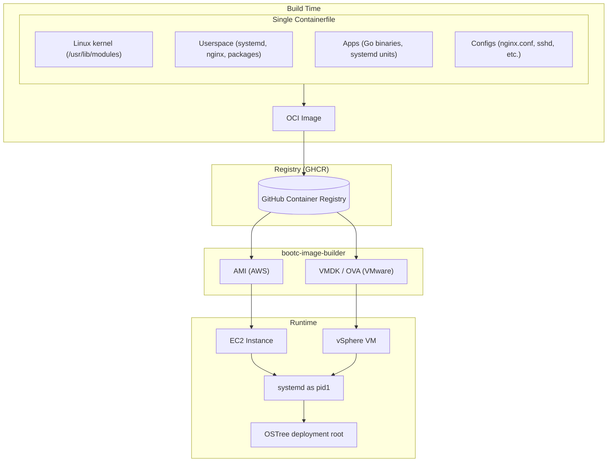
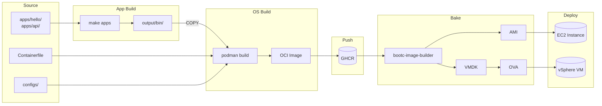
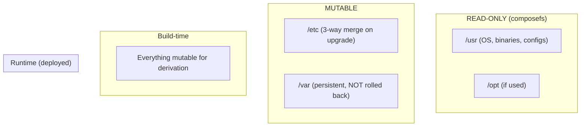
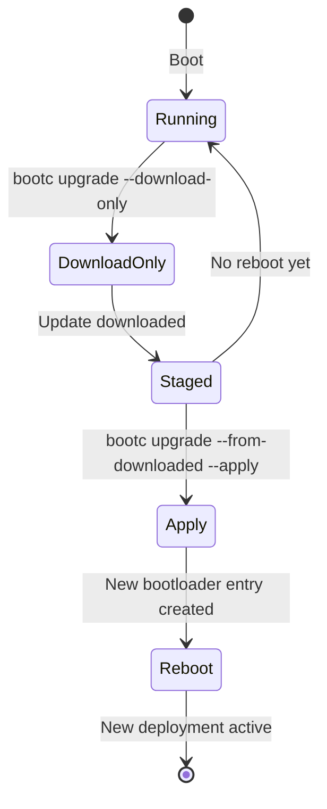
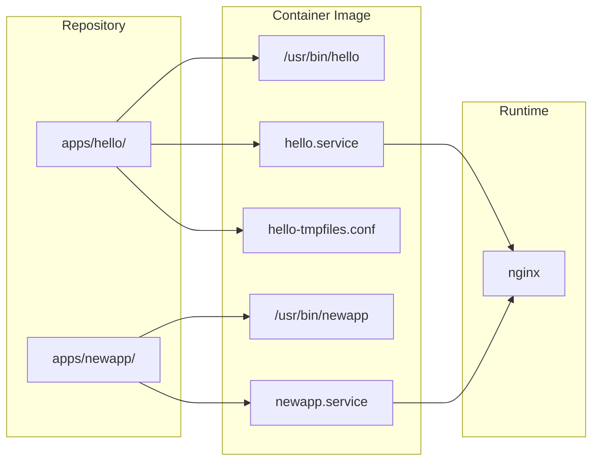
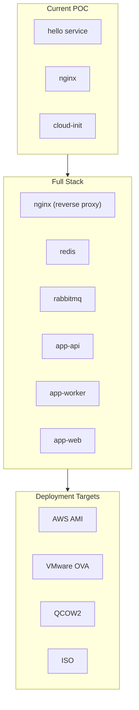

# Architecture Overview

A high-level visual guide to how bootc (bootable containers) fits into the stack and how a single Containerfile drives kernel, userspace, apps, and configs through to deployed EC2 instances.

---

## System Architecture

bootc delivers a **single-source-of-truth** model: one Containerfile produces the entire OS image—kernel, userspace, applications, and configuration—deployed natively to physical or virtual machines.



### Layers from One Containerfile

| Layer | Contents | Source in Image |
|-------|----------|-----------------|
| **Kernel** | Linux kernel + modules | `/usr/lib/modules` (from base image) |
| **Userspace** | systemd, coreutils, packages | `RUN dnf install ...` |
| **Apps** | Binaries + systemd units | `COPY apps/*/` → `/usr/bin`, `/usr/lib/systemd/system` |
| **Configs** | nginx, sshd, etc. | `/usr/share/` or `/etc/` (with drop-ins) |

---

## Build Pipeline



### Decoupled Build

```
make apps                          make build
    │                                  │
    ├─ apps/hello/ → output/bin/hello  ├─ Containerfile (single FROM fedora-bootc:41)
    ├─ apps/api/   → output/bin/api    │    ├─ RUN dnf install nginx cloud-init ...
    └─ ...                             │    ├─ COPY output/bin/ /usr/bin/
                                       │    ├─ COPY apps/hello/hello.service ...
                                       │    ├─ COPY configs/nginx.conf ...
                                       │    └─ RUN bootc container lint
                                       │
                                       └─ podman push → ghcr.io/…
                                              │
                                              ├─ bootc-image-builder --type ami  → AMI → EC2
                                              └─ bootc-image-builder --type vmdk → VMDK → OVA → vSphere
```

---

## Filesystem Model



| Path | Build-time | Runtime | Behavior |
|------|------------|---------|----------|
| `/usr` | Mutable | **Read-only** | OS content, binaries, drop-in configs |
| `/etc` | Mutable | **Mutable** | 3-way merge on upgrade; use drop-ins |
| `/var` | Mutable | **Mutable, persistent** | Data survives upgrade and rollback |

---

## Upgrade Lifecycle



### Phased Upgrade (Production-Safe)

| Phase | Command | When |
|-------|---------|------|
| **1. Download** | `bootc upgrade --download-only` | Business hours; no downtime |
| **2. Apply** | `bootc upgrade --from-downloaded --apply` | Maintenance window; triggers reboot |

### A/B Deployment with OSTree

```
/sysroot/ostree/deploy/default/
├── deploy/abc123.../     ← Current (booted)
└── deploy/def456.../     ← Staged (new)
```

On reboot, the bootloader atomically switches to the staged deployment. Rollback = boot the previous deployment.

---

## App Deployment Model



### Adding a New App

1. Create `apps/newapp/` with `main.go`, `go.mod`, `newapp.service`, `newapp-tmpfiles.conf`
2. Add COPY + enable lines in Containerfile (binary auto-built by `make apps`)
3. Add `RUN systemctl enable newapp`
4. `make build` (auto-discovers all `apps/*/` dirs)

All apps share the same OS image; scaling = more `apps/` dirs + COPY lines.

---

## Production Vision



### Scaling the POC

| Component | How |
|-----------|-----|
| **nginx** | Already present; add more vhosts/config |
| **redis** | `RUN dnf install redis` + `redis.service` |
| **rabbitmq** | `RUN dnf install rabbitmq-server` + systemd unit |
| **Many apps** | `apps/api/`, `apps/worker/`, `apps/web/`; same Containerfile pattern |

### Deployment Targets

| Target | Command | Use Case |
|--------|---------|----------|
| **AWS AMI** | `make ami` | Cloud deployment on EC2 |
| **VMware OVA** | `make ova` | On-premise customer delivery via vSphere |
| **VMDK** | `make vmdk` | Direct VMware disk image |

Same pattern everywhere: **Containerfile + systemd units + tmpfiles.d** for `/var` dirs. One image, one source of truth, atomic upgrades. Same OCI image produces AMI, OVA, or any other format via bootc-image-builder.

---

## References

- [bootc: Introduction](https://bootc-dev.github.io/bootc/intro.html)
- [bootc: Relationship with other projects](https://bootc-dev.github.io/bootc/relationships.html)
- [bootc: Filesystem](https://bootc-dev.github.io/bootc/filesystem.html)
- [bootable containers mission](https://containers.github.io/bootable/)
