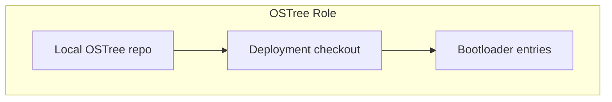
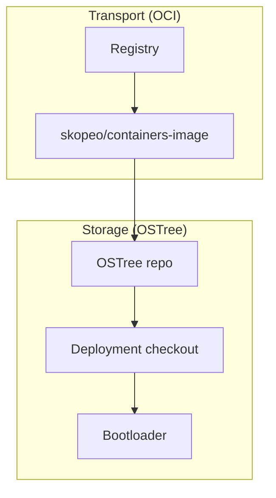

# Architecture & How OSTree Works

> *Sources: [bootc Introduction](https://bootc-dev.github.io/bootc/intro.html), [Relationship with other projects](https://bootc-dev.github.io/bootc/relationships.html)*

bootc uses OCI images for transport and OSTree for local storage and bootloader integration. Understanding both is essential for operations and debugging.

---

## High-Level Flow


| Stage | Component | Role |
|-------|-----------|------|
| 1 | Containerfile | Build-time source; multi-stage OK |
| 2 | OCI image | Transport format (same as Docker/podman) |
| 3 | Registry | GHCR, ECR, quay.io, etc. |
| 4 | bootc-image-builder | Converts image → disk image (AMI, etc.) |
| 5 | Disk image | Deployed to physical/VM |
| 6 | Deployed system | Boots natively via OSTree |

---

## OSTree: Git-like Repo for OS Data

OSTree provides:

1. **A transport layer** for pulling content over HTTP
2. **A bootloader integration layer** (GRUB/shim)
3. **A git-like repo** for OS data from which you can check out an entire rootfs



### bootc vs OSTree Transport

| | OSTree-native | bootc |
|---|---------------|-------|
| **Transport** | OSTree HTTP | OCI (skopeo/containers-image) |
| **Format** | OSTree commits | OCI image layers |
| **After fetch** | N/A | Imported into local OSTree repo |
| **Deployment** | OSTree checkout | Same OSTree deployment model |

> *"With bootc, the OSTree transport layer is not used. Instead, content is pulled as OCI containers using skopeo... However, this content is then imported into the local OSTree repo to perform a deployment checkout."*  
> — [bootc relationships](https://bootc-dev.github.io/bootc/relationships.html)

---

## A/B Deployment Model

OSTree manages two deployments (bootloader entries):

```
/sysroot/ostree/deploy/default/
├── deploy/<commit-a>/   ← Current (booted)
└── deploy/<commit-b>/   ← Staged (after bootc upgrade --download-only)
```

On `bootc upgrade --from-downloaded --apply`:

1. New deployment is finalized
2. Bootloader entry is created for new deployment
3. Next reboot = boot into new deployment
4. **Atomic swap**—no partial state

---

## composefs: Read-Only Root Integrity

bootc recommends the [composefs backend](https://ostreedev.github.io/ostree/composefs/). With composefs enabled:

- The entire `/` is a **read-only filesystem**
- Critical for correct semantics and integrity

Enable via `/usr/lib/ostree/prepare-root.conf`:

```ini
[composefs]
enabled = true
```

*(Requires initramfs regeneration when changing this file.)*

---

## Image Pull: skopeo / containers-image

bootc uses **skopeo** and **containers/image** (same library family as podman) to fetch container images. Implications:

- Honors `/etc/containers/containers-registries.conf`
- Honors `/etc/containers/auth.json` for registry auth
- Mirrors and custom registries work the same as with podman

---

## The "Chroot" Concept: Deployment Root

When the system is fully booted, it runs in the equivalent of a **chroot**. The "physical" host root filesystem is mounted at **`/sysroot`**.

| Path | Meaning |
|------|---------|
| `/sysroot` | Physical root; OSTree repo, deploy dirs |
| `/` | Logical root = deployment checkout (e.g. `/sysroot/ostree/deploy/default/deploy/<commit>/`) |

The target deployment is determined by the `ostree=` kernel command-line argument.

```
Physical layout (simplified):

/sysroot/
├── ostree/
│   ├── repo/           # Git-like content store
│   └── deploy/default/
│       ├── var         # Shared /var (bind mount)
│       └── deploy/<commit>/  ← / is a bind to here
└── ...
```

---

## Summary: bootc Uses OSTree for Storage, OCI for Transport



> *"bootc is intending to be a fresh, new container-native interface, and ostree is an implementation detail."*  
> — [bootc filesystem docs](https://bootc-dev.github.io/bootc/filesystem.html)

---

## References

- [bootc: Introduction](https://bootc-dev.github.io/bootc/intro.html)
- [bootc: Relationship with other projects](https://bootc-dev.github.io/bootc/relationships.html)
- [bootc: Filesystem](https://bootc-dev.github.io/bootc/filesystem.html)
- [bootc: Filesystem: sysroot](https://bootc-dev.github.io/bootc/filesystem-sysroot.html)
- [OSTree composefs](https://ostreedev.github.io/ostree/composefs/)
- [OSTree atomic upgrades](https://ostreedev.github.io/ostree/atomic-upgrades/)
