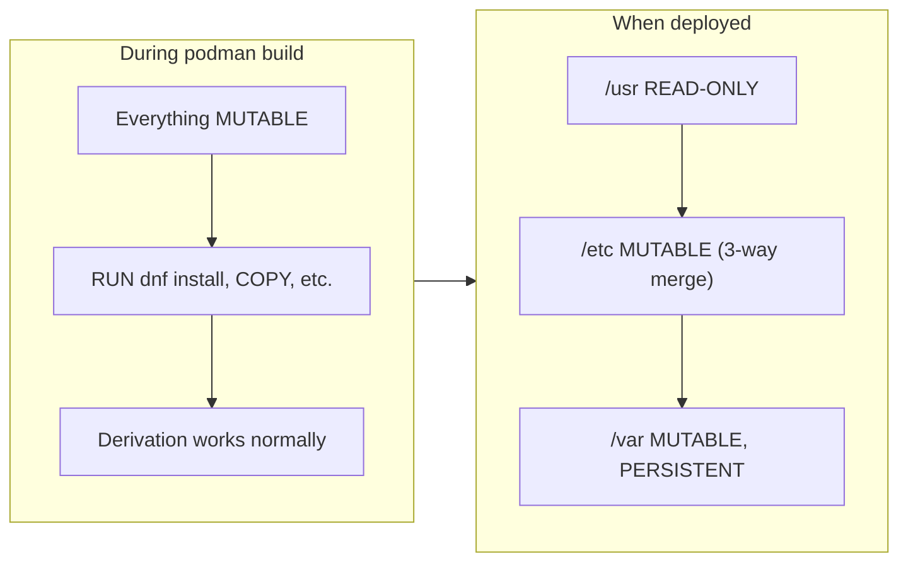
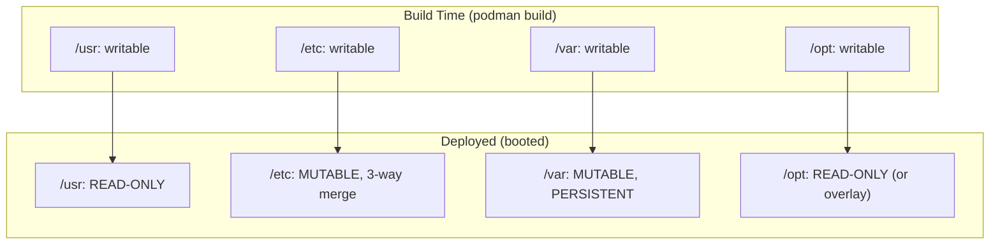

# Filesystem Layout (MUST UNDERSTAND)

> *Source: [bootc Filesystem](https://bootc-dev.github.io/bootc/filesystem.html)*

This is the most critical document for bootc operations. Misunderstanding the filesystem model leads to failed builds, broken upgrades, and data loss.

---

## Build-Time vs Runtime



| Phase | State | Notes |
|-------|-------|-------|
| **Build (container)** | Fully mutable | Same as any Docker/podman build |
| **Deployed (booted)** | `/usr` read-only, `/etc` and `/var` mutable | composefs makes root immutable |

---

## ASCII: Filesystem Layout at Runtime

```
                    ┌─────────────────────────────────────────────────────────┐
                    │                    DEPLOYMENT ROOT (/)                  │
                    └─────────────────────────────────────────────────────────┘
                                             │
        ┌────────────────────────────────────┼────────────────────────────────────┐
        │                                    │                                    │
        ▼                                    ▼                                    ▼
┌───────────────┐                  ┌───────────────┐                  ┌───────────────┐
│  /usr         │                  │  /etc         │                  │  /var         │
│  READ-ONLY    │                  │  MUTABLE      │                  │  MUTABLE     │
│  (composefs)  │                  │  3-way merge  │                  │  PERSISTENT  │
│               │                  │  on upgrade   │                  │  NOT rolled  │
│ /bin→/usr/bin │                  │              │                  │  back        │
│ /lib→/usr/lib │                  │ Use drop-ins │                  │              │
└───────────────┘                  └───────────────┘                  └───────────────┘
        │                                    │                                    │
        │                                    │                                    │
  Lifecycled with                     Retained across                    Like Docker
  container image                     upgrades (merge)                   VOLUME
```

---

## Fixed Directory Layout (FHS) & Core Symlinks

`bootc/ostree` enforces a strict directory layout to resolve the conflict between the standard Linux Filesystem Hierarchy Standard (FHS) and the need for an immutable OS core. 

### The Persistence Dilemma

bootc divides the root filesystem into two primary zones:
1. `/usr` — **Immutable**, read-only, managed entirely by ostree container images.
2. `/var` — **Mutable**, persistent, never touched by ostree during upgrades.

**The Problem:** According to FHS, directories like `/home` or `/mnt` sit at the root (`/`). However, user data must persist across OS updates. If `/home` were managed normally, OS upgrades would either wipe it or conflict with immutability.

**The Solution:** ostree moves the actual data into the persistent `/var` partition and places **symlinks** at the root level pointing to `/var`. 

### Directory States & Symlinks Table

You **must not** attempt to break these symlinks or change the root layout.

| Path | Type | State / Target | Reason / Notes |
|------|------|----------------|----------------|
| `/usr` | Dir | Read-only (immutable) | Managed solely by `ostree`. Contains binaries. |
| `/etc` | Dir | Writable | 3-way merged on upgrade. |
| `/var` | Dir | Writable | Persistent across updates. Data survives here. |
| `/sysroot` | Dir | `ostree` internal | **Do not touch**. Underlying physical state. |
| `/boot` | Dir | Managed | Handled by the bootloader. |
| `/home` | Symlink | `→ /var/home` | User data must persist. |
| `/root` | Symlink | `→ /var/roothome` | Root home directory must persist. |
| `/mnt` | Symlink | `→ /var/mnt` | Temporary mount points. |
| `/srv` | Symlink | `→ /var/srv` | Service data. |
| `/opt` | Dir/Symlink | `→ /var/opt` (varies) | Often read-only unless specifically symlinked to `/var`. |

### Upgrade Behavior

When `bootc upgrade` applies a new OS image:
1. `/usr` is **completely replaced** by the new image's payload.
2. `/etc` undergoes a **3-way merge** (base vs local changes vs new base).
3. `/var` is **left completely alone** → `/var/home` and `/var/roothome` are safe.

---

## /usr: READ-ONLY When Deployed

### Contents

- All OS content: binaries, libraries, kernel modules
- `/bin` → `/usr/bin`, `/lib` → `/usr/lib` (UsrMove symlinks)
- Prefer putting configs here for **immutability**

### /usr/local

Default: **regular directory** (part of image). Base images typically keep it this way so derived images can add content.

> *"Projects that want to produce 'final' images that are themselves not intended to be derived from can enable [the symlink to /var/usrlocal] in derived builds."* — [bootc filesystem](https://bootc-dev.github.io/bootc/filesystem.html)

### /usr/etc — DO NOT USE

`/usr/etc` is an **internal implementation detail**. It holds the default `/etc` from the image. **Do not put files here manually**; undefined behavior. `bootc container lint` checks for this.

### Practical: Put Config in /usr

```dockerfile
# Good: config in /usr (immutable)
COPY configs/nginx.conf /usr/share/nginx/nginx.conf
RUN ln -sf /usr/share/nginx/nginx.conf /etc/nginx/nginx.conf
```

---

## /etc: MUTABLE, Persistent, 3-Way Merge

### Default Behavior

- `/etc` **persists** across reboots
- On upgrade: **3-way merge**:
  1. New default `/etc` from image as base
  2. Local modifications are retained
  3. Diff from previous `/etc` applied to new base

### Viewing Local Changes

```bash
ostree admin config-diff
```

Metadata (uid, gid, xattrs) counts as "modified"—changing any of these blocks image updates for that file.

### Best Practice: Drop-In Directories

Avoid editing main config files. Use drop-ins instead:

```dockerfile
# Good: drop-in, less drift
COPY configs/sshd-hardening.conf /etc/ssh/sshd_config.d/99-hardening.conf

# Risky: editing main file; 3-way merge can conflict
# COPY configs/sshd_config /etc/ssh/sshd_config
```

### Option: Transient /etc

For stateless systems, set in `/usr/lib/ostree/prepare-root.conf`:

```ini
[etc]
transient = true
```

Then `/etc` is regenerated from image each boot. Machine-specific state may need kernel command line or other mechanisms.

---

## /var: MUTABLE, PERSISTENT, NOT ROLLED BACK

### Critical: Acts Like Docker VOLUME

Content in `/var` in the container image behaves like `VOLUME /var`:

- Unpacked **only on first install**
- **Subsequent changes** to `/var` in new image versions are **NOT applied**
- DB data, logs, caches **survive** upgrades **and** rollbacks

```
Image v1: /var/lib/postgresql/ (initial unpack)
Image v2: /var/lib/postgresql/ (changed structure)
         └── On upgrade: v2 structure NOT applied; v1 content kept
```

### Use tmpfiles.d or StateDirectory=

Pre-create directories needed by services:

```dockerfile
# tmpfiles.d (bootc container lint warns if missing for /var dirs)
COPY apps/hello/hello-tmpfiles.conf /usr/lib/tmpfiles.d/hello.conf
```

```conf
# hello-tmpfiles.conf
d /var/lib/hello/uploads 0750 - - -
```

**Better:** use systemd `StateDirectory=` and `LogsDirectory=`:

```ini
[Service]
StateDirectory=hello
LogsDirectory=hello
ExecStart=/usr/bin/hello
```

This creates `/var/lib/hello` and `/var/log/hello` automatically—no tmpfiles.d needed for those.

### As of bootc 1.1.6

`bootc container lint` warns about missing tmpfiles.d entries for `/var` directories.

---

## /opt: READ-ONLY (Problem Area)

With composefs, `/opt` is **read-only** like `/usr`. Some third-party software (deb/rpm) expects to write under `/opt/examplepkg`.

### Decision Matrix for /opt

| Need | Solution | Trade-off |
|------|----------|-----------|
| App writes to `/opt/examplepkg` | Symlink subdirs to `/var` | Max immutability |
| | `BindPaths=` in systemd unit | Minimal change |
| | `ostree-state-overlay@opt.service` | Writable overlay, some drift |
| | `root.transient=true` | Entire root writable until reboot |

### Solution 1: Symlink to /var (Recommended)

```dockerfile
RUN dnf install -y examplepkg && \
    mv /opt/examplepkg/logs /var/log/examplepkg && \
    ln -sr /var/log/examplepkg /opt/examplepkg/logs
```

### Solution 2: BindPaths in systemd

```ini
[Service]
BindPaths=/var/log/exampleapp:/opt/exampleapp/logs
```

### Solution 3: State Overlay

```dockerfile
RUN systemctl enable ostree-state-overlay@opt.service
```

- Writable overlay on `/opt`
- New image files override local on update
- Persists across reboots
- Some temporary drift until next update

### Solution 4: Transient Root

```ini
# /usr/lib/ostree/prepare-root.conf
[root]
transient = true
```

- Entire root writable (until reboot)
- Combine with symlinks to `/var` for persistence
- Larger mutability surface

---

## Transient Root

Set in `/usr/lib/ostree/prepare-root.conf`:

```ini
[root]
transient = true
```

- Entire root filesystem writable **until next reboot**
- Use symlinks to `/var` for content that must persist
- Requires initramfs regeneration

---

## State Overlays: ostree-state-overlay@.service

Template unit for persistent writable overlay on normally read-only paths:

```dockerfile
RUN systemctl enable ostree-state-overlay@opt.service
```

Semantics:

- During updates: new image files override local versions
- Changes persist across reboots
- Smaller surface than transient root

---

## Mermaid: Build vs Deployed State



---

## Practical Containerfile Examples

### Example 1: App with /var State

```dockerfile
# Pre-built binary in /usr (read-only when deployed)
COPY output/bin/ /usr/bin/

# systemd unit with StateDirectory (auto-creates /var/lib/hello)
COPY apps/hello/hello.service /usr/lib/systemd/system/hello.service

# Optional: extra /var dirs via tmpfiles.d
COPY apps/hello/hello-tmpfiles.conf /usr/lib/tmpfiles.d/hello.conf

RUN systemctl enable hello
```

### Example 2: Config in /usr, Symlink in /etc

```dockerfile
# Immutable config in /usr
COPY configs/nginx.conf /usr/share/nginx/nginx.conf
RUN ln -sf /usr/share/nginx/nginx.conf /etc/nginx/nginx.conf
```

### Example 3: Drop-In for /etc

```dockerfile
# Avoid editing main config; use drop-in
COPY configs/sshd-hardening.conf /etc/ssh/sshd_config.d/99-hardening.conf
```

### Example 4: /opt Package Needing Writable Dir

```dockerfile
RUN dnf install -y examplepkg && \
    mv /opt/examplepkg/logs /var/log/examplepkg && \
    ln -sr /var/log/examplepkg /opt/examplepkg/logs
```

---

## What NOT to Ship

- `/run`, `/proc` — API filesystems; not for image content
- Manual files in `/usr/etc` — internal use only

---

## composefs Integrity

Ensure `/usr/lib/ostree/prepare-root.conf` contains:

```ini
[composefs]
enabled = true
```

Makes `/` read-only for correct semantics.

Optional: `enabled = verity` for fsverity integrity (see [bootc filesystem](https://bootc-dev.github.io/bootc/filesystem.html) for caveats).

---

## Quick Summary

### Lifecycle Table

| Zone | During Build | At Runtime | On Upgrade | On Rollback |
|------|-------------|-----------|------------|-------------|
| `/usr` | Fully writable | **Read-only** (composefs) | Replaced entirely by new image | Swapped to previous image |
| `/etc` | Fully writable | Writable | **3-way merge** (local changes retained) | Swapped to previous image |
| `/var` | Fully writable | Writable | **Unchanged** (never overwritten) | **Unchanged** (never rolled back) |
| `/opt` | Fully writable | **Read-only** (unless overlay) | Same as `/usr` | Same as `/usr` |

### Mental Model

Think of a bootc system like a **smartphone**:

- **`/usr` = Firmware / ROM** — you can only change it via an OTA update (rebuild image + `bootc upgrade`)
- **`/etc` = Settings** — you can customize them; when the firmware updates, your settings are merged back in
- **`/var` = User data** (photos, messages, databases) — never erased by updates, never rolled back by factory reset

### Decision Quick-Ref: Where to Put Files

| What you have | Where to put it | Why |
|---------------|----------------|-----|
| App binary | `/usr/bin/` | Immutable, versioned with image |
| Config that must not drift | `/usr/share/<pkg>/` + symlink to `/etc` | Immutable source of truth |
| Config admin may customize | `/etc/<pkg>.d/*.conf` (drop-in) | Survives upgrades via merge, avoids conflicts |
| Runtime data, logs, uploads | `/var/` via `StateDirectory=` or `tmpfiles.d` | Persistent, not managed by image |
| Third-party `/opt` package | Symlink writable dirs to `/var/` | Keeps `/opt` read-only |

---

## References

- [bootc: Filesystem](https://bootc-dev.github.io/bootc/filesystem.html)
- [bootc: Building guidance](https://bootc-dev.github.io/bootc/building/guidance.html)
- [OSTree prepare-root](https://ostreedev.github.io/ostree/man/ostree-prepare-root.html)
- [OSTree atomic upgrades: 3-way merge](https://ostreedev.github.io/ostree/atomic-upgrades/#assembling-a-new-deployment-directory)
- [systemd tmpfiles.d](https://www.freedesktop.org/software/systemd/man/latest/tmpfiles.d.html)
- [systemd StateDirectory=](https://www.freedesktop.org/software/systemd/man/latest/systemd.exec.html#RuntimeDirectory=)
