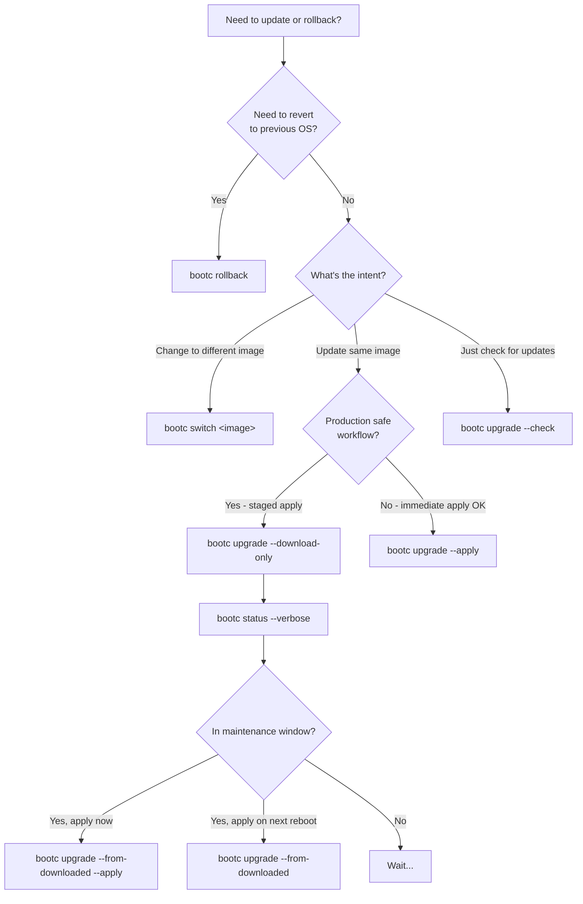

# Upgrade & Rollback (Most Important for Ops)

> *Source: [bootc Upgrades and Rollback](https://bootc-dev.github.io/bootc/upgrades.html)*
>
> Man pages: [bootc-upgrade](https://bootc-dev.github.io/bootc/man/bootc-upgrade.8.html), [bootc-switch](https://bootc-dev.github.io/bootc/man/bootc-switch.8.html), [bootc-rollback](https://bootc-dev.github.io/bootc/man/bootc-rollback.8.html)

This is the **most important document for operations** on bootc systems. It explains how upgrades work, the production-safe download-only workflow, switching images, rollback semantics, and critical gotchas.

---

## Core Concept: The bootc upgrade Verb

`bootc upgrade` does three things:

1. **Queries** the container image source for updates
2. **Stages** the updated container image for the next boot
3. **Does not change** the running system by default

### A/B System Backed by OSTree

Upgrades are backed by OSTree, implementing an **A/B-style upgrade system**:

- Changes are **staged** into a second deployment
- The running system is untouched until you apply and reboot
- On reboot, the bootloader switches to the new deployment atomically

```
┌─────────────────────────────────────────────────────────────────────┐
│  Current boot          Staged (pending)                              │
│  ┌──────────────┐      ┌──────────────┐                             │
│  │ Deployment A │  →   │ Deployment B │   (new image staged)         │
│  │ (running)    │      │ (download-only or auto-apply)               │
│  └──────────────┘      └──────────────┘                             │
│        ↑                       ↑                                    │
│        └── reboot ─────────────┘  (swap bootloader entry)            │
└─────────────────────────────────────────────────────────────────────┘
```

---

## Apply on Reboot: bootc upgrade --apply

To **auto-apply** queued changes and reboot immediately:

```bash
bootc upgrade --apply
```

This will:

1. Pull the latest image from the image source
2. Stage it as the next deployment
3. Reboot into it (subject to staged state—see download-only below)

> Use this only when you are ready to reboot. For production, prefer the **download-only workflow**.

---

## Download-Only Mode (Production Pattern)

The **download-only** workflow is the recommended pattern for production: pull and stage updates during business hours, apply only during a maintenance window.

### 1. Stage Without Applying: --download-only

```bash
bootc upgrade --download-only
```

This will:

- Pull the new container image from the image source
- Create a **staged deployment** in download-only mode
- **Not** apply it on shutdown or reboot until you explicitly apply it

The running system is unchanged; the new deployment is queued but locked.

### 2. Check Status: bootc status --verbose

```bash
bootc status --verbose
```

Look for:

- `Download-only: yes` — staged deployment will **not** apply on reboot
- `Download-only: no` — staged deployment **will** apply on next shutdown/reboot

> `Download-only` is only shown in verbose mode (`--verbose`).

### 3. Apply Staged (From Downloaded): --from-downloaded

**Option A: Unlock for next reboot (no fetch)**

```bash
bootc upgrade --from-downloaded
```

- Unlocks the staged deployment for automatic application on next shutdown/reboot
- **Does not** fetch from the container image source
- Use when you want to apply the **exact version** you already downloaded at a scheduled time

**Option B: Unlock and reboot immediately**

```bash
bootc upgrade --from-downloaded --apply
```

- Unlocks the staged deployment and **immediately reboots** into it
- No fetch from image source; applies what was previously downloaded

**Option C: Check for newer updates first**

```bash
bootc upgrade
```

- Pulls from the image source to check for updates
- If the staged deployment matches the latest, it is unlocked
- If a **newer** update exists, the staged deployment is replaced with the newer version

### 4. Check Without Changing State: --check

```bash
bootc upgrade --check
```

- Downloads updated metadata only
- **Does not** change download-only state
- Use to see if updates exist without staging anything

---

## Critical GOTCHA: Reboot Before Apply

If you run `bootc upgrade --download-only`, then **reboot before** running `bootc upgrade --from-downloaded` (or `bootc upgrade`):

- The system boots into the **current** deployment
- The **staged deployment is discarded**

However:

- The **downloaded image data remains cached**
- Re-running `bootc upgrade --download-only` will be **fast** (no re-download)
- You can re-stage and apply in your maintenance window

---

## Full Production Workflow

| Step | When | Command |
|------|------|---------|
| 1. Download | Business hours | `bootc upgrade --download-only` |
| 2. Verify | Before maintenance window | `bootc status --verbose` (check `Download-only: yes`) |
| 3. Apply | Maintenance window | `bootc upgrade --from-downloaded` then reboot, or `bootc upgrade --from-downloaded --apply` |

**Example: Controlled rollout**

```bash
# 1. During business hours: download and stage
bootc upgrade --download-only

# 2. Verify staged deployment
bootc status --verbose
# Output shows: Download-only: yes

# 3. (Optional) Check for updates without side effects
bootc upgrade --check

# 4. During maintenance window: apply
# Option A: Unlock for next reboot (manual reboot)
bootc upgrade --from-downloaded
# ... then reboot when ready

# Option B: Unlock and reboot immediately
bootc upgrade --from-downloaded --apply
```

> **Important:** `bootc upgrade --from-downloaded` does **not** fetch from the image source. Use it when you want to apply the exact version you already downloaded. Use `bootc upgrade` (without flags) if you want to check for newer updates before applying.

---

## bootc switch: Change Image (Blue/Green)

`bootc switch` changes the **container image being tracked**—e.g. for blue/green deployments.

```bash
bootc switch quay.io/examplecorp/os-prod-blue:latest
```

- Same effect as `bootc upgrade` in terms of staging and deployment
- No semantic difference except: you are **changing** the image source, not just updating the same image
- Preserves existing state in `/etc` and `/var` (SSH keys, home dirs, etc.)

Use cases:

- Blue/green: some hosts on `os-prod-blue`, others on `os-prod-green`
- A management agent can invoke `bootc switch` (or `bootc edit`) declaratively
- Canary or phased rollouts

---

## bootc rollback: Swap to Previous Deployment

```bash
bootc rollback
```

- **Swaps** the bootloader to the **previous** deployment
- **No download**—just a pointer swap
- Time: ~1–2 minutes (reboot time only)
- **`/var` is NOT rolled back**—data persists; only the OS image is reverted

Use when:

- New deployment has issues
- You need to revert to the previous OS version quickly

---

## Bootloader Updates (Separate from bootc upgrade)

> *Source: [Fedora bootc Bootloader Updates](https://docs.fedoraproject.org/en-US/bootc/bootloader-updates/)*

**bootc upgrade does NOT update the bootloader** (GRUB, shim, etc.).

- Use **bootupctl** (from [bootupd](https://github.com/coreos/bootupd)) to update the bootloader separately
- Typical flow: `bootupctl status` → `bootupctl adopt-and-update` (if needed) → `bootupctl update`
- Plan bootloader updates as part of maintenance; they are independent of OS image updates

---

## rpm-ostree Conflict

> *Source: [bootc Relationship with rpm-ostree](https://bootc-dev.github.io/bootc/relationships.html)*

**If you run `rpm-ostree install` (or similar mutations) on a bootc host, bootc upgrade will error.**

- bootc takes a **hard stance**: system state must come from the container image
- `rpm-ostree install` mutates the system (layers packages)—bootc cannot reconcile this
- **Recommended:** do **not** use `rpm-ostree install` on bootc systems; manage packages in the container image instead

---

## Decision Flowchart: When to Use Which Command



---

## Quick Reference

| Command | Purpose |
|---------|---------|
| `bootc upgrade` | Pull + stage; unlock if matches latest |
| `bootc upgrade --apply` | Pull + stage + immediate reboot |
| `bootc upgrade --download-only` | Pull + stage; do NOT apply on reboot |
| `bootc upgrade --from-downloaded` | Unlock staged deployment (no fetch) |
| `bootc upgrade --from-downloaded --apply` | Unlock + immediate reboot |
| `bootc upgrade --check` | Check for updates, no state change |
| `bootc status --verbose` | Show Download-only status |
| `bootc switch <image>` | Change tracked image (blue/green) |
| `bootc rollback` | Boot into previous deployment |
