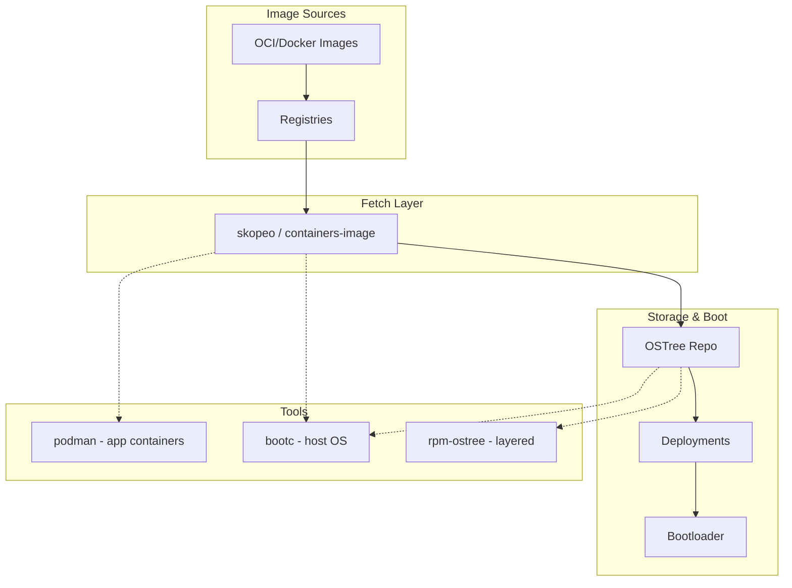

# How bootc Relates to Podman, OSTree, rpm-ostree

> *Source: [bootc Relationship with Other Projects](https://bootc-dev.github.io/bootc/relationships.html)*
>
> Related: [Bootable Containers](https://containers.github.io/bootable/), [bootc-image-builder](https://github.com/osbuild/bootc-image-builder)

bootc sits in a broader ecosystem: podman for application containers, OSTree for deployments, rpm-ostree for traditional Fedora-style systems. Understanding these relationships avoids confusion and prevents operational mistakes.

---

## Relationship with Podman

### Analogy

bootc is the **bootable-container analogue** for podman: podman runs application containers; bootc delivers **bootable host OSes** from the same OCI image format.

| | podman | bootc |
|---|--------|-------|
| **What it runs** | Application containers | Bootable host OS |
| **At runtime** | Container runtime (runc, etc.) | Native boot, systemd as pid1 |
| **Storage** | `/var/lib/containers` | OSTree deployment roots |
| **Image fetch** | containers/image (skopeo) | Same (skopeo, containers/image) |
| **Registry config** | `/etc/containers/*` | Same—honored automatically |

### Key Points

1. **`podman image prune --all` will NOT delete your OS.** The storage for the bootc OS is distinct from `/var/lib/containers`.

2. **Configure once, both honor it.** If you configure podman to pull from a local mirror via `/etc/containers/registries.conf`, bootc will use that mirror too.

3. **Same tooling.** Both use skopeo and the [containers/image](https://github.com/containers/image) library. If you can `podman pull` or `skopeo copy`, bootc can consume that registry.

4. **Future:** bootc may [hard bind with podman](https://github.com/bootc-dev/bootc/pull/215), reducing OSTree's role. A transition path from OSTree-based bootc is planned.

---

## Relationship with OSTree

OSTree provides:

1. **A transport layer** for pulling content over HTTP  
2. **A bootloader integration layer** (GRUB, shim)  
3. **A git-like repo** for OS data (checkout entire rootfs)

### What bootc Uses vs. Does Not

| OSTree feature | bootc usage |
|----------------|-------------|
| **Transport** | **Not used.** bootc pulls OCI via skopeo, not OSTree HTTP. |
| **Bootloader integration** | **Used.** Deployments = bootloader entries. |
| **Local repo + checkout** | **Used.** OCI content is imported into OSTree repo, then checked out as deployment. |

> *"With bootc, the OSTree transport layer is not used. Instead, content is pulled as OCI containers using skopeo... However, this content is then imported into the local OSTree repo to perform a deployment checkout."*  
> — [bootc relationships](https://bootc-dev.github.io/bootc/relationships.html)

The role of OSTree may shrink further as tighter integration with podman and composefs occurs, but the bootloader layer and deployment management will remain.

---

## Relationship with rpm-ostree

rpm-ostree and bootc share the same OSTree backend. When the image source is a container:

- `rpm-ostree upgrade` and `bootc upgrade` are **effectively equivalent**
- You can use either command to upgrade

### Critical Difference: Mutations Break bootc

**If you run `rpm-ostree install` (or similar mutations) on a bootc host, `bootc upgrade` will error.**

bootc takes a **hard stance**: system state should come from the container image. rpm-ostree's "layering" (e.g. `rpm-ostree install`) mutates the system in a way bootc cannot reconcile.

| Action | bootc upgrade result |
|--------|----------------------|
| Pure container image, no layering | Works |
| `rpm-ostree install` or other layering | **Errors**—bootc will not upgrade |

### What Still Works

- `bootc status` continues to work even with layered packages
- bootc and rpm-ostree can **coexist**; they are not mutually exclusive
- `rpm-ostree kargs` works (kernel args use OSTree backend in both)
- `rpm-ostree initramfs --enable` and similar client-side changes work today because of the shared base

### When to Use Which

| Use case | Prefer |
|----------|--------|
| Pure image-based model, no host-side package installs | **bootc** |
| Need to layer packages at runtime | **rpm-ostree** (bootc will not upgrade) |
| Fedora CoreOS, Silverblue with container source | Either; avoid layering if using bootc |

### Future

When bootc switches to a hard binding with podman, compatibility with rpm-ostree will break. A one-way transition from OSTree-based bootc will be supported; there are no plans to teach rpm-ostree to use podman.

---

## Image Builder (osbuild)

[bootc-image-builder](https://github.com/osbuild/bootc-image-builder) bridges bootc and disk images:

- Input: bootc OCI image  
- Output: Disk images (AMI, qcow2, raw, etc.)  
- Uses osbuild under the hood

Use bootc-image-builder when you need to produce cloud or VM images from a bootc Containerfile/image.

---

## Relationship with Kubernetes

bootc **does not depend** on Kubernetes, just as podman does not depend on a Kubernetes API server.

Plans for the future:

- bootc may understand Kubernetes API types (e.g. [ConfigMap/Secret support](https://github.com/bootc-dev/bootc/issues/22))
- Possible support for a `Pod`-like representation of host state
- Potential CRD for use inside and outside Kubernetes

Today: bootc is Kubernetes-agnostic.

---

## Fedora CoreOS / Silverblue

A top-level goal is **seamless upgrade** from existing OSTree-based systems:

- Fedora CoreOS  
- Fedora Silverblue  

See [Fedora CoreOS tracker](https://github.com/coreos/fedora-coreos-tracker/issues/1446) and [OstreeNativeContainerStable](https://fedoraproject.org/wiki/Changes/OstreeNativeContainerStable) for details.

---

## Summary Diagram

---

## Quick Reference

| Tool | Role | Overlap with bootc |
|------|------|--------------------|
| **podman** | Application containers | Shared registry config; separate storage |
| **OSTree** | Transport + bootloader + repo | bootc uses bootloader + repo; not OSTree transport |
| **rpm-ostree** | Layered RPM on OSTree | Same upgrade result with container source; **rpm-ostree install breaks bootc upgrade** |
| **bootc-image-builder** | OCI → disk images | Consumes bootc images |
| **Kubernetes** | Orchestration | No dependency; future API types possible |
| **FCOS/Silverblue** | Fedora OSTree systems | Seamless upgrade path from existing systems |
