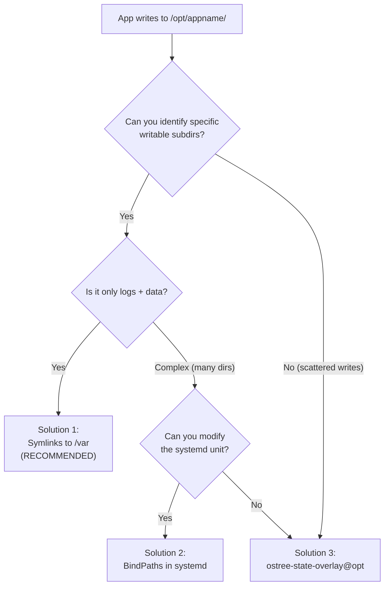
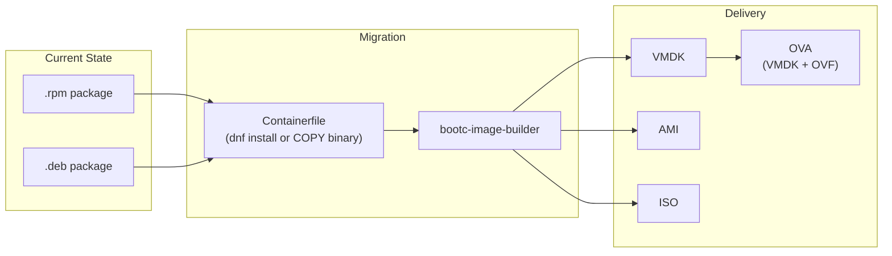

# Base Distro Comparison for bootc

> A deep-dive analysis of base image options for bootc OVA/AMI delivery. Use this to make informed decisions about which distro to base your bootc images on.

**Sources:**
- [bootc: Base images](https://bootc-dev.github.io/bootc/installation.html)
- [bootc: Filesystem](https://bootc-dev.github.io/bootc/filesystem.html)
- [bootc: Building guidance](https://bootc-dev.github.io/bootc/building/guidance.html)
- [bootc-image-builder](https://github.com/osbuild/bootc-image-builder)
- [CentOS bootc project](https://centos.github.io/centos-bootc/)
- [Red Hat: Image mode for RHEL](https://docs.redhat.com/en/documentation/red_hat_enterprise_linux/9/html/using_image_mode_for_rhel_to_build_deploy_and_manage_operating_systems/index)

---

## Why Base Image Choice Matters

In bootc, the base distro is a **build-time** concern. At runtime, there is no package manager -- the OS is an immutable image managed by bootc/ostree. Applications run via systemd, not via apt/dnf.

However, the choice of base image has enormous practical consequences:

| Concern | Impact |
|---------|--------|
| **bootc-image-builder support** | Only Fedora/CentOS/RHEL derivatives are officially supported for disk image generation (AMI, VMDK, QCOW2, ISO) |
| **composefs/ostree maturity** | Fedora/CentOS/RHEL have years of production ostree usage. Ubuntu/Debian are experimental. |
| **Release lifecycle** | Fedora = 13 months. CentOS Stream 9 = ~2027. RHEL 9 = 2032. Ubuntu 25.10 = 9 months. |
| **Package availability** | Some software only ships .deb, some only .rpm. But static binaries bypass this entirely. |
| **Tooling ecosystem** | `bootc container lint`, SELinux policies, cloud-init integration are best tested on Fedora/RHEL |

From [bootc docs](https://bootc-dev.github.io/bootc/installation.html):

> "bootc itself is not tied to Fedora derivatives; [this issue](https://github.com/coreos/bootupd/issues/468) tracks the main blocker for other distributions."

From [bootc-image-builder](https://github.com/osbuild/bootc-image-builder):

> "A container to create disk images from bootc container inputs, **especially oriented towards Fedora/CentOS bootc** or derivatives."

---

## Master Comparison Table

| | Fedora bootc 41 | CentOS Stream 9 | RHEL 9 bootc | Ubuntu bootc | Debian bootc | Debian Stable bootc |
|---|---|---|---|---|---|---|
| **Base image** | `quay.io/fedora/fedora-bootc:41` | `quay.io/centos-bootc/centos-bootc:stream9` | `registry.redhat.io/rhel9/rhel-bootc:latest` | [bootcrew/ubuntu-bootc](https://github.com/bootcrew/ubuntu-bootc) | [bootcrew/debian-bootc](https://github.com/bootcrew/debian-bootc) | [frostyard/debian-bootc-core](https://github.com/frostyard/debian-bootc-core) |
| **License** | Free (Fedora Project) | Free (CentOS Project) | RHEL subscription required | Free (Community) | Free (Community) | Free (Community) |
| **Cost** | $0 | $0 | ~$349+/yr per system | $0 | $0 | $0 |
| **Package format** | rpm / dnf | rpm / dnf | rpm / dnf | deb / apt | deb / apt | deb / apt |
| **bootc-image-builder** | Official | Official | Official (Red Hat) | Not supported | Not supported | Not supported |
| **Disk formats** | AMI, VMDK, QCOW2, ISO, raw, VHD, GCE | AMI, VMDK, QCOW2, ISO, raw, VHD, GCE | AMI, VMDK, QCOW2, ISO, raw, VHD, GCE | `bootc install` only | `bootc install` only | `bootc install` only |
| **OVA possible** | Yes (VMDK + OVF) | Yes (VMDK + OVF) | Yes (VMDK + OVF, documented by Red Hat) | Manual only | Manual only | Manual only |
| **Release base** | Fedora 41 | Near-RHEL, rolling | RHEL 9.x | Ubuntu 25.10 (NOT LTS) | Debian unstable (sid) | Debian stable |
| **Support window** | ~13 months | Until ~2027 (Stream 9) | Until 2032 (RHEL 9) | ~9 months (non-LTS) | Rolling, no fixed EOL | Follows Debian stable |
| **composefs/ostree** | Mature (years of Silverblue/CoreOS use) | Mature (shared codebase with Fedora) | Mature + Red Hat QA | Experimental | Experimental | Experimental |
| **SELinux** | Enforced by default | Enforced by default | Enforced by default | AppArmor (different model) | No MAC by default | No MAC by default |
| **GitHub stars** | N/A (official Fedora infra) | N/A (official CentOS infra) | N/A (Red Hat product) | 32 | 68 | 16 |
| **Maintainers** | Fedora Project + Red Hat | CentOS Project + Red Hat | Red Hat | Community (bootcrew) | Community (bootcrew) | 1 individual |
| **Production risk** | LOW (for dev/POC) | LOW | LOWEST | HIGH | VERY HIGH | HIGH |
| **Recommended for** | POC, development, learning | Free production delivery | Enterprise production | Future option (when mature) | Experimental only | Experimental only |

---

## Deep Dive per Distro

### Fedora bootc 41 (Current POC)

```dockerfile
FROM quay.io/fedora/fedora-bootc:41
RUN dnf install -y nginx cloud-init && dnf clean all
```

Fedora is the upstream testbed for bootc. The Fedora/CentOS bootc project is described as "the most closely aligned upstream project" in the official bootc docs. Every bootc feature lands in Fedora first.

**Strengths**: Latest bootc features, zero cost, full bootc-image-builder support, strong community.

**Weakness**: 13-month lifecycle per release. Not suitable for long-term customer appliances that need multi-year support. You must rebuild and re-qualify when Fedora 41 goes EOL.

**Use case**: POC, development, CI/CD testing, learning.

### CentOS Stream 9

```dockerfile
FROM quay.io/centos-bootc/centos-bootc:stream9
RUN dnf install -y nginx cloud-init && dnf clean all
```

CentOS Stream 9 tracks ahead of RHEL 9, meaning it gets fixes and features before RHEL. From the [CentOS bootc project](https://centos.github.io/centos-bootc/): the project maintains "default definitions for base bootable container images, locked with Fedora ELN and CentOS Stream 9."

**Strengths**: Free, rpm-based, official bootc-image-builder support, multi-year lifecycle (~2027), near-RHEL stability, SELinux enforced.

**Weakness**: rpm-based (customers wanting .deb need workaround). No formal SLA.

**Use case**: Free production OVA/AMI delivery. The best free option if the customer can accept an rpm-based system.

### RHEL 9 bootc

```dockerfile
FROM registry.redhat.io/rhel9/rhel-bootc:latest
RUN dnf install -y nginx cloud-init && dnf clean all
```

RHEL bootc is the commercially supported option. Red Hat provides its own `bootc-image-builder` image at `registry.redhat.io/rhel9/bootc-image-builder`. The full VMDK/AMI/ISO pipeline is documented in [Red Hat's official guide](https://docs.redhat.com/en/documentation/red_hat_enterprise_linux/9/html/using_image_mode_for_rhel_to_build_deploy_and_manage_operating_systems/index).

**Strengths**: Full Red Hat support, FIPS compliance, security hardening, 10-year lifecycle (RHEL 9 until 2032), certified VMware/AWS integrations.

**Weakness**: Requires RHEL subscription (~$349+/yr per system). Registry requires authentication to `registry.redhat.io`.

**Use case**: Enterprise production where the customer pays for or already has RHEL subscriptions.

### Ubuntu bootc (Community)

```dockerfile
FROM ghcr.io/bootcrew/ubuntu-bootc:latest
RUN apt-get update && apt-get install -y nginx && apt-get clean
```

The [bootcrew/ubuntu-bootc](https://github.com/bootcrew/ubuntu-bootc) project is a community experiment. It builds on Ubuntu 25.10 (Plucky Puffin) because Ubuntu 24.04 LTS does not have the kernel/systemd versions needed for bootc+composefs.

**Strengths**: deb-based (matches customers using .deb packages), free.

**Weaknesses**:
- Based on Ubuntu 25.10 -- NOT an LTS release (only ~9 months of support)
- Ubuntu 24.04 LTS does not support bootc properly
- 32 GitHub stars, small community
- bootc-image-builder does NOT support Ubuntu images
- No `bootc container lint` validation for Ubuntu
- [bootupd#468](https://github.com/coreos/bootupd/issues/468) tracks the main blocker for non-Fedora distros

**Risk**: HIGH. Not suitable for customer-facing OVA delivery today.

**Future**: If Ubuntu 26.04 LTS ships with proper bootc/composefs/ostree support, this becomes viable. Monitor the bootcrew project and Ubuntu kernel/systemd releases.

### Debian bootc (Community)

```dockerfile
FROM ghcr.io/bootcrew/debian-bootc:latest
RUN apt-get update && apt-get install -y nginx && apt-get clean
```

The [bootcrew/debian-bootc](https://github.com/bootcrew/debian-bootc) project is based on Debian unstable (sid). There is a [Debian stable fork](https://github.com/frostyard/debian-bootc-core) by a single maintainer (16 stars).

**Strengths**: deb-based, free, more community interest than Ubuntu bootc (68 stars).

**Weaknesses**:
- Based on Debian unstable -- inherently not stable
- Debian stable fork is maintained by 1 person
- bootc-image-builder does NOT support Debian images
- Same bootupd blocker as Ubuntu

**Risk**: VERY HIGH. Not suitable for any customer-facing delivery.

---

## The /opt Filesystem Challenge

Many existing applications (especially those previously distributed as .deb or .rpm packages) install to `/opt/appname/` and expect to write logs, data, and temp files there. bootc makes `/opt/` **read-only** at runtime via composefs.

From [bootc filesystem docs](https://bootc-dev.github.io/bootc/filesystem.html):

> "In the default suggested model of using composefs the /opt directory will be read-only, alongside other toplevels such as /usr."

### Official Solution Hierarchy

The bootc documentation provides four solutions, listed from **maximum immutability** (best) to **most permissive** (easiest migration):

| Priority | Solution | Immutability | Migration Effort | Persists Across Reboots | Persists Across Updates |
|----------|----------|-------------|-----------------|------------------------|------------------------|
| 1 (Best) | Symlinks to /var | Maximum | Medium | Yes | Yes |
| 2 | BindPaths in systemd | High | Low | Yes | Yes |
| 3 | ostree-state-overlay | Moderate | Lowest | Yes | Overwritten by new image |
| 4 | root.transient=true | Minimal | Lowest | No (lost on reboot) | No |

### Solution 1: Symlinks to /var (Recommended)

From [bootc building guidance](https://bootc-dev.github.io/bootc/building/guidance.html):

> "A simple way to handle this is to change the directories that need to be writable to symbolic links to /var"

```dockerfile
RUN dnf install -y examplepkg && \
    mv /opt/examplepkg/logs /var/log/examplepkg && \
    ln -sr /var/log/examplepkg /opt/examplepkg/logs && \
    mv /opt/examplepkg/data /var/lib/examplepkg && \
    ln -sr /var/lib/examplepkg /opt/examplepkg/data
```

**Concrete migration example for `/opt/mocm/`:**

```dockerfile
# Before (breaks on bootc -- /opt is read-only):
# App writes to /opt/mocm/logs, /opt/mocm/data, /opt/mocm/tmp

# After (bootc-compatible):
RUN mkdir -p /opt/mocm && \
    mkdir -p /var/log/mocm /var/lib/mocm /var/tmp/mocm && \
    ln -sr /var/log/mocm /opt/mocm/logs && \
    ln -sr /var/lib/mocm /opt/mocm/data && \
    ln -sr /var/tmp/mocm /opt/mocm/tmp
```

Binaries and read-only config stay in `/opt/mocm/` (immutable). Only writable subdirectories are symlinked to `/var/`.

### Solution 2: BindPaths in systemd

From [bootc building guidance](https://bootc-dev.github.io/bootc/building/guidance.html):

> "Another option is to configure the systemd unit launching the service to do these mounts dynamically via e.g. BindPaths="

```ini
[Service]
ExecStart=/opt/mocm/bin/mocm
BindPaths=/var/log/mocm:/opt/mocm/logs
BindPaths=/var/lib/mocm:/opt/mocm/data
```

The bind mounts are only visible inside the service's mount namespace. No system-wide `/opt` mutation.

### Solution 3: State Overlay

From [bootc filesystem docs](https://bootc-dev.github.io/bootc/filesystem.html):

> "To enable this feature, instantiate the ostree-state-overlay@.service unit template on the target path."

```dockerfile
RUN systemctl enable ostree-state-overlay@opt.service
```

Trade-offs from the official docs:
- New files from the container image override locally modified versions on update
- Changes persist across reboots
- "It allows for some temporary state drift until the next update"

### Solution 4: Transient Root (Last Resort)

```
# In /usr/lib/ostree/prepare-root.conf
[root]
transient = true
```

Makes the entire rootfs writable transiently (until reboot). From the docs: this is the least recommended approach as it sacrifices the core immutability guarantee.

### Decision Flowchart



---

## Key Insight: Package Format Is a Build-Time Concern

In a bootc image, the package manager (apt/dnf) runs **only during `podman build`** inside the Containerfile. At runtime on the deployed machine, there is no package manager. The OS is immutable.

This means:
- You can extract binaries from a .deb and COPY them into an rpm-based bootc image
- Static binaries (Go, Rust) work on any distro without any package manager
- The real blockers are **bootc-image-builder support** and **composefs/ostree maturity**, not the package format

```dockerfile
# Example: using .deb content in an rpm-based bootc image
FROM quay.io/centos-bootc/centos-bootc:stream9

# Extract binary from .deb without apt
COPY myapp.deb /tmp/myapp.deb
RUN cd /tmp && ar x myapp.deb && tar xf data.tar.* && \
    cp -a usr/bin/myapp /usr/bin/myapp && \
    rm -rf /tmp/myapp.deb /tmp/data.tar.* /tmp/control.tar.*
```

---

## Recommendation Matrix

| Customer Scenario | Recommended Base | Rationale |
|-------------------|-----------------|-----------|
| **POC / learning** | Fedora bootc 41 | Latest features, zero friction, our current setup |
| **Free production (rpm OK)** | CentOS Stream 9 | Official support, multi-year lifecycle, VMDK/AMI works |
| **Enterprise production** | RHEL 9 bootc | Full Red Hat support, FIPS, 10-year lifecycle, certified |
| **Customer wants free + deb** | CentOS Stream 9 + static binaries | Use CentOS as OS base; deliver app as static binary (bypass .deb entirely) |
| **Customer insists on Ubuntu** | Wait for Ubuntu 26.04 LTS | Current 25.10 is not LTS; monitor bootcrew/ubuntu-bootc progress |
| **Customer insists on Debian** | Not recommended | Debian bootc is based on unstable; too risky for production |

### Migration Path for Current Product

If the company currently ships .rpm/.deb packages and needs to move to bootc OVA:



1. Choose base: CentOS Stream 9 (free) or RHEL 9 (paid)
2. Migrate `/opt/mocm/` writable dirs to `/var/` with symlinks (Solution 1)
3. Build with `bootc-image-builder --type vmdk`
4. Package VMDK into OVA with OVF descriptor
5. Deliver OVA to customer

---

## References

- [bootc: Installation / Base images](https://bootc-dev.github.io/bootc/installation.html)
- [bootc: Filesystem](https://bootc-dev.github.io/bootc/filesystem.html)
- [bootc: Building guidance](https://bootc-dev.github.io/bootc/building/guidance.html)
- [bootc-image-builder](https://github.com/osbuild/bootc-image-builder)
- [CentOS bootc project](https://centos.github.io/centos-bootc/)
- [Red Hat: Image mode for RHEL](https://docs.redhat.com/en/documentation/red_hat_enterprise_linux/9/html/using_image_mode_for_rhel_to_build_deploy_and_manage_operating_systems/index)
- [bootupd#468: Non-Fedora distro blocker](https://github.com/coreos/bootupd/issues/468)
- [bootcrew/ubuntu-bootc](https://github.com/bootcrew/ubuntu-bootc)
- [bootcrew/debian-bootc](https://github.com/bootcrew/debian-bootc)
- [frostyard/debian-bootc-core](https://github.com/frostyard/debian-bootc-core)
- [Fedora/CentOS bootc examples](https://github.com/redhat-et/bootc-examples)
