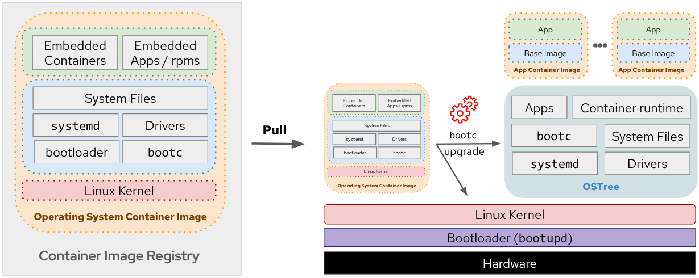

# What is Bootc?

Bootc is a technology that enables transactional, in-place operating system updates using OCI/Docker container images by using bootable containers (container images that include the Kernel). It applies the successful container layering model to bootable host systems, using standard OCI/Docker containers as a transport and delivery format for base operating system updates.




## How do you build Bootc images?

Building a bootc image follows a process similar to creating a traditional container image, with an additional extra steps if you need a installable OS asset.

1. Prepare the Containerfile that describes your image and the associated files
2. Build the Container image using standard tools
3. Create installable artifacts (optional). If you want to deploy on fresh hardware or a cloud instance (e.g., bare metal, VM, or cloud provider image), use `bootc-image-builder` to produce installable formats (ISO,RAW,VMDK,AMI,...)

---

## The Key Insight: Native Boot, Not Container Runtime

The container image includes a **Linux kernel** (e.g. in `/usr/lib/modules`), which is used to boot. At runtime on a target system:

- The base userspace is **not** running inside a container by default
- **systemd acts as pid1** as usual—there is no "outer" process
- The image is a **delivery format**; the deployed system boots natively

```
┌─────────────────────────────────────────────────────────┐
│  Traditional container:  App runs INSIDE container       │
│  ┌─────────────────────────────────────────────────┐    │
│  │  pid1: container runtime                         │    │
│  │    └── your app                                  │    │
│  └─────────────────────────────────────────────────┘    │
└─────────────────────────────────────────────────────────┘

┌─────────────────────────────────────────────────────────┐
│  bootc:  OS boots NATIVELY from container image         │
│  ┌─────────────────────────────────────────────────┐    │
│  │  pid1: systemd (native)                           │    │
│  │    └── nginx, hello, cloud-init, ...             │    │
│  └─────────────────────────────────────────────────┘    │
└─────────────────────────────────────────────────────────┘
```

---

## "podman image prune --all" Won't Delete Your OS

> *Source: [bootc Relationship with podman](https://bootc-dev.github.io/bootc/relationships.html)*

When a bootc container is booted, **podman (or docker) is not involved**. The storage used for the operating system content is **distinct from** `/var/lib/containers`.

- `podman image prune --all` **will not** delete your operating system
- bootc uses **skopeo** and **containers/image** to fetch images—same libraries as podman
- Registry config (e.g. `/etc/containers/containers-registries.conf`) is honored by both

---

## Status

The **CLI and API for bootc are now considered stable**. Every existing system can be upgraded in place seamlessly across any future changes.

The core underlying code uses the [ostree](https://github.com/ostreedev/ostree) project, which has powered stable OS updates for many years. Stability here refers to the surface APIs, not the underlying logic.

---

## Why This Matters

| Benefit | Description |
|---------|-------------|
| **Single source of truth** | One Containerfile = entire OS; no drift between image and AMI |
| **No config drift** | OS and config come from the image; 3-way merge for `/etc` |
| **Atomic upgrades** | A/B deployment; bootloader swap on reboot |
| **Fast rollback** | Boot previous deployment—no reinstall |
| **Familiar tooling** | `podman build`, OCI registries, same workflows as app containers |

---

## Comparison: Traditional AMI vs bootc

| | Traditional AMI (e.g. Packer) | bootc |
|---|-------------------------------|-------|
| **Build** | Packer template, 15–30 min bake | Containerfile, `podman build` |
| **Update** | Bake new AMI, redeploy instances | Push image → `bootc upgrade` → reboot |
| **Config** | Often separate (Ansible, cloud-init) | In image or drop-ins |
| **Rollback** | Redeploy old AMI | Reboot into previous deployment |
| **Source of truth** | AMI + config management | Single Containerfile |

---

## References

- [bootc: Introduction](https://bootc-dev.github.io/bootc/intro.html)
- [bootable containers](https://containers.github.io/bootable/)
- [bootc: Relationship with other projects](https://bootc-dev.github.io/bootc/relationships.html)
