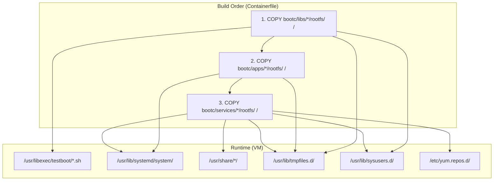
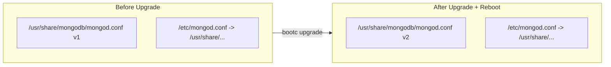

# Building Images

A deep-dive guide for DevOps teams building bootc-compatible container images. bootc applies the same "layers" technique used for application containers to bootable host systems, using OCI/Docker as the transport format.

**Sources:**
- [bootc: Generic guidance for building images](https://bootc-dev.github.io/bootc/building/guidance.html)
- [bootc: "bootc compatible" images](https://bootc-dev.github.io/bootc/bootc-images.html)

## Table of Contents

- [Core Principle: Same as App Containers](#core-principle-same-as-app-containers)
- [Understanding Mutability](#understanding-mutability)
- [systemd as pid 1](#systemd-as-pid-1)
- [LABEL containers.bootc 1](#label-containersbootc-1)
- [Kernel Placement](#kernel-placement)
- [bootc container lint](#bootc-container-lint)
- [Configuration Placement](#configuration-placement)
- [Handling Read-Only vs Writable](#handling-read-only-vs-writable)
- [Rootfs Overlay System](#rootfs-overlay-system)
- [Build-time to Runtime Mapping](#build-time-to-runtime-mapping)
- [The Three Layers](#the-three-layers)
- [Immutable Config Pattern](#immutable-config-pattern)
- [How to Add New Components](#how-to-add-new-components)
- [Nesting OCI Containers (Avoid)](#nesting-oci-containers-avoid)
- [Deriving from Base Images](#deriving-from-base-images)
- [Practical Example: Complete Containerfile](#practical-example-complete-containerfile)
- [GHCR image naming (this repository)](#ghcr-image-naming-this-repository)
- [Summary Checklist](#summary-checklist)
- [References](#references)

---

## Core Principle: Same as App Containers

Every tool and technique for creating application base images applies to bootc host images. The core pattern is:

```dockerfile
RUN $pkgsystem install somepackage && $pkgsystem clean all
```

For Fedora/RHEL:

```dockerfile
RUN dnf install -y postgresql nginx && dnf clean all
```

For Debian/Ubuntu:

```dockerfile
RUN apt-get update && apt-get install -y postgresql nginx && apt-get clean
```

There is nothing special here compared to application containers. bootc's goal is that building host OS images feels like building app containers.

---

## Understanding Mutability

**During build (inside the container):** The filesystem is fully mutable. Writing to `/usr`, `/etc`, and anywhere else is normal and encouraged. This is when you run `dnf install`, copy config files, create symlinks, etc.

**When deployed:** The container image files are **read-only by default**. The OSTree backend mounts `/usr` (and other image content) read-only. Only specific locations like `/var`, `/etc` (with 3-way merge), and `/home` persist as writable.

Plan your layout accordingly: static content in `/usr`, writable data in `/var`, and machine-local config in `/etc`.

---

## systemd as pid 1

bootc expects **systemd as pid 1**. Unlike microservice containers where the application is pid 1, bootc systems run systemd, which then launches your services via systemd units.

When you install a package:

```dockerfile
RUN dnf -y install postgresql && dnf clean all
```

PostgreSQL ships with a systemd unit. That service will be started the same way as on a package-based system. Embed your own software the same way:

1. Install binaries into `/usr/bin` or `/usr/local/bin`
2. Add a `.service` unit under `/usr/lib/systemd/system/`
3. Enable it with `systemctl enable myservice`

Do not use `ENTRYPOINT` or `CMD` to run your main software--systemd units handle that.

---

## LABEL containers.bootc 1

Add this label to signal that your image is bootc-compatible:

```dockerfile
LABEL containers.bootc=1
```

This helps tooling and documentation identify bootc images. It is strongly recommended by the bootc project.

---

## Kernel Placement

The kernel and initramfs must be in a specific location:

- **Kernel:** `/usr/lib/modules/$kver/vmlinuz`
- **Initramfs:** `initramfs.img` in the same directory

**Do not put content in `/boot`** in your container image. bootc copies the kernel/initramfs from the container image to `/boot` at install/upgrade time.

The `bootc container lint` command checks this. Run it in your build to catch violations.

---

## bootc container lint

Run `bootc container lint` during your image build to catch common misconfigurations:

- Multiple kernels (ambiguous which to boot)
- Bad `/var` layout (e.g. symlinks that conflict with expectations)
- Missing or incorrect tmpfiles.d entries
- Kernel placement issues

Example:

```dockerfile
RUN bootc container lint
```

Add this near the end of your Containerfile, after all layers are applied.

---

## Configuration Placement

### Prefer `/usr` for Static Config (Immutable)

Put configuration in `/usr` when it should be part of the immutable image:

- `/usr/lib/systemd/system/` -- systemd units
- `/usr/lib/tmpfiles.d/` -- tmpfiles.d fragments
- `/usr/share/<app>/` -- application default config

For apps that look in `/etc`, symlink:

```dockerfile
COPY bootc/services/nginx/rootfs/ /
RUN ln -sf /usr/share/nginx/nginx.conf /etc/nginx/nginx.conf
```

### `/etc` for Machine-Local Config (3-Way Merge)

`/etc` is machine-local state. OSTree performs a **3-way merge** on `/etc` during updates: changes in the image are applied unless the file was modified locally.

### Immutable Configs (Appliance Delivery)

For customer-facing appliances, put all configs in `/usr/share/<service>/` and symlink from `/etc/`. This makes configs read-only at runtime -- customers cannot edit them, and upgrades replace them atomically with zero merge conflicts.

#### The Problem

bootc uses a **3-way merge** for `/etc` during upgrades. If a customer edits a config file in `/etc`, the merge can conflict with your new version. This means:

- You cannot guarantee the config is correct after upgrade
- Customer edits can silently break services
- Debugging config issues on customer machines is painful

#### Our Solution: All Configs in `/usr` (Read-Only)

We put **every config file** in `/usr/share/<service>/` and create symlinks from `/etc/` to point there:

```
/etc/nginx/nginx.conf  --->  /usr/share/nginx/nginx.conf  (read-only)
/etc/nginx/conf.d/     --->  /usr/share/nginx/conf.d/     (read-only)
/etc/mongod.conf       --->  /usr/share/mongodb/mongod.conf (read-only)
/etc/valkey/valkey.conf  --->  /usr/share/valkey/valkey.conf  (read-only)
```

**Why this works:**

- `/usr` is **read-only** at runtime -- customer cannot edit configs
- On upgrade, `/usr` is **fully replaced** -- new configs are atomically applied
- No merge conflicts, no drift, no surprises
- Customer just starts the VM and uses it

#### How It Looks in the Containerfile

```dockerfile
# 1. Install the package (puts default config in /etc)
RUN dnf install -y nginx

# 2. Our custom config is in /usr/share/ (from rootfs overlay)
COPY bootc/services/nginx/rootfs/ /

# 3. Replace /etc config with symlink to /usr/share (immutable)
RUN ln -sf /usr/share/nginx/nginx.conf /etc/nginx/nginx.conf && \
    rm -rf /etc/nginx/conf.d && \
    ln -sf /usr/share/nginx/conf.d /etc/nginx/conf.d
```

#### The Rootfs Overlay Pattern

Every service follows the same structure:

```
bootc/services/<service>/rootfs/
  usr/share/<service>/<config-file>          # immutable config
  usr/lib/systemd/system/<service>.service.d/override.conf  # systemd tweaks
  usr/lib/tmpfiles.d/<service>.conf          # /var directories
```

See [003-deploying-and-upgrading.md](003-deploying-and-upgrading.md) for full upgrade behavior details.

### Drop-in Directories (Base OS Tuning)

For base OS tuning (sysctl, journald, SSH hardening), use drop-in directories:

- systemd: `/etc/systemd/system/unit.d/` or `unit.d/*.conf`
- sudoers: `/etc/sudoers.d/` instead of editing `/etc/sudoers`
- SSH: `/etc/ssh/sshd_config.d/`

These reduce state drift and merge conflicts during updates.

---

## Handling Read-Only vs Writable

| Location | Purpose |
|----------|---------|
| `/usr` | Read-only: executables, libraries, static config |
| `/var` | Writable: logs, databases, caches, state |
| `/etc` | Machine-local: config with 3-way merge |

For apps that install to `/opt` and mix data with code:

```dockerfile
RUN apt|dnf install examplepkg && \
    mv /opt/examplepkg/logs /var/log/examplepkg && \
    ln -sr /var/log/examplepkg /opt/examplepkg/logs
```

Alternative: use systemd `BindPaths=` in the unit:

```ini
BindPaths=/var/log/exampleapp:/opt/exampleapp/logs
```

---

## Rootfs Overlay System

Every component under `bootc/` has a `rootfs/` directory. Files inside `rootfs/` mirror the target filesystem root (`/`). When the Containerfile runs `COPY bootc/libs/*/rootfs/ /`, Docker/podman strips everything up to and including `rootfs/` and copies the rest directly into `/`.

**Example:**

```
Source (in repo):     bootc/libs/common/rootfs/usr/libexec/testboot/log.sh
                      |-- bootc/libs/common/rootfs  <-- stripped by COPY
                      \-- /usr/libexec/testboot/log.sh  <-- lands here in image

Source (in repo):     bootc/services/mongodb/rootfs/usr/share/mongodb/mongod.conf
                      |-- bootc/services/mongodb/rootfs  <-- stripped by COPY
                      \-- /usr/share/mongodb/mongod.conf  <-- lands here in image
```

The three COPY instructions in the [Containerfile](../../Containerfile) (lines 19-21):

```dockerfile
COPY bootc/libs/*/rootfs/ /
COPY bootc/apps/*/rootfs/ /
COPY bootc/services/*/rootfs/ /
```

Order matters: libs are copied first so shared scripts are available when services and apps reference them. The wildcard `*` means every subdirectory is included automatically -- adding a new component requires no Containerfile changes.

---

## Build-time to Runtime Mapping

Every file in `bootc/` and its runtime destination. The "Zone" column indicates the filesystem behavior at runtime (see [003-filesystem-layout.md](../bootc/003-filesystem-layout.md) for details).

### Newbie: `/usr` vs `/etc` vs `/var` (and symlinks)

On a bootc host, treat the layers like this:

- **`/usr` (including `/usr/share/...`)** -- Shipped **inside the image**. At runtime it is **read-only** in the usual bootc model; OS and app files you bake in the Containerfile live here.
- **`/etc/...`** -- **Mutable** machine configuration. Software often hard-codes paths under `/etc`. This repo keeps the **real** config under `/usr/share/<service>/` and puts a **symlink** in `/etc` so services still see the path they expect, while the content stays part of the immutable image tree.
- **`/var/...`** -- **Persistent state**: databases, logs, secrets generated on first boot, etc.

Quick check on a running VM:

```bash
ls -la /etc/nginx/nginx.conf
readlink -f /etc/nginx/nginx.conf
```

You should see a symlink into `/usr/share/nginx/`.

**`mongodb-init.service`** runs `/usr/libexec/testboot/mongodb-init.sh`, which calls **`mongosh`** to `mongodb://127.0.0.1:27017/` without TLS (`preferTLS` allows localhost plain). The app image installs the **`mongodb-mongosh`** package alongside `mongodb-org-server` so replica-set init and admin user creation can succeed.

### libs/common

Shared utility scripts and system definitions used by all services and apps.

| Source Path | Runtime Path | Zone | Purpose |
|-------------|-------------|------|---------|
| `bootc/libs/common/rootfs/usr/libexec/testboot/log.sh` | `/usr/libexec/testboot/log.sh` | Read-only | Structured logging library (sourced by other scripts) |
| `bootc/libs/common/rootfs/usr/libexec/testboot/gen-password.sh` | `/usr/libexec/testboot/gen-password.sh` | Read-only | Atomic random password generation (idempotent) |
| `bootc/libs/common/rootfs/usr/libexec/testboot/wait-for-service.sh` | `/usr/libexec/testboot/wait-for-service.sh` | Read-only | TCP readiness probe (polls host:port) |
| `bootc/libs/common/rootfs/usr/libexec/testboot/healthcheck.sh` | `/usr/libexec/testboot/healthcheck.sh` | Read-only | HTTP health endpoint check |
| `bootc/libs/common/rootfs/usr/libexec/testboot/gen-tls-cert.sh` | `/usr/libexec/testboot/gen-tls-cert.sh` | Read-only | Self-signed TLS cert generator (CA + server) |
| `bootc/libs/common/rootfs/usr/lib/sysusers.d/apps.conf` | `/usr/lib/sysusers.d/apps.conf` | Read-only | Creates shared `apps` group for all Go app services |
| `bootc/libs/common/rootfs/usr/lib/tmpfiles.d/testboot-common.conf` | `/usr/lib/tmpfiles.d/testboot-common.conf` | Read-only | Creates shared `/var` directories at boot |
| `bootc/libs/common/rootfs/etc/logrotate.d/bootc-testboot` | `/etc/logrotate.d/bootc-testboot` | Read-only | Rotates `/var/log/bootc-testboot/*.log` only; per-app dirs use `hello` / `worker` snippets ([008-services-runtime.md](008-services-runtime.md)) |
| `bootc/libs/common/rootfs/etc/sysconfig/arptables` | `/etc/sysconfig/arptables` | Mutable | Minimal ARP rules so `arptables.service` is not `NOTCONFIGURED` if enabled; image ships the unit **disabled** by default |
| `bootc/libs/common/rootfs/usr/lib/systemd/system-preset/99-bootc-testboot.preset` | `/usr/lib/systemd/system-preset/99-bootc-testboot.preset` | Read-only | Preset: `disable` `arptables.service` and `rdisc.service` (cloud-friendly defaults) |
| `bootc/libs/common/rootfs/usr/lib/systemd/system/testboot-app-setup.service` | `/usr/lib/systemd/system/testboot-app-setup.service` | Read-only | Oneshot: reads infra secrets and writes shared env files for apps (runs once at first boot) |
| `bootc/libs/common/rootfs/usr/libexec/testboot/testboot-app-setup.sh` | `/usr/libexec/testboot/testboot-app-setup.sh` | Read-only | Generates `mongodb.env`, `valkey.env`, `rabbitmq.env` in `/var/lib/bootc-testboot/shared/env/` |

### services/mongodb

| Source Path | Runtime Path | Zone | Purpose |
|-------------|-------------|------|---------|
| `bootc/services/mongodb/rootfs/etc/yum.repos.d/mongodb-org-8.0.repo` | `/etc/yum.repos.d/mongodb-org-8.0.repo` | Mutable | MongoDB 8.0 package repository (needed at build time for `dnf install`) |
| `bootc/services/mongodb/rootfs/usr/share/mongodb/mongod.conf` | `/usr/share/mongodb/mongod.conf` | Read-only | Immutable MongoDB config (rs0 + auth + TLS) |
| `bootc/services/mongodb/rootfs/usr/lib/systemd/system/mongod.service.d/override.conf` | `/usr/lib/systemd/system/mongod.service.d/override.conf` | Read-only | systemd drop-in: `StateDirectory=`, `LogsDirectory=`, `After=mongodb-setup.service` |
| `bootc/services/mongodb/rootfs/usr/lib/systemd/system/mongodb-setup.service` | `/usr/lib/systemd/system/mongodb-setup.service` | Read-only | Oneshot (Before=mongod): generates TLS certs, keyFile, admin password |
| `bootc/services/mongodb/rootfs/usr/lib/systemd/system/mongodb-init.service` | `/usr/lib/systemd/system/mongodb-init.service` | Read-only | Oneshot (After=mongod): rs.initiate() + create admin user |
| `bootc/services/mongodb/rootfs/usr/libexec/testboot/mongodb-init.sh` | `/usr/libexec/testboot/mongodb-init.sh` | Read-only | Script for replica set init and admin user creation (requires **`mongosh`** from **`mongodb-mongosh`**, installed in the Containerfile) |
| `bootc/services/mongodb/rootfs/usr/lib/sysusers.d/mongod.conf` | `/usr/lib/sysusers.d/mongod.conf` | Read-only | Creates `mongod` user/group for `bootc container lint` |
| `bootc/services/mongodb/rootfs/usr/lib/tmpfiles.d/mongodb.conf` | `/usr/lib/tmpfiles.d/mongodb.conf` | Read-only | Creates `/var/lib/mongodb`, `/var/lib/mongodb/tls`, `/var/log/mongodb` at boot |

The app `Containerfile` compiles both `mongodb.pp` (upstream) and `mongodb-ftdc-local.pp`
(local FTDC supplement) in a **throwaway build stage** (`mongodb-selinux-builder`) using
`checkmodule` + `semodule_package`. Only the compiled `.pp` files are copied into the final image;
`selinux-policy-devel` and `checkpolicy` remain in the builder stage only (keeps `bootc container
lint` clean). Both modules are installed into the SELinux policy store via `semodule --install` in a
`RUN` step -- **at build time**, not via a runtime service.

> `semanage fcontext -a -t mongod_var_lib_t '/var/lib/mongodb(/.*)? '` is also run at build time.
> `restorecon /var/lib/mongodb` is deferred to `ExecStartPre` in `mongod.service.d/override.conf`
> because `/var` does not exist at image build time.
>
> See [006-selinux-reference.md](006-selinux-reference.md) for the full problem history and rationale.

Plus a symlink created in the Containerfile: `/etc/mongod.conf` -> `/usr/share/mongodb/mongod.conf`

### services/valkey

| Source Path | Runtime Path | Zone | Purpose |
|-------------|-------------|------|---------|
| `bootc/services/valkey/rootfs/usr/share/valkey/valkey.conf` | `/usr/share/valkey/valkey.conf` | Read-only | Immutable Valkey config |
| `bootc/services/valkey/rootfs/usr/lib/systemd/system/valkey.service.d/override.conf` | `/usr/lib/systemd/system/valkey.service.d/override.conf` | Read-only | systemd drop-in override |
| `bootc/services/valkey/rootfs/usr/lib/tmpfiles.d/valkey.conf` | `/usr/lib/tmpfiles.d/valkey.conf` | Read-only | Creates Valkey `/var` dirs at boot |

Plus a symlink: `/etc/valkey/valkey.conf` -> `/usr/share/valkey/valkey.conf`

### services/nginx

| Source Path | Runtime Path | Zone | Purpose |
|-------------|-------------|------|---------|
| `bootc/services/nginx/rootfs/usr/share/nginx/nginx.conf` | `/usr/share/nginx/nginx.conf` | Read-only | Immutable main nginx config |
| `bootc/services/nginx/rootfs/usr/lib/tmpfiles.d/nginx.conf` | `/usr/lib/tmpfiles.d/nginx.conf` | Read-only | Creates nginx `/var` dirs at boot |

Plus symlinks: `/etc/nginx/nginx.conf` -> `/usr/share/nginx/nginx.conf`, `/etc/nginx/conf.d` -> `/usr/share/nginx/conf.d`

### services/rabbitmq

| Source Path | Runtime Path | Zone | Purpose |
|-------------|-------------|------|---------|
| `bootc/services/rabbitmq/rootfs/etc/yum.repos.d/rabbitmq.repo` | `/etc/yum.repos.d/rabbitmq.repo` | Mutable | RabbitMQ + Erlang package repository (x86_64 only) |
| `bootc/services/rabbitmq/rootfs/usr/share/rabbitmq/rabbitmq.conf` | `/usr/share/rabbitmq/rabbitmq.conf` | Read-only | Immutable RabbitMQ config |
| `bootc/services/rabbitmq/rootfs/usr/lib/systemd/system/rabbitmq-server.service.d/override.conf` | `/usr/lib/systemd/system/rabbitmq-server.service.d/override.conf` | Read-only | systemd drop-in override |
| `bootc/services/rabbitmq/rootfs/usr/lib/sysusers.d/rabbitmq.conf` | `/usr/lib/sysusers.d/rabbitmq.conf` | Read-only | Creates `rabbitmq` user/group |
| `bootc/services/rabbitmq/rootfs/usr/lib/tmpfiles.d/rabbitmq.conf` | `/usr/lib/tmpfiles.d/rabbitmq.conf` | Read-only | Creates RabbitMQ `/var` dirs at boot |

Plus a symlink: `/etc/rabbitmq/rabbitmq.conf` -> `/usr/share/rabbitmq/rabbitmq.conf`

> **Note:** Unlike MongoDB (which has `mongodb-setup.service` and `mongodb-init.service` for credential and TLS generation), RabbitMQ currently uses default `guest:guest` credentials from `rabbitmq.conf`. A dedicated `rabbitmq-setup.service` for automated credential rotation is a planned future improvement. The `testboot-app-setup.sh` script gracefully falls back to default credentials when `/var/lib/rabbitmq/.admin-pw` is absent.

### apps/hello

| Source Path | Runtime Path | Zone | Purpose |
|-------------|-------------|------|---------|
| `bootc/apps/hello/rootfs/usr/lib/systemd/system/hello.service` | `/usr/lib/systemd/system/hello.service` | Read-only | systemd unit: three-tier EnvironmentFile pattern; `After=testboot-app-setup.service` |
| `bootc/apps/hello/rootfs/usr/share/bootc-testboot/hello/hello.env` | `/usr/share/bootc-testboot/hello/hello.env` | Read-only | Tier 1: immutable defaults (`LISTEN_ADDR`, `LOG_LEVEL`, etc.) |
| `bootc/apps/hello/rootfs/etc/logrotate.d/hello` | `/etc/logrotate.d/hello` | Read-only | Daily rotate for `/var/log/bootc-testboot/hello/*.log` (`copytruncate`, `su hello hello`; see [008](008-services-runtime.md)) |
| `bootc/apps/hello/rootfs/usr/lib/tmpfiles.d/hello.conf` | `/usr/lib/tmpfiles.d/hello.conf` | Read-only | Optional extra tmpfiles; `StateDirectory`/`LogsDirectory` create `/var/lib`/`/var/log` paths |
| `bootc/apps/hello/rootfs/usr/share/nginx/conf.d/hello.conf` | `/usr/share/nginx/conf.d/hello.conf` | Read-only | nginx vhost reverse proxy config |

The hello binary itself comes from a separate COPY: `COPY output/bin/ /usr/bin/` (built by `make apps` from `repos/hello/`).

### apps/worker

| Source Path | Runtime Path | Zone | Purpose |
|-------------|-------------|------|---------|
| `bootc/apps/worker/rootfs/usr/lib/systemd/system/worker.service` | `/usr/lib/systemd/system/worker.service` | Read-only | systemd unit: three-tier EnvironmentFile pattern; connects to MongoDB/RabbitMQ/Valkey |
| `bootc/apps/worker/rootfs/usr/share/bootc-testboot/worker/worker.env` | `/usr/share/bootc-testboot/worker/worker.env` | Read-only | Tier 1: immutable defaults (`LISTEN_ADDR=:8001`, `WORKER_MODE`, `SEED_*`, etc.) |
| `bootc/apps/worker/rootfs/usr/lib/systemd/system/worker-healthcheck.service` | `/usr/lib/systemd/system/worker-healthcheck.service` | Read-only | Periodic HTTP healthcheck (oneshot, called by timer) |
| `bootc/apps/worker/rootfs/usr/lib/systemd/system/worker-healthcheck.timer` | `/usr/lib/systemd/system/worker-healthcheck.timer` | Read-only | Timer: 1min interval, randomized delay |
| `bootc/apps/worker/rootfs/usr/lib/sysusers.d/worker.conf` | `/usr/lib/sysusers.d/worker.conf` | Read-only | Dedicated `worker` user + member of `apps` group |
| `bootc/apps/worker/rootfs/usr/lib/tmpfiles.d/worker.conf` | `/usr/lib/tmpfiles.d/worker.conf` | Read-only | Extra `/var` dirs for worker state |
| `bootc/apps/worker/rootfs/etc/logrotate.d/worker` | `/etc/logrotate.d/worker` | Read-only | Daily rotate for `/var/log/bootc-testboot/worker/*.log` |

The worker binary itself comes from a separate COPY: `COPY output/bin/ /usr/bin/` (built by `make apps` from `repos/worker/`).

### Three-Tier EnvironmentFile Convention

All app services use a three-tier `EnvironmentFile` pattern for configuration and secrets:

```ini
# Tier 1: immutable defaults (image-versioned, in /usr/share/)
EnvironmentFile=/usr/share/bootc-testboot/<app>/<app>.env

# Tier 2: shared infra secrets (declare only what this app uses)
EnvironmentFile=-/var/lib/bootc-testboot/shared/env/mongodb.env
EnvironmentFile=-/var/lib/bootc-testboot/shared/env/valkey.env
EnvironmentFile=-/var/lib/bootc-testboot/shared/env/rabbitmq.env

# Tier 3: per-app secret overrides
EnvironmentFile=-/var/lib/bootc-testboot/<app>/<app>.secrets.overrides
```

| Tier | Location | Mutable? | Who writes it | When updated |
|------|----------|----------|---------------|--------------|
| 1 | `/usr/share/bootc-testboot/<app>/<app>.env` | No (read-only) | Developer (in Containerfile) | On image rebuild |
| 2 | `/var/lib/bootc-testboot/shared/env/<infra>.env` | Yes (persistent) | `testboot-app-setup.service` | First boot (reads infra passwords) |
| 3 | `/var/lib/bootc-testboot/<app>/<app>.secrets.overrides` | Yes (persistent) | Operator / cloud-init | Deployment-specific |

**Tier 2 env files** are generated by `testboot-app-setup.service` at first boot. It reads passwords generated by infra setup services (e.g., `/var/lib/mongodb/.admin-pw`) and writes standardized env files with variables like `MONGODB_URI`, `MONGODB_{HOST,PORT,USERNAME,PASSWORD}`, `RABBITMQ_{HOST,PORT,USERNAME,PASSWORD,VHOST}`, `VALKEY_{HOST,PORT}` (plus a `REDIS_URL` compat alias since Valkey is wire-compatible). Each app declares only the infra files it actually uses.

**Boot order:** infra setup services -> `testboot-app-setup.service` -> app services.

---

## The Three Layers



### libs -- Shared utilities

**Directory:** `bootc/libs/common/`

Scripts that any service or app can use at runtime. They live in `/usr/libexec/testboot/` (the [FHS](https://refspecs.linuxfoundation.org/FHS_3.0/fhs/ch04s07.html)-standard location for internal executables not meant to be called directly by users).

Services reference these scripts in their systemd units:

```ini
ExecStartPre=/usr/libexec/testboot/gen-password.sh /var/lib/mongodb/password 48
ExecStartPre=/usr/libexec/testboot/wait-for-service.sh 127.0.0.1 27017 30
```

Also includes `sysusers.d` (the `apps` shared group) and `tmpfiles.d` (directory definitions for shared resources under `/var/lib/bootc-testboot/shared/`).

### services -- Middleware daemons

**Directories:** `bootc/services/mongodb/`, `bootc/services/valkey/`, `bootc/services/nginx/`, `bootc/services/rabbitmq/`

Each service provides:

| File Type | Location Pattern | Purpose |
|-----------|-----------------|---------|
| Immutable config | `usr/share/<name>/<name>.conf` | Service configuration (read-only at runtime) |
| systemd override | `usr/lib/systemd/system/<unit>.d/override.conf` | Customize service startup (StateDirectory, ExecStartPre, etc.) |
| tmpfiles.d | `usr/lib/tmpfiles.d/<name>.conf` | Declare `/var` directories created at boot |
| sysusers.d | `usr/lib/sysusers.d/<name>.conf` | Declare system users/groups |
| yum repo | `etc/yum.repos.d/<name>.repo` | External RPM repository (needed for `dnf install` at build time) |

Services are installed via `dnf install` in the Containerfile. The rootfs overlay only provides configuration and system definitions -- the actual binaries come from the RPM packages.

### apps -- Custom applications

**Directories:** `bootc/apps/hello/`

Each app provides:

| File Type | Location Pattern | Purpose |
|-----------|-----------------|---------|
| systemd unit | `usr/lib/systemd/system/<name>.service` | Defines how the app runs |
| tmpfiles.d | `usr/lib/tmpfiles.d/<name>.conf` | Any `/var` directories the app needs |
| nginx vhost | `usr/share/nginx/conf.d/<name>.conf` | Reverse proxy config (if web-facing) |

App binaries are compiled separately (`make apps` from `repos/<name>/`) and copied via `COPY output/bin/ /usr/bin/` -- they do not go through the rootfs overlay.

---

## Immutable Config Pattern

bootc makes `/usr` **read-only** at runtime. This is by design: immutable OS, atomic upgrades, no configuration drift.

The problem: services like MongoDB expect their config at `/etc/mongod.conf`, which is in the mutable `/etc` zone. If we put the config directly in `/etc`, customers could edit it, and upgrades would need 3-way merges.

The solution: **store configs in `/usr/share/`, symlink from `/etc/`**.

```
Build time (Containerfile):
  ln -sf /usr/share/mongodb/mongod.conf /etc/mongod.conf

Runtime filesystem:
  /usr/share/mongodb/mongod.conf  <-- actual config (read-only, replaced on upgrade)
  /etc/mongod.conf                <-- symlink -> /usr/share/mongodb/mongod.conf
```

### What happens on upgrade



- `/usr/share/mongodb/mongod.conf` is replaced atomically (new OSTree deployment).
- `/etc/mongod.conf` is a symlink -- it survives the 3-way merge and points to the new config automatically.
- No manual intervention. No merge conflicts. The customer cannot edit the config (read-only target).

### When customers need overrides

If a customer needs custom settings (e.g., different MongoDB bind address), they should use systemd drop-in overrides or environment files in `/etc`, not edit the config directly. This is documented in [003-deploying-and-upgrading.md](003-deploying-and-upgrading.md).

---

## Permission Model (Three Roles)

The project uses three distinct user/group roles for security and isolation:

| Role | Entity | Created by | Purpose |
|------|--------|------------|---------|
| **Operator** | `devops` | `bootc-image-builder` config.toml | SSH login, debugging, administration (wheel group) |
| **Shared ACL** | `apps` (group only) | `sysusers.d` | Read access to shared env files |
| **App runtime** | `hello`, `api`, etc. | `sysusers.d` (per-app, nologin) | Run app services with isolation |

### How shared credentials flow

```
testboot-app-setup.service (runs as root)
  │
  ├─ writes mongodb.env, valkey.env, rabbitmq.env
  │   owner: root:apps  mode: 0640
  │
  └─ into /var/lib/bootc-testboot/shared/env/
      owner: root:apps  mode: 0750
```

Per-app users (e.g., `hello`) can read these files because they are members of the `apps` group (via `m hello apps` in sysusers.d). The operator (`devops`, created by bootc-image-builder) is NOT in `apps` — uses `sudo` to inspect credentials if needed.

> **Note:** Interactive login users (like `devops`) are created via `bootc-image-builder` config.toml at disk image build time — NOT via `sysusers.d`. Per [bootc](https://docs.fedoraproject.org/en-US/bootc/authentication/) and [systemd-sysusers](https://www.freedesktop.org/software/systemd/man/latest/systemd-sysusers.html) guidelines, `sysusers.d` is for system service accounts only.

### Directory ownership summary

| Path | Owner | Mode | Who can read |
|------|-------|------|-------------|
| `/var/lib/bootc-testboot/` | `root:root` | 0755 | Everyone |
| `/var/lib/bootc-testboot/shared/` | `root:apps` | 0750 | root + app services |
| `/var/lib/bootc-testboot/shared/env/*.env` | `root:apps` | 0640 | root + app services |
| `/var/lib/bootc-testboot/<app>/` | `<app>:<app>` | via StateDirectory | Only that app + root |

### The `apps` group

The shared group is defined in `bootc/libs/common/rootfs/usr/lib/sysusers.d/apps.conf`:

```
g apps -                    # shared group definition
```

Each app user joins the group via `m <app> apps` in its sysusers.d config. The group controls read access to shared infra credentials (`root:apps 0640`).

```
g apps -                    # shared group (sysusers.d/apps.conf)
m hello apps                # hello joins the group
m api apps                  # future: api joins too
m worker apps               # worker app implemented

root:apps 0640              # env files: root writes, apps group reads
```

All files under `/var/lib/bootc-testboot/shared/env/` and `/var/lib/bootc-testboot/shared/tls/` use `root:apps` ownership — root writes via `testboot-app-setup.service`, app services read via group membership.

### Adding a new app user

Every new app needs a sysusers.d config following this pattern:

```
# bootc/apps/<app>/rootfs/usr/lib/sysusers.d/<app>.conf
u <app> - "<app> service" /var/lib/bootc-testboot/<app> /usr/sbin/nologin
m <app> apps
```

The `m <app> apps` line grants the app access to shared infra credentials.

### Port allocation convention

Web-facing apps behind nginx use ports in the range **8000-8099**. Each app gets a unique port defined in its env file (`LISTEN_ADDR`) and matching nginx upstream config.

| App | Port | Status |
|-----|------|--------|
| hello | 8000 | Active |
| api | 8001 | Future |
| worker | 8001 | Active (health checks, data seeding) |
| scheduler | — | No HTTP (cron-like) |

Not all apps need a port — only those serving HTTP behind nginx.

When adding or changing apps, **manually** keep `LISTEN_ADDR` in each app’s `*.env` aligned with `server 127.0.0.1:<port>` in that app’s nginx `conf.d` snippet (range **8000–8099**, unique per web-facing app).

---

## How to Add New Components

Detailed instructions for adding new libs, services, and apps are in [bootc/README.md](../../bootc/README.md) under "How to Extend". The key steps:

**New utility script:** Create at `bootc/libs/common/rootfs/usr/libexec/testboot/<name>.sh`. It's automatically included by the `COPY bootc/libs/*/rootfs/ /` wildcard.

**New service (middleware):** Create `bootc/services/<name>/rootfs/` with configs, systemd overrides, tmpfiles.d, and sysusers.d. Add `dnf install` and `ln -sf` lines to the Containerfile. The auto-enable loop picks up services with `WantedBy=` automatically.

**New app:** Create `bootc/apps/<name>/rootfs/` with a systemd unit and optional nginx vhost. Add the source to `repos/<name>/` -- `make apps` auto-discovers it.

In all cases, the wildcard COPY means no Containerfile edits are needed for the rootfs overlay -- only for `dnf install` and symlink creation.

---

## Nesting OCI Containers (Avoid)

OCI uses "whiteouts" (`.wh` files) in the tar stream. Without special handling, whiteouts cannot be nested. A line like:

```dockerfile
RUN podman pull quay.io/exampleimage/someimage
```

can create whiteout files inside your image filesystem and cause problems. Avoid nesting OCI container pulls in bootc builds unless your toolchain explicitly supports it. See [this tracker issue](https://github.com/bootc-dev/bootc/issues/128).

---

## Deriving from Base Images

Start from an official bootc base image and customize:

```dockerfile
FROM quay.io/fedora/fedora-bootc:41
RUN dnf -y install foo && dnf clean all
```

For CentOS Stream:

```dockerfile
FROM quay.io/centos-bootc/centos-bootc:stream9
RUN dnf -y install nginx && dnf clean all
```

Use `podman build`, `buildah`, or `docker build`--any tool that produces OCI images.

---

## Practical Example: Complete Containerfile

```dockerfile
# =============================================================================
# Stage 1: Build application binaries (optional)
# =============================================================================
FROM docker.io/library/golang:1.25-alpine AS builder
WORKDIR /build
COPY repos/hello/go.mod repos/hello/
COPY repos/hello/*.go   repos/hello/
RUN cd repos/hello && CGO_ENABLED=0 go build -o /out/hello .

# =============================================================================
# Stage 2: bootc OS image
# =============================================================================
FROM quay.io/fedora/fedora-bootc:41

# --- System packages ---
RUN dnf install -y nginx cloud-init htop curl jq \
    && dnf clean all && rm -rf /var/cache/dnf

# --- App binaries from builder stage ---
COPY --from=builder /out/hello /usr/bin/hello

# --- App configs via rootfs overlay (systemd, tmpfiles, nginx) ---
COPY bootc/apps/hello/rootfs/ /
COPY bootc/services/nginx/rootfs/ /
RUN ln -sf /usr/share/nginx/nginx.conf /etc/nginx/nginx.conf

# --- Drop-in for SSH (via base OS rootfs overlay) ---
COPY base/rootfs/ /

# --- Enable services ---
RUN systemctl enable nginx hello cloud-init

# --- Image metadata ---
LABEL containers.bootc=1
LABEL org.opencontainers.image.source="https://github.com/your-org/your-repo"

# --- Validate image ---
RUN bootc container lint
```

---

## GHCR image naming (this repository)

Published names follow a **path-style** image reference on GitHub Container Registry:

| Layer | Example |
|-------|---------|
| Base | `ghcr.io/<owner>/bootc-testboot/base/<distro>:latest` or `:1.0.0` |
| App | `ghcr.io/<owner>/bootc-testboot/<distro>:latest` or `:1.0.0` |
| Disk artifact | `ghcr.io/<owner>/bootc-testboot/<distro>/<format>:latest` (`qcow2`, `ami`, ...) |

Local `make base` / `make build` use the same pattern via `IMAGE_ROOT` in the [Makefile](../../Makefile) (default `ghcr.io/duyhenryer/bootc-testboot`). The application [Containerfile](../../Containerfile) takes `IMAGE_ROOT` and `BASE_DISTRO` so `FROM` resolves to `.../base/<distro>:<tag>`.

### Pinning tags and reproducibility (supply chain)

| knob | Default | Production note |
|------|---------|-----------------|
| `BASE_IMAGE_VERSION` | `latest` (Makefile / `podman build --build-arg`) | Pin to a **digest** or immutable tag when reproducing builds: `FROM ...@sha256:...` or `:1.2.3`. |
| `VERSION` | `latest` for app image tag | CI uses commit-based flows; for releases use semver tags on GHCR (see [005-ghcr-audit-and-post-deploy.md](005-ghcr-audit-and-post-deploy.md)). |
| OCI metadata | `org.opencontainers.image.revision` = `GIT_SHA` | Set at build time from git; recorded in image labels. |

After building, capture an OCI manifest for audit:

```bash
make manifest APP_IMAGE_REF=ghcr.io/<owner>/bootc-testboot/centos-stream9 VERSION=latest
# writes output/image-manifest-*.json
```

Optional CVE scan (requires [Trivy](https://aquasecurity.github.io/trivy/) installed locally):

```bash
make scan-image
```

**Reading Trivy output on bootc images:** Trivy may report `Detected OS family="none"` (limited OS package detection on OSTree layouts). It will still scan **language binaries** (`gobinary`, etc.). You may see many findings under paths like `sysroot/ostree/repo/objects/...` — those are **blobs from the base OS / tooling** (old Go stdlib, container stack), not your app sources under `repos/`. Remediating those usually means **rebuilding when the base distro ships newer RPMs**, not a single `go.mod` change. For **app-layer** issues (e.g. `usr/bin/worker`), fix dependencies in `repos/<app>/go.mod` and rebuild the image. For a narrower report, [`scripts/scan-image-trivy.sh`](../../scripts/scan-image-trivy.sh) supports optional `TRIVY_SKIP_DIRS` (comma-separated paths, each passed as `--skip-dirs` to Trivy).

---

## Summary Checklist

- [ ] Use `RUN dnf install` / `apt install` as in app containers
- [ ] Add `LABEL containers.bootc=1`
- [ ] Put kernel at `/usr/lib/modules/$kver/vmlinuz` (base images handle this)
- [ ] Do not add content under `/boot`
- [ ] Put static config in `/usr/share/` (immutable), symlink from `/etc/`
- [ ] Use drop-in directories for base OS tuning only
- [ ] Put data under `/var`; symlink from `/opt` if needed
- [ ] Launch services via systemd units, not entrypoint
- [ ] Use the `rootfs/` convention for config overlays (libs, services, apps)
- [ ] Run `bootc container lint` before finalizing the image
- [ ] Avoid `RUN podman pull` inside the build

---

## References

- [001-architecture-overview.md](001-architecture-overview.md) -- Build pipeline and filesystem model diagrams
- [003-deploying-and-upgrading.md](003-deploying-and-upgrading.md) -- What happens to each zone during upgrades
- [004-testing-guide.md](004-testing-guide.md) -- Testing guide and registry
- [005-ghcr-audit-and-post-deploy.md](005-ghcr-audit-and-post-deploy.md) -- GHCR audit and post-deploy
- [006-selinux-reference.md](006-selinux-reference.md) -- SELinux MongoDB reference
- [bootc/README.md](../../bootc/README.md) -- Layer roles, file placement rules, extension guide
- [003-filesystem-layout.md](../bootc/003-filesystem-layout.md) -- Deep dive into `/usr`, `/etc`, `/var` at runtime
- [bootc: Generic guidance for building images](https://bootc-dev.github.io/bootc/building/guidance.html)
- [bootc: "bootc compatible" images](https://bootc-dev.github.io/bootc/bootc-images.html)
