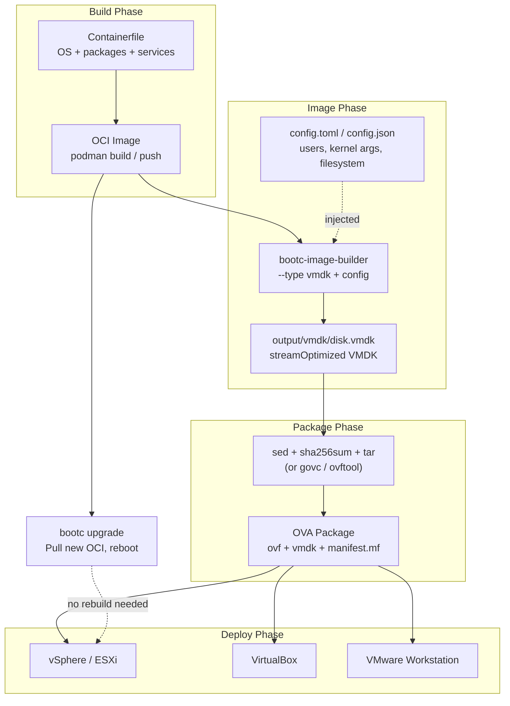

# Deploying and Upgrading

Covers the full lifecycle: building disk images, deploying to cloud/on-prem targets, upgrading running systems, and day-2 operations.

> **Pre-requisite reading:** [001-architecture-overview.md](001-architecture-overview.md) for the
> two-layer image design and [002-building-images.md](002-building-images.md) for how to build images.

## Table of Contents

- [Part A -- Getting Started](#part-a--getting-started)
- [Part B -- Artifacts and bootc-image-builder](#part-b--artifacts-and-bootc-image-builder)
- [Part C -- Deployment Targets](#part-c--deployment-targets)
- [Part D -- Upgrading a Running System](#part-d--upgrading-a-running-system)
- [Part E -- Release Scenarios](#part-e--release-scenarios)
- [Part F -- Operations and Debugging](#part-f--operations-and-debugging)
- [Part G -- Partition Planning](#part-g--partition-planning)
- [Tips and Checklist](#tips-and-checklist)
- [Quick Reference](#quick-reference)

---

## Part A -- Getting Started

## 1. Prerequisites

Before starting, ensure you have:

| Requirement | Details |
|-------------|---------|
| **AWS account** | With permissions for EC2, S3, IAM |
| **EC2 builder instance** | For AMI creation: **t3.large** or larger, with **podman** installed, running as root |
| **VM Import service role** | Configured for S3/EC2 import (see [AWS VM Import prerequisites](https://docs.aws.amazon.com/vm-import/latest/userguide/vmie_prereqs.html)) |
| **S3 bucket** | For bootc-image-builder intermediate artifacts |
| **Go 1.25+** | For building apps locally (`go version`) |
| **GitHub account** | With access to GitHub Container Registry (GHCR) |

---

## 2. Clone Repo and Explore Structure

```bash
git clone https://github.com/duyhenryer/bootc-testboot.git
cd bootc-testboot
```

### Project structure

```
bootc-testboot/
├── base/
│   ├── rootfs/                   # Base OS config overlay (SSH, sysctl, systemd)
│   ├── centos/stream9/Containerfile
│   ├── centos/stream10/Containerfile
│   ├── fedora/40/Containerfile
│   └── fedora/41/Containerfile
├── bootc/
│   ├── libs/common/rootfs/       # Shared libraries and scripts
│   ├── apps/hello/rootfs/        # App config overlay (systemd unit, tmpfiles)
│   ├── services/nginx/rootfs/    # nginx config overlay
│   ├── services/mongodb/rootfs/  # MongoDB config overlay
│   ├── services/valkey/rootfs/   # Valkey config overlay
│   └── services/rabbitmq/rootfs/ # RabbitMQ config overlay (x86_64 only)
├── repos/
│   └── hello/                    # Go HTTP hello world
│       ├── main.go
│       ├── go.mod
│       └── main_test.go
├── output/                       # (gitignored) build artifacts
│   └── bin/                      # pre-built Go binaries
├── builder/                      # bootc-image-builder configs (per format)
│   ├── ami/config.toml
│   ├── gce/config.toml
│   ├── qcow2/config.toml
│   ├── vmdk/config.toml
│   ├── ova/bootc-testboot.ovf
│   └── README.md
├── .github/workflows/
│   ├── build-base.yml            # Base image CI (weekly/manual)
│   ├── build-bootc.yml           # App image CI (push to main)
│   ├── build-artifacts.yml       # Disk artifact generation (manual dispatch)
│   └── ci.yml                    # PR checks (build, lint, test)
├── Containerfile                 # Layer 2: app image
└── Makefile                      # Local dev targets (apps/test/build/lint/clean)
```

---

## 3. Run Tests Locally

```bash
make test
```

**Expected output:**

```
==> Testing repos/hello/
=== RUN   TestHandleRoot
--- PASS: TestHandleRoot (0.00s)
=== RUN   TestHandleHealth
--- PASS: TestHandleHealth (0.00s)
PASS
ok      hello   0.002s
```

---

## 4. Build bootc Image

```bash
make build
```

This runs two steps automatically:

1. **`make apps`** — compiles all Go apps under `repos/*/` to `output/bin/` (static binaries, CGO disabled).
2. **`podman build`** — assembles the OS image from the base OCI image, copying pre-built binaries + `bootc/apps/*/rootfs/` and `bootc/services/*/rootfs/` overlays.

**Expected output:**

```
==> Building hello
STEP 1/14: FROM quay.io/fedora/fedora-bootc:41
...
STEP 14/14: RUN bootc container lint
COMMIT ghcr.io/duyhenryer/bootc-testboot:dev
--> 7a3b2c1d4e5f
Successfully tagged ghcr.io/duyhenryer/bootc-testboot:dev
```

---

## 5. Push to GHCR (CI only)

Pushing to GHCR is handled **automatically by GitHub Actions** when you merge to `main`. There is no need to login or push locally.

The workflow (`.github/workflows/build-bootc.yml`) builds the image with `podman build` then pushes using the built-in `GITHUB_TOKEN` — no PAT or manual credentials required.

---

## 6. Create Disk Images (CI only)

Disk images (AMI, VMDK, OVA, QCOW2, ISO) are built in CI, not locally. Use `workflow_dispatch` on `build-artifacts.yml`:

1. Go to **Actions** > **Build disk artifacts** > **Run workflow**
2. Select distro, platforms, and fill in `formats` (e.g. `qcow2,vmdk,ami`)
3. The workflow builds disk images and pushes them as OCI scratch artifacts to GHCR

### Pulling and deploying disk artifacts

For step-by-step extraction and deployment instructions (AWS, GCP, VMware, bare metal), see [003-deploying-and-upgrading.md](003-deploying-and-upgrading.md). That document covers:

- How to extract disk files from OCI artifacts (`podman create` + `podman cp`)
- Artifact path reference table for all formats (AMI, QCOW2, VMDK, OVA, ISO)
- Complete deployment walkthroughs for AWS EC2 and GCP

---

## 7. Launch EC2 from AMI

This project does not include Terraform. Launch manually:

**AWS Console:**
1. EC2 → Launch instance
2. Select **My AMIs** → choose `bootc-testboot-dev`
3. Instance type: t3.small or larger
4. Configure security group (SSH 22, HTTP 80, 8000 for hello)
5. Attach IAM instance profile with **SSM** permissions (for Session Manager)

**AWS CLI:**

```bash
aws ec2 run-instances \
  --image-id ami-0123456789abcdef0 \
  --instance-type t3.small \
  --key-name my-key \
  --security-group-ids sg-xxxxx \
  --iam-instance-profile Name=SSMInstanceProfile
```

---

## 8. Verify Instance

Connect via **AWS Systems Manager Session Manager** (or SSH if configured):

```bash
aws ssm start-session --target i-0123456789abcdef0
```

On the instance there is **no** project `Makefile` — the OS is the bootc deployment, not a dev checkout. Verify by hand. For production-safe upgrades, rollbacks, debugging, and emergencies on the host, continue to [Part B](#part-b--operations-runbook) below.

```bash
# Booted image and deployment
sudo bootc status

# Expected services (adjust names to match your image)
systemctl is-active nginx hello.service sshd chronyd || true

# HTTP (nginx → hello on 8000, if configured)
curl -sf -o /dev/null -w "%{http_code}\n" http://127.0.0.1/ || true
curl -sf http://127.0.0.1:8000/health || true

# Immutable /usr
touch /usr/bin/.test 2>&1 || echo "/usr is not writable (expected)"
```

**Registry audit (on your laptop, not on the VM):** after CI publishes to GHCR, run `make verify-ghcr` or `./scripts/verify-ghcr-packages.sh` to pull and verify artifact images — [005-ghcr-audit-and-post-deploy.md](005-ghcr-audit-and-post-deploy.md).

---

## 9. Adding a New App

Example: add `repos/api/` alongside `repos/hello/`.

### Step 1: Create app layout

```
repos/api/
├── main.go
├── main_test.go
├── go.mod
└── rootfs/
    ├── usr/lib/systemd/system/api.service
    └── usr/lib/tmpfiles.d/api.conf
```

### Step 2: Update Containerfile

Add COPY + enable lines (the binary is auto-built by `make apps`):

```dockerfile
COPY bootc/apps/api/rootfs/ /
RUN systemctl enable api
```

### Step 3: Rebuild and test locally

```bash
make build    # auto-discovers repos/api/, builds binary, assembles OS image
make lint     # verify bootc compliance
```

Push to `main` to trigger CI build. Use `workflow_dispatch` for disk artifacts. On existing instances, use the upgrade flow in [Part B §1](#1-upgrade-os-production-safe).


## Part B -- Artifacts and bootc-image-builder


### Local build prerequisites (Option A)

Option A requires a bootc OCI image built from this repo. If you have not built one yet, do it first. You can use Make **or** podman directly:

**Using Make (recommended):**

```bash
make base                    # Layer 1: base OS image (default BASE_DISTRO=centos-stream9)
make build                   # Layer 2: app image (Containerfile)
```

`make base` builds **one** base at a time. Valid `BASE_DISTRO` values (same as CI): `centos-stream9`, `centos-stream10`, `fedora-40`, `fedora-41`.

**Build more than one base OS**

```bash
# Single distro (example)
make base BASE_DISTRO=centos-stream10

# All four bases in one shell loop (matches Makefile ALL_DISTROS)
for d in centos-stream9 centos-stream10 fedora-40 fedora-41; do
  make base BASE_DISTRO="$d"
done
```

Layer 2 follows the same variable: run `make build BASE_DISTRO=<distro>` for each app image you need. Override `VERSION` / `BASE_IMAGE_VERSION` if you are not using `latest`.

**Optional — validate every base + one app image:** `make audit` runs `make base` for each distro, runs `bootc container lint` on each base image, then `make build` for the default `BASE_DISTRO` (centos-stream9 unless you override) and lints the app image. Use it when you want a full local quality pass, not only “build all bases.”

**Using podman directly:**

```bash
# Layer 1: base image
podman build -f base/centos/stream9/Containerfile \
    -t ghcr.io/duyhenryer/bootc-testboot/base/centos-stream9:latest .

# Layer 2: app image
podman build \
    --build-arg IMAGE_ROOT=ghcr.io/duyhenryer/bootc-testboot \
    --build-arg BASE_DISTRO=centos-stream9 \
    --build-arg BASE_IMAGE_VERSION=latest \
    -t ghcr.io/duyhenryer/bootc-testboot/centos-stream9:latest \
    -f Containerfile .
```

Change `centos/stream9` to your target distro (`centos/stream10`, `fedora/40`, `fedora/41`), and keep **Containerfile path**, **`BASE_DISTRO`**, and **image tags** (`…/base/<distro>:…` and `…/<distro>:…`) aligned. See [Makefile](../../Makefile) for all variables.

After building, verify with `podman images | grep bootc-testboot`. Then proceed to the deployment section for your target (AWS, GCE, VMware).

After a VM is up (e.g. EC2), use [004-testing-guide.md](004-testing-guide.md) — **Post-deploy audit** — to check `systemd` failed units, app health, MongoDB init, symlinks, and **`hello` log files** (`hello.log`, `healthcheck.log` under `/var/log/bootc-testboot/hello/`).

---

## 1. How Artifacts Work

### What is an OCI artifact?

When CI runs `bootc-image-builder`, it produces a disk file (e.g. `disk.raw`, `disk.qcow2`). That file is then packaged into a minimal container image (`FROM scratch` + `COPY . /`) and pushed to GHCR. This means you can use normal `podman pull` to download disk images, just like pulling any container image.

### Image naming and tags

Pattern (path-style on GHCR):

- Base: `ghcr.io/duyhenryer/bootc-testboot/base/<distro>:<tag>`
- App (bootc): `ghcr.io/duyhenryer/bootc-testboot/<distro>:<tag>`
- Disk artifact: `ghcr.io/duyhenryer/bootc-testboot/<distro>/<format>:<tag>` (e.g. `qcow2`, `ami`)

| Tag | Meaning |
|-----|---------|
| `latest` | Latest build from `main` (merge) |
| `1.0.1` | Semver from git tag / release workflow |

CI builds **linux/amd64** only. To pull explicitly: `podman pull --platform linux/amd64 <image>:latest`.

### Artifact path reference

The disk file path **inside** the OCI container depends on the format. These paths have been verified against the actual CI output:

| Format | Path segment | Path inside container | Example image |
|--------|----------------|----------------------|---------------|
| AMI | `ami` | `/image/disk.raw` | `.../bootc-testboot/centos-stream9/ami:latest` |
| QCOW2 | `qcow2` | `/qcow2/disk.qcow2` | `.../bootc-testboot/centos-stream9/qcow2:latest` |
| Raw (for GCE) | `raw` | `/image/disk.raw` | `.../bootc-testboot/centos-stream9/raw:latest` |
| VMDK | `vmdk` | `/vmdk/disk.vmdk` | `.../bootc-testboot/centos-stream9/vmdk:latest` |
| OVA | `ova` | `/*.ova` | `.../bootc-testboot/centos-stream9/ova:latest` |
| Anaconda ISO | `anaconda-iso` | `/bootiso/disk.iso` | `.../bootc-testboot/centos-stream9/anaconda-iso:latest` |

To verify all published images and these paths automatically, run [005-ghcr-audit-and-post-deploy.md](005-ghcr-audit-and-post-deploy.md) (`./scripts/verify-ghcr-packages.sh` or `make verify-ghcr`).

### How to extract a disk file (generic steps)

This 3-step pattern works for any format:

```bash
# 1. Pull the artifact image
podman pull ghcr.io/duyhenryer/bootc-testboot/centos-stream9/qcow2:latest

# 2. Create a temporary container (the image has no OS, so we use /bin/true as a dummy command)
ctr=$(podman create ghcr.io/duyhenryer/bootc-testboot/centos-stream9/qcow2:latest /bin/true)

# 3. Copy the disk file out of the container
mkdir -p output/qcow2
podman cp "$ctr":/qcow2/disk.qcow2 output/qcow2/disk.qcow2

# 4. Clean up
podman rm "$ctr"
```

Change the image name and path to match your format (see the table above).

> **Why `/bin/true`?** These are `FROM scratch` images with no operating system inside. `podman create` requires an entrypoint, but we never actually run the container -- we just use it to access the filesystem layer. `/bin/true` is a dummy value that satisfies the requirement.

### Auditing an artifact image

To see everything inside an artifact image without extracting:

```bash
ctr=$(podman create ghcr.io/duyhenryer/bootc-testboot/centos-stream9/ami:latest /bin/true)
podman export "$ctr" | tar -t
podman rm "$ctr"
```

---

## 2. bootc-image-builder Reference

bootc-image-builder is a **container** that converts bootc OCI images into disk images. You run it with podman; it uses [osbuild](https://osbuild.org/docs/bootc/) under the hood to produce QCOW2, AMI, VMDK, raw, and other formats.

**Sources:**
- [bootc-image-builder (GitHub)](https://github.com/osbuild/bootc-image-builder)
- [osbuild: bootc-image-builder](https://osbuild.org/docs/bootc/)

### Tool prerequisites

| Requirement | Notes |
|-------------|-------|
| **podman** | Required. Use package manager on Linux or Podman Desktop on macOS/Windows |
| **--privileged** | Required. Cannot run in ECS/Fargate or other restricted environments |
| **osbuild-selinux** | Required on SELinux-enforced systems (e.g. Fedora, RHEL) |
| **Rootful podman** | On macOS, run `podman machine set --rootful` before starting |

### Supported flags

Reference: [osbuild.org/docs/bootc](https://osbuild.org/docs/bootc/)

| Flag | Description | Default |
|------|-------------|---------|
| `--type` | Image type (can be passed multiple times) | qcow2 |
| `--rootfs` | Root filesystem type: ext4, xfs, btrfs | from source image |
| `--config` | Path to config.toml or config.json inside the container | /config.toml |
| `--chown` | chown output directory to UID:GID | (none) |
| `--target-arch` | Build for a different architecture (experimental) | host arch |
| `--output` | Artifact output directory | `.` |
| `--progress` | Progress bar: verbose, term, debug | auto |
| `--use-librepo` | Use librepo for RPM downloads (faster) | false |
| `--log-level` | Logging level: debug, info, error | error |
| `-v, --verbose` | Verbose output (implies --log-level=info) | false |

> **Note:** There is no `--size` flag. Disk sizing is controlled via `[[customizations.filesystem]]` in config.toml. See [Build config](#build-config-configtoml) below.

### Image types

| Type | Target |
|------|--------|
| `ami` | Amazon Machine Image |
| `qcow2` (default) | QEMU/KVM |
| `vmdk` | vSphere, VMware |
| `vhd` | Virtual PC, Hyper-V |
| `gce` | Google Compute Engine |
| `raw` | Raw disk |
| `bootc-installer` | Installer ISO |
| `anaconda-iso` | Anaconda installer ISO |

Pass multiple types: `--type qcow2 --type ami` (comma/space separation does not work).

### Volumes

| Volume | Purpose | Required |
|--------|----------|----------|
| `/output` | Artifact output directory | Yes (unless AMI auto-upload) |
| `/var/lib/containers/storage` | Container storage for image cache | Yes |
| `/store` | osbuild store cache | No |
| `/rpmmd` | DNF cache | No |

You must mount `/var/lib/containers/storage` so the builder can pull and reuse your bootc image.

### Build config (config.toml)

The config file is mounted at `/config.toml` (or `/config/config.toml` when mounting a directory). It follows the [Blueprint schema](https://github.com/osbuild/blueprint); bootc-image-builder supports a subset.

**Users:**

```toml
[[customizations.user]]
name = "devops"
password = "optional-plaintext"
key = "ssh-rsa AAAA... devops@company.com"
groups = ["wheel"]
```

Fields: `name` (required), `password`, `key`, `groups`.

**Filesystem (disk sizing and partitions):**

Disk sizing is controlled via `[[customizations.filesystem]]` in config.toml. There is no `--size` CLI flag.

```toml
[[customizations.filesystem]]
mountpoint = "/"
minsize = "10 GiB"

[[customizations.filesystem]]
mountpoint = "/var/data"
minsize = "50 GiB"
```

Rules:
- `/` -- root filesystem (mounted at `/sysroot` when booted)
- `/boot` -- boot partition
- Subdirectories of `/var` supported, e.g. `/var/data`
- `/var` itself cannot be a mountpoint
- Symlinks in `/var` (e.g. `/var/home`, `/var/run`) cannot be mountpoints
- If `--rootfs btrfs` is used, keep filesystem customizations to `/` and `/boot` only

Recommended filesystem strategy by deployment type:

| Deployment target | Builder config | Recommended profile |
|---|---|---|
| AWS AMI | `builder/ami/config.toml` | `cloud-minimal` (small `/`, data on EBS) |
| GCE (raw import) | `builder/gce/config.toml` | `cloud-minimal` (small `/`, data on Persistent Disk) |
| Generic raw | `builder/raw/config.toml` | `portable-minimal` |
| QCOW2 lab/KVM | `builder/qcow2/config.toml` | `portable-minimal` |
| VMware VMDK/OVA | `builder/vmdk/config.toml` | `onprem-stateful` (`/` + `/var/*` as needed) |

**Kernel arguments:**

```toml
[customizations.kernel]
append = "console=tty0 console=ttyS0,115200n8"
```

### Target architecture

Use `--target-arch` when building disk artifacts locally so the output matches the machine you need (e.g. `amd64` when building on an Apple Silicon Mac):

```bash
--target-arch amd64
```

The bootc OCI image and bootc-image-builder image must support the target arch. Check [Quay](https://quay.io/repository/centos-bootc/bootc-image-builder?tab=tags) for supported architectures. CI for this repo only produces **amd64** images; there is no published arm64 OCI image from these workflows.

For builder configs per format, see [builder/README.md](../../builder/README.md).

## Part C -- Deployment Targets


## 3. Deploying to AWS EC2 (AMI)

**Status: Tested**

The flow: bootc OCI image → raw disk → S3 → AMI → EC2 instance.

The image includes nginx, MongoDB 8.0, Valkey, and the hello app. RabbitMQ is included on x86_64 only (no upstream arm64 packages).

### Prerequisites

| Requirement | Notes |
|-------------|-------|
| **AWS CLI v2** | Installed and configured (`aws configure`) |
| **IAM permissions** | `s3:PutObject`, `s3:CreateBucket`, `ec2:RunInstances` + Method A: `ec2:ImportImage`, `ec2:DescribeImportImageTasks` + Method B: `ec2:ImportSnapshot`, `ec2:DescribeImportSnapshotTasks`, `ec2:RegisterImage` |
| **VM Import role** | The `vmimport` service role must exist -- see setup below |
| **podman** | Required for Option A (local build) and Option B (pulling from GHCR) |

### Setup: vmimport role and S3 policy

AWS requires a `vmimport` service role to import disk images. If you already have this role, skip to the policy step.

**Create the vmimport role** (one-time, per AWS account):

```bash
aws iam create-role --role-name vmimport --assume-role-policy-document '{
  "Version": "2012-10-17",
  "Statement": [
    {
      "Effect": "Allow",
      "Principal": { "Service": "vmie.amazonaws.com" },
      "Action": "sts:AssumeRole",
      "Condition": {
        "StringEquals": { "sts:ExternalId": "vmimport" }
      }
    }
  ]
}'
```

**Attach S3 access policy** (update the bucket name to match yours):

```bash
export BUCKET=bootc-testboot   # or your bucket name

aws iam put-role-policy \
  --role-name vmimport \
  --policy-name vmimport-s3-access \
  --policy-document "{
    \"Version\": \"2012-10-17\",
    \"Statement\": [
      {
        \"Effect\": \"Allow\",
        \"Action\": [
          \"s3:GetBucketLocation\",
          \"s3:GetObject\",
          \"s3:ListBucket\"
        ],
        \"Resource\": [
          \"arn:aws:s3:::${BUCKET}\",
          \"arn:aws:s3:::${BUCKET}/*\"
        ]
      },
      {
        \"Effect\": \"Allow\",
        \"Action\": [
          \"ec2:ModifySnapshotAttribute\",
          \"ec2:CopySnapshot\",
          \"ec2:RegisterImage\",
          \"ec2:Describe*\"
        ],
        \"Resource\": \"*\"
      }
    ]
  }"
```

**Verify:**

```bash
aws iam get-role --role-name vmimport
aws iam get-role-policy --role-name vmimport --policy-name vmimport-s3-access
```

Reference: [AWS VM Import Service Role](https://docs.aws.amazon.com/vm-import/latest/userguide/required-permissions.html)

### Option A: Build locally (A to Z)

This builds everything on your machine -- from Containerfile to deployable disk image.

**Step 1: Build the bootc OCI image**

If you have not built the image yet, follow [Local build prerequisites](#local-build-prerequisites-option-a) at the top of this document. Verify the image exists:

```bash
podman images | grep bootc-testboot
```

**Step 2: Copy to root podman storage**

`bootc-image-builder` runs with `sudo` and uses root's container storage, not your user storage. Copy the image across:

```bash
podman save ghcr.io/duyhenryer/bootc-testboot/centos-stream9:latest | sudo podman load
```

**Step 3: Build the raw disk**

Run from the **repository root**. Use `$(pwd)` so paths resolve correctly with `sudo`:

```bash
mkdir -p output/ami
sudo podman run --rm --privileged \
    --security-opt label=type:unconfined_t \
    -v /var/lib/containers/storage:/var/lib/containers/storage \
    -v "$(pwd)/builder/ami":/config:ro \
    -v "$(pwd)/output/ami":/output \
    quay.io/centos-bootc/bootc-image-builder:latest \
    --type ami --rootfs ext4 \
    --chown $(id -u):$(id -g) \
    --config /config/config.toml \
    ghcr.io/duyhenryer/bootc-testboot/centos-stream9:latest
```

Output: `output/ami/image/disk.raw`

> Disk size is controlled by `[[customizations.filesystem]]` in `builder/ami/config.toml`. For AWS, keep the root volume small and attach EBS volumes for data (e.g. `/var/lib/mongodb`).
>
> **`--chown`** makes output files owned by your user instead of root.
>
> **Gotcha:** `builder/ami/config.toml` must be a **regular file**, not a symlink. If it's a symlink, the container can't follow it (the symlink target is outside the mounted volume). The config includes AWS-tuned kernel args: `nvme_core.io_timeout=4294967295` for Nitro NVMe and `console=ttyS0` for EC2 serial console.

### Option B: Pull from GHCR

If CI has already built the AMI artifact, pull and extract it:

```bash
podman pull ghcr.io/duyhenryer/bootc-testboot/centos-stream9/ami:latest

mkdir -p output/ami/image
ctr=$(podman create ghcr.io/duyhenryer/bootc-testboot/centos-stream9/ami:latest /bin/true)
podman cp "$ctr":/image/disk.raw output/ami/image/disk.raw
podman rm "$ctr"
```

### Upload and deploy

AWS offers two ways to turn a disk image in S3 into a launchable AMI:

| | import-snapshot (recommended for bootc) | import-image (standard Linux only) |
|---|---|---|
| **Result** | EBS snapshot → register as AMI | AMI created directly |
| **AWS commands** | 6: `s3 cp` → `import-snapshot` → `describe-import-snapshot-tasks` → `register-image` → `run-instances` | 4: `s3 cp` → `import-image` → `describe-import-image-tasks` → `run-instances` |
| **Disk formats** | raw, VMDK, VHD, VHDX | raw, VMDK, VHD, VHDX, OVA |
| **OS detection** | None -- you specify architecture and boot mode manually | Yes -- AWS scans the disk to detect the OS |
| **When to use** | **bootc/ostree images (required).** Also useful when you need fine control over AMI flags | Standard Linux VMs (Fedora, RHEL, Ubuntu) with conventional filesystem. **Does NOT work with bootc/ostree images.** |

> **Why does import-image fail with bootc?**
>
> The disk image IS bootable -- `bootc-image-builder --type ami` produces a proper GPT partition table, EFI System Partition with GRUB, and kernel + initramfs. The EC2 instance boots fine once the AMI exists.
>
> The problem is AWS's **OS detection during import**:
>
> 1. `import-image` mounts the root filesystem and scans for OS markers (`/etc/os-release`, standard directory layout, bootloader config)
> 2. bootc/ostree images mount the real root at `/sysroot`, then bind-mount a specific deployment to `/` -- there is no traditional `/boot` with GRUB config in the expected location
> 3. AWS scanner sees the ostree layout and reports: `CLIENT_ERROR: Unknown OS / Missing OS files`
>
> `import-snapshot` bypasses this entirely. It imports the raw disk as an EBS snapshot without any OS detection. You then register the AMI yourself via `register-image`, specifying `--boot-mode uefi` -- and the VM boots normally because the disk IS properly bootable.

Reference: [AWS VM Import/Export comparison](https://docs.aws.amazon.com/vm-import/latest/userguide/vmimport-differences.html)

#### Method A: import-snapshot (recommended for bootc)

This is the recommended method for bootc images. It bypasses AWS OS detection (which fails on ostree-based filesystems) and gives you full control over AMI registration flags (`--boot-mode`, `--architecture`, etc.).

```bash
# Step 1: Set your region and create an S3 bucket
export AWS_REGION=ap-southeast-1
export BUCKET=bootc-testboot
aws s3 mb "s3://${BUCKET}" --region "$AWS_REGION"   # skip if bucket already exists

# Step 2: Upload the raw disk to S3
# Both Option A and Option B produce the file at output/ami/image/disk.raw
aws s3 cp output/ami/image/disk.raw "s3://${BUCKET}/bootc-testboot.raw"

# Step 3: Import as EBS snapshot (bypasses OS detection)
aws ec2 import-snapshot \
    --region "$AWS_REGION" \
    --description "bootc-testboot CentOS Stream 9" \
    --disk-container "Format=raw,UserBucket={S3Bucket=${BUCKET},S3Key=bootc-testboot.raw}"
# Output contains ImportTaskId, e.g. "import-snap-0123456789abcdef0"

# Step 4: Wait for the import to finish (5-15 minutes)
# Re-run this command until Status shows "completed":
aws ec2 describe-import-snapshot-tasks \
    --region "$AWS_REGION" \
    --import-task-ids import-snap-XXXXX
# When done, note the SnapshotId from SnapshotTaskDetail (e.g. "snap-0123456789abcdef0")

# Step 5: Register the snapshot as an AMI
aws ec2 register-image \
    --region "$AWS_REGION" \
    --name "bootc-testboot-centos9-$(date +%Y%m%d)" \
    --description "bootc CentOS Stream 9 - hello + nginx + MongoDB + Valkey" \
    --architecture x86_64 \
    --root-device-name /dev/xvda \
    --virtualization-type hvm \
    --ena-support \
    --boot-mode uefi \
    --block-device-mappings "DeviceName=/dev/xvda,Ebs={SnapshotId=snap-XXXXX,VolumeType=gp3}"
# Output contains ImageId (e.g. "ami-0123456789abcdef0")

# Step 6: Launch an EC2 instance
aws ec2 run-instances \
    --region "$AWS_REGION" \
    --image-id ami-XXXXX \
    --instance-type t3.medium \
    --key-name YOUR_KEY_PAIR \
    --security-group-ids sg-XXXXX \
    --subnet-id subnet-XXXXX \
    --iam-instance-profile Arn=arn:aws:iam::ACCOUNT_ID:instance-profile/AmazonSSMManagedInstanceCore \
    --block-device-mappings "DeviceName=/dev/xvda,Ebs={VolumeSize=20,VolumeType=gp3}" \
    --tag-specifications 'ResourceType=instance,Tags=[{Key=Name,Value=bootc-testboot}]'
```

Replace `XXXXX` placeholders with the actual IDs from the output of each previous step.

| Flag | Why |
|------|-----|
| `--key-name` | SSH key pair for direct SSH access |
| `--iam-instance-profile` | Attach SSM role so you can connect via AWS Systems Manager Session Manager (no public IP needed). Remove if not using SSM. |
| `--block-device-mappings VolumeSize=20` | Override root EBS volume to 20 GiB. The AMI's snapshot is ~12 GiB; this gives headroom for MongoDB data, logs, etc. Adjust as needed. |

> **VMDK format also works.** If you built with `--type vmdk` instead of `--type ami`, change `"Format":"raw"` to `"Format":"vmdk"` and the S3 key accordingly.

If you ever use an **aarch64** disk produced outside this repo’s CI, use `--architecture arm64` in `register-image` and a Graviton instance type (e.g. `t4g.medium`). RabbitMQ is not packaged for aarch64 on the same mirrors as x86_64.

#### Method B: import-image (standard Linux only)

> **Warning:** `import-image` does **NOT work** with bootc/ostree images. It will fail with `CLIENT_ERROR: Unknown OS / Missing OS files`. Use **Method A: import-snapshot** above instead. This method is documented for reference only -- it works for traditional Linux VMs with conventional filesystem layout.

This is the simpler path for standard Linux images. One command creates the AMI directly -- no `register-image` needed.

```bash
# Step 1: Set your region and create an S3 bucket
export AWS_REGION=ap-southeast-1
export BUCKET=bootc-testboot-$(date +%Y%m%d)
aws s3 mb "s3://${BUCKET}" --region "$AWS_REGION"

# Step 2: Upload the raw disk to S3
aws s3 cp output/ami/image/disk.raw "s3://${BUCKET}/bootc-testboot.raw"

# Step 3: Import directly as AMI
aws ec2 import-image \
    --region "$AWS_REGION" \
    --description "bootc-testboot CentOS Stream 9" \
    --license-type BYOL \
    --disk-containers "[{\"Format\":\"raw\",\"UserBucket\":{\"S3Bucket\":\"${BUCKET}\",\"S3Key\":\"bootc-testboot.raw\"}}]"
# Output contains ImportTaskId, e.g. "import-ami-0123456789abcdef0"

# Step 4: Wait for the import to finish
aws ec2 describe-import-image-tasks \
    --region "$AWS_REGION" \
    --import-task-ids import-ami-XXXXX
# When done, the output contains ImageId (e.g. "ami-0123456789abcdef0")

# Step 5: Launch an EC2 instance
aws ec2 run-instances \
    --region "$AWS_REGION" \
    --image-id ami-XXXXX \
    --instance-type t3.medium \
    --key-name YOUR_KEY_PAIR \
    --security-group-ids sg-XXXXX \
    --subnet-id subnet-XXXXX \
    --iam-instance-profile Arn=arn:aws:iam::ACCOUNT_ID:instance-profile/AmazonSSMManagedInstanceCore \
    --block-device-mappings "DeviceName=/dev/xvda,Ebs={VolumeSize=20,VolumeType=gp3}" \
    --tag-specifications 'ResourceType=instance,Tags=[{Key=Name,Value=bootc-testboot}]'
```

For an aarch64 disk image, use a Graviton instance type (e.g. `t4g.medium`). `import-image` detects the architecture automatically. This project’s CI does not publish arm64 artifacts.

### Connect and verify

**Via SSM** (private subnet, no public IP needed):

```bash
aws ssm start-session --target i-XXXXX --region "$AWS_REGION"
```

**Via SSH** (public subnet with public IP):

```bash
ssh -i ~/.ssh/YOUR_KEY.pem devops@EC2_PUBLIC_IP

systemctl status hello nginx mongod valkey
curl -sf http://127.0.0.1:8000/health
```

If the security group allows inbound HTTP (port 80), nginx reverse-proxies to the hello app:

```bash
curl -sf http://EC2_PUBLIC_IP/
```

### Alternative: AMI auto-upload (skip S3 manually)

bootc-image-builder can upload the AMI directly to AWS if you pass `--aws-ami-name`, `--aws-bucket`, and `--aws-region` **together**. When all three are set, no `/output` mount is needed -- the image goes straight to AWS.

The S3 bucket must already exist, and the [vmimport service role](https://docs.aws.amazon.com/vm-import/latest/userguide/required-permissions.html) must be configured.

**Credentials via `$HOME/.aws`:**

```bash
sudo podman run \
  --rm --privileged \
  --security-opt label=type:unconfined_t \
  -v $HOME/.aws:/root/.aws:ro \
  -v /var/lib/containers/storage:/var/lib/containers/storage \
  --env AWS_PROFILE=default \
  quay.io/centos-bootc/bootc-image-builder:latest \
  --type ami --rootfs ext4 \
  --aws-ami-name bootc-testboot-ami \
  --aws-bucket YOUR_BOOTC_IMPORT_BUCKET \
  --aws-region us-east-1 \
  ghcr.io/duyhenryer/bootc-testboot/centos-stream9:latest
```

**Credentials via env-file (recommended for CI):**

Never pass secrets via `--env AWS_ACCESS_KEY_ID=xxx` -- they leak in process lists. Use `--env-file` instead:

```bash
# aws.secrets (chmod 600, add to .gitignore)
AWS_ACCESS_KEY_ID=AKIA...
AWS_SECRET_ACCESS_KEY=...

sudo podman run \
  --rm --privileged \
  --security-opt label=type:unconfined_t \
  -v /var/lib/containers/storage:/var/lib/containers/storage \
  --env-file=aws.secrets \
  quay.io/centos-bootc/bootc-image-builder:latest \
  --type ami --rootfs ext4 \
  --aws-ami-name bootc-testboot-ami \
  --aws-bucket YOUR_BOOTC_IMPORT_BUCKET \
  --aws-region us-east-1 \
  ghcr.io/duyhenryer/bootc-testboot/centos-stream9:latest
```

---

## 4. Deploying to Google Cloud Platform (GCE)

**Status: Tested**

GCP requires a `.tar.gz` containing exactly one file named `disk.raw`. The flow: bootc OCI image → raw disk → tar.gz → GCS → GCE image → VM instance.

### Prerequisites

| Requirement | Notes |
|-------------|-------|
| **gcloud CLI** | Installed and authenticated (`gcloud auth login`) |
| **gsutil** | Included with gcloud SDK |
| **GCS bucket** | Must exist in your project |
| **IAM permissions** | `roles/compute.imageAdmin` + `roles/storage.objectAdmin` |
| **podman** | Required for building and extracting |

### Option A: Build locally (A to Z)

**Step 1: Build the bootc OCI image**

If you have not built the image yet, follow [Local build prerequisites](#local-build-prerequisites-option-a) at the top of this document.

**Step 2: Copy to root podman storage**

```bash
podman save ghcr.io/duyhenryer/bootc-testboot/centos-stream9:latest | sudo podman load
```

**Step 3: Build the raw disk and package for GCE**

```bash
mkdir -p output/gce
sudo podman run --rm --privileged \
    --security-opt label=type:unconfined_t \
    -v /var/lib/containers/storage:/var/lib/containers/storage \
    -v "$(pwd)/builder/gce":/config:ro \
    -v "$(pwd)/output/gce":/output \
    quay.io/centos-bootc/bootc-image-builder:latest \
    --type raw --rootfs ext4 \
    --chown $(id -u):$(id -g) \
    --config /config/config.toml \
    ghcr.io/duyhenryer/bootc-testboot/centos-stream9:latest

# Package for GCE (the tar.gz must contain exactly "disk.raw")
cd output/gce/image
tar -Szcf ../bootc-centos9.tar.gz disk.raw
```

### Option B: Pull from GHCR

```bash
podman pull ghcr.io/duyhenryer/bootc-testboot/centos-stream9/raw:latest

mkdir -p output/raw/image output/gce
ctr=$(podman create ghcr.io/duyhenryer/bootc-testboot/centos-stream9/raw:latest /bin/true)
podman cp "$ctr":/image/disk.raw output/raw/image/disk.raw
podman rm "$ctr"

tar -Szcf output/gce/bootc-centos9.tar.gz -C output/raw/image disk.raw
```

### Upload and deploy

```bash
# Upload to GCS
gsutil cp ./output/gce/bootc-centos9.tar.gz \
    gs://bootc-testboot-drive/bootc-centos9.tar.gz

# Create GCE custom image
gcloud compute images create "bootc-centos9-v4" \
    --project="skilled-box-481815-k8" \
    --source-uri="gs://bootc-testboot-drive/bootc-centos9.tar.gz" \
    --guest-os-features=UEFI_COMPATIBLE,VIRTIO_SCSI_MULTIQUEUE \
    --description="bootc CentOS Stream 9 - hello app + nginx + MongoDB 8.0 + Valkey + RabbitMQ"

# Create VM instance
gcloud compute instances create "vm-bootc-test" \
    --project="skilled-box-481815-k8" \
    --zone="asia-southeast1-a" \
    --machine-type="e2-small" \
    --image="bootc-centos9-v4" \
    --boot-disk-size=20GB \
    --tags=http-server,https-server
```

### SSH in and verify

```bash
gcloud compute ssh devops@vm-bootc-test \
    --project=skilled-box-481815-k8 \
    --zone=asia-southeast1-a \
    --command="systemctl status hello nginx mongod valkey rabbitmq-server && curl -sf http://127.0.0.1:8000/health"
```

### Bugs found and fixed

Issues discovered during GCE deployment:

| Bug | Fix |
|-----|-----|
| sudoers files had 664 permissions (must be 0440) | `chmod 0440` on sudoers.d files |
| MongoDB 8.0 removed `storage.journal.enabled` option | Removed obsolete config from `mongod.conf` |
| Valkey SELinux: `valkey_t` cannot read `usr_t` (config in `/usr/share/`) | systemd override reads Valkey config from `/usr/share/` directly instead of symlink |

---

## 5. Deploying to VMware (VMDK / OVA)

**Status: Tested in CI (build + package). vSphere import tested via govc and vSphere UI.**

The flow: bootc OCI image → VMDK disk → OVA package (OVF + VMDK + manifest) → vSphere / Workstation / VirtualBox.

`bootc-image-builder` does **not** have a `--type ova`. It builds a VMDK, and a second step packages that VMDK into an OVA archive. The CI pipeline does this automatically; the steps below show how to do it locally.

### What is an OVA?

An OVA is a tar archive containing three files:

| File | Purpose |
|------|---------|
| `*.ovf` | XML descriptor: VM name, CPU, RAM, disk size, SCSI controller, network, firmware (EFI) |
| `*.vmdk` | The actual disk image (streamOptimized format for network transfer) |
| `*.mf` | SHA256 checksums of the OVF and VMDK files |

The OVF template lives at [`builder/ova/bootc-testboot.ovf`](../../builder/ova/bootc-testboot.ovf). It uses placeholders (`CPU_COUNT`, `MEMORY_MB`, `DISK_SIZE_GB`, `VMDK_FILENAME`, `VMDK_SIZE`) that are filled in during packaging. See [`builder/README.md`](../../builder/README.md) for details on the OVF settings (EFI firmware, SCSI controller, hardware version). **Hardware version** defaults to **vmx-19** (vSphere 7.0+); lower it in the OVF if you must support older ESXi clusters.

### OVA build flow



### Prerequisites

| Requirement | Notes |
|-------------|-------|
| **podman** | Required for building and extracting |
| **vSphere access** | vCenter or ESXi host (for production deployment) |
| **govc** (optional) | Open-source Go CLI for vSphere. Install: `go install github.com/vmware/govmomi/govc@latest` or download from [GitHub releases](https://github.com/vmware/govmomi/releases) |
| **ovftool** (optional) | VMware proprietary CLI. Download from [VMware Developer](https://developer.broadcom.com/tools/open-virtualization-format-ovf-tool/latest) |

### Console login vs SSH (OVA / VMDK)

[`builder/vmdk/config.toml`](../../builder/vmdk/config.toml) injects user **`devops`** with an SSH **public key** and a **`password`** field (SHA-512 crypt) used for **local console** login (hypervisor VM console, serial), e.g. when you have not yet got a network path for SSH.

| Channel | How to authenticate |
|---------|---------------------|
| **VM console** (Xen Orchestra, vSphere console, serial) | User `devops` and the lab password documented in [`builder/README.md`](../../builder/README.md): **`BootcOvaConsoleDevAb`** — change with `passwd` after first login or replace the hash in [`builder/vmdk/config.toml`](../../builder/vmdk/config.toml) before production builds. |
| **SSH** | Still **private key** matching the `key = "..."` line in `config.toml`. The base image keeps [`PasswordAuthentication no`](../../base/rootfs/etc/ssh/sshd_config.d/99-hardening.conf), so SSH does not accept passwords unless you add a separate `sshd` drop-in. |

Baking a password into the disk image means **every VM** built from that `config.toml` shares it until you change it on the machine or rebuild with a new hash (see [`builder/README.md`](../../builder/README.md)).

### Option A: Build locally (A to Z)

**Step 1: Build the bootc OCI image**

If you have not built the image yet, follow [Local build prerequisites](#local-build-prerequisites-option-a) at the top of this document.

**Step 2: Copy to root podman storage**

```bash
podman save ghcr.io/duyhenryer/bootc-testboot/centos-stream9:latest | sudo podman load
```

**Step 3: Build the VMDK**

Run from the **repository root**. Use `$(pwd)` so paths resolve correctly with `sudo`:

```bash
mkdir -p output/vmdk
sudo podman run --rm --privileged \
    --security-opt label=type:unconfined_t \
    -v /var/lib/containers/storage:/var/lib/containers/storage \
    -v "$(pwd)/builder/vmdk":/config:ro \
    -v "$(pwd)/output/vmdk":/output \
    quay.io/centos-bootc/bootc-image-builder:latest \
    --type vmdk --rootfs ext4 \
    --chown $(id -u):$(id -g) \
    --config /config/config.toml \
    ghcr.io/duyhenryer/bootc-testboot/centos-stream9:latest
```

Output: `output/vmdk/vmdk/disk.vmdk`

**Step 4: Package the VMDK into an OVA**

This is the same process the CI uses. You need the OVF template from this repo and standard Linux tools (`sed`, `sha256sum`, `tar`):

```bash
# Configurable VM specs (adjust as needed)
CPU_COUNT=2
MEMORY_MB=4096
DISK_SIZE_GB=20
OVA_NAME="bootc-testboot"

# Locate the VMDK
VMDK_FILE=$(find output/vmdk -name '*.vmdk' | head -1)
VMDK_BASENAME=$(basename "$VMDK_FILE")
VMDK_SIZE=$(stat -c%s "$VMDK_FILE")

# Fill the OVF template placeholders
mkdir -p output/ova
sed -e "s/VMDK_FILENAME/${VMDK_BASENAME}/" \
    -e "s/VMDK_SIZE/${VMDK_SIZE}/" \
    -e "s/DISK_SIZE_GB/${DISK_SIZE_GB}/" \
    -e "s/CPU_COUNT/${CPU_COUNT}/g" \
    -e "s/MEMORY_MB/${MEMORY_MB}/g" \
    builder/ova/bootc-testboot.ovf > output/ova/${OVA_NAME}.ovf

# Copy the VMDK alongside the OVF
cp "$VMDK_FILE" output/ova/${VMDK_BASENAME}

# Create OVF-compliant manifest (SHA256)
cd output/ova
for f in ${OVA_NAME}.ovf ${VMDK_BASENAME}; do
  echo "SHA256($f)= $(sha256sum "$f" | awk '{print $1}')"
done > ${OVA_NAME}.mf

# Package into OVA (tar archive, no compression -- OVA spec requires plain tar)
tar cf ${OVA_NAME}.ova ${OVA_NAME}.ovf ${VMDK_BASENAME} ${OVA_NAME}.mf
echo "OVA created: ${OVA_NAME}.ova ($(du -h ${OVA_NAME}.ova | cut -f1))"
```

Output: `output/ova/bootc-testboot.ova`

### Option B: Pull from GHCR

If CI has already built the artifacts, pull and extract:

```bash
# Option 1: Pull the ready-made OVA
mkdir -p output/ova
podman pull ghcr.io/duyhenryer/bootc-testboot/centos-stream9/ova:latest
ctr=$(podman create ghcr.io/duyhenryer/bootc-testboot/centos-stream9/ova:latest /bin/true)
podman export "$ctr" | tar -xf - -C ./output/ova/
podman rm "$ctr"
# The .ova file is inside output/ova/

# Option 2: Pull just the VMDK (if you want to customize the OVF or skip OVA)
podman pull ghcr.io/duyhenryer/bootc-testboot/centos-stream9/vmdk:latest
mkdir -p output/vmdk/vmdk
ctr=$(podman create ghcr.io/duyhenryer/bootc-testboot/centos-stream9/vmdk:latest /bin/true)
podman cp "$ctr":/vmdk/disk.vmdk output/vmdk/vmdk/disk.vmdk
podman rm "$ctr"
```

### Deploy to vSphere

Three methods are available. Use whichever fits your environment.

#### Method 1: vSphere Web Client (UI)

1. Log in to vSphere Client (https://your-vcenter/ui)
2. Navigate to **Hosts and Clusters**
3. Right-click the target host or cluster > **Deploy OVF Template**
4. **Select an OVF template**: choose "Local file" and browse to the `.ova` file
5. **Select a name and folder**: enter a VM name (e.g. `bootc-testboot`)
6. **Select a compute resource**: pick the target host or resource pool
7. **Review details**: verify vCPU, RAM, disk size from the OVF
8. **Select storage**: choose a datastore; thin provisioning is recommended
9. **Select networks**: map "VM Network" to your port group
10. **Ready to complete**: review and click **Finish**
11. Wait for the deployment task to complete, then right-click the VM > **Power On**

#### Method 2: govc (open-source CLI)

```bash
# Set vSphere connection (add to ~/.bashrc or use env-file)
export GOVC_URL=https://vcenter.example.com/sdk
export GOVC_USERNAME=administrator@vsphere.local
export GOVC_PASSWORD='your-password'
export GOVC_INSECURE=true    # skip TLS verify for self-signed certs
export GOVC_DATASTORE=datastore1
export GOVC_NETWORK="VM Network"
export GOVC_RESOURCE_POOL=/datacenter/host/cluster/Resources

# Import the OVA
govc import.ova -name=bootc-testboot output/ova/bootc-testboot.ova

# Power on
govc vm.power -on bootc-testboot

# Get the VM IP (wait a few seconds for DHCP)
govc vm.ip bootc-testboot
```

To customize CPU/RAM at import time:

```bash
govc import.ova \
    -name=bootc-testboot \
    -options=<(echo '{"DiskProvisioning":"thin","NetworkMapping":[{"Name":"VM Network","Network":"your-portgroup"}]}') \
    output/ova/bootc-testboot.ova

govc vm.change -vm bootc-testboot -c 4 -m 8192
govc vm.power -on bootc-testboot
```

#### Method 3: ovftool (VMware proprietary)

```bash
# Deploy to vSphere
ovftool \
    --name=bootc-testboot \
    --net:"VM Network"="your-portgroup" \
    --datastore=datastore1 \
    --diskMode=thin \
    --powerOn \
    output/ova/bootc-testboot.ova \
    'vi://administrator@vsphere.local:password@vcenter.example.com/datacenter/host/cluster'

# Deploy to VMware Workstation (local)
ovftool output/ova/bootc-testboot.ova ~/vmware/bootc-testboot/bootc-testboot.vmx
```

### SSH in and verify

```bash
ssh -i ~/.ssh/YOUR_KEY.pem devops@VM_IP_ADDRESS

systemctl status hello nginx mongod valkey
curl -sf http://127.0.0.1:8000/health
```

> **Tip:** If the VM has no IP, check that the network adapter is connected and the port group has DHCP. Use `govc vm.ip -wait 60s bootc-testboot` to wait for the IP.

### Recommendation: open-vm-tools

For production VMware deployments, consider adding `open-vm-tools` and `cloud-init` to your Containerfile. These provide guest OS heartbeat reporting, graceful shutdown from vSphere, and VM customization (hostname, network) at first boot.

This project does **not** include them by default (they are unnecessary for AWS/GCE/bare metal). If your target is exclusively VMware, add them in a derived layer:

```dockerfile
FROM ghcr.io/duyhenryer/bootc-testboot/centos-stream9:latest

RUN dnf -y install open-vm-tools cloud-init && \
    ln -s ../cloud-init.target /usr/lib/systemd/system/default.target.wants/cloud-init.target && \
    systemctl enable vmtoolsd.service && \
    dnf clean all && rm -rf /var/cache/{dnf,ldconfig,libdnf5} /var/log/{dnf*,hawkey*} /var/lib/dnf
```

Then build your VMDK/OVA from this derived image instead of the base.

---

## 6. Bare Metal (Anaconda ISO)

**Status: Not yet tested end-to-end.** The CI builds Anaconda ISO artifacts.

### Pull from GHCR

```bash
podman pull ghcr.io/duyhenryer/bootc-testboot/centos-stream9/anaconda-iso:latest
mkdir -p output/anaconda-iso/bootiso
ctr=$(podman create ghcr.io/duyhenryer/bootc-testboot/centos-stream9/anaconda-iso:latest /bin/true)
podman cp "$ctr":/bootiso/disk.iso output/anaconda-iso/bootiso/disk.iso
podman rm "$ctr"
```

### Flash and boot

```bash
sudo dd if=output/anaconda-iso/bootiso/disk.iso of=/dev/sdX bs=4M status=progress
```

Boot the physical machine from the USB drive. The Anaconda installer automatically lays down the bootc image onto the hard drive.

---

## 7. Adding New Deployment Targets

All deployment targets follow the same two-option pattern:

1. **Option A (local):** `bootc-image-builder --type <format>` with a `builder/<format>/config.toml`
2. **Option B (CI):** Pull from `ghcr.io/duyhenryer/bootc-testboot-{distro}-{format}:{tag}` and extract using `podman cp`

For builder configs per format, see [builder/README.md](../../builder/README.md).

---

## 8. Running QCOW2 Locally

If you built a QCOW2 image (via `--type qcow2`), you can boot it locally without deploying to any cloud.

**With QEMU:**

```bash
qemu-system-x86_64 \
  -M accel=kvm \
  -cpu host \
  -smp 2 \
  -m 4096 \
  -bios /usr/share/OVMF/OVMF_CODE.fd \
  -serial stdio \
  -snapshot output/qcow2/disk.qcow2
```

**With virt-install:**

```bash
sudo virt-install \
  --name fedora-bootc \
  --cpu host \
  --vcpus 4 \
  --memory 4096 \
  --import --disk ./output/qcow2/disk.qcow2,format=qcow2 \
  --os-variant fedora-eln
```

---

## Part D -- Upgrading a Running System

> **Key concept:** OVA, QCOW2, AMI, and ISO are only for the **initial deployment**. Every
> subsequent update is an in-place `bootc upgrade` — no redeployment, no new VM, no data loss.

### How it works

bootc uses an **A/B deployment model** backed by OSTree. The running system has two deployment
slots. `bootc upgrade` downloads the new image, writes it to the inactive slot, and on reboot the
bootloader atomically switches to it. The old slot is kept for instant rollback.

```
┌─────────────────────────────────────────────────────────┐
│  Slot A (current, booted)      Slot B (staged, new)     │
│  centos-stream9:latest         centos-stream9:latest    │
│  sha256:aaa111...              sha256:bbb222...         │
│                                                         │
│  reboot → Slot B becomes active                         │
│  rollback → Slot A becomes active again                 │
└─────────────────────────────────────────────────────────┘
```

### Workflow: push code → upgrade VM

```bash
# === On your workstation ===
git push origin main          # CI builds + pushes new image to GHCR

# === On the running VM (SSH in) ===

# 1. Check what's available (no download, no reboot)
sudo bootc upgrade --check

# 2. Download + stage (no reboot, no downtime)
sudo bootc upgrade

# 3. Reboot to activate the new deployment
sudo reboot

# 4. Verify after reboot
bootc status                  # confirms new digest
sudo systemctl --failed       # should be empty
```

### Production-safe phased upgrade

For production VMs, split the upgrade into download and apply phases to control when the reboot
happens:

```bash
# Phase 1: Download during business hours (no impact)
sudo bootc upgrade --download-only

# Phase 2: Apply during maintenance window (triggers reboot)
sudo bootc upgrade --from-downloaded --apply
```

### Rollback

If the new image has a problem — instant rollback, no rebuild needed:

```bash
sudo bootc rollback
sudo reboot
```

After reboot the VM runs the previous image. Your data in `/var` (MongoDB, logs, credentials) is
**untouched** — it survives both upgrades and rollbacks.

### What changes and what doesn't

Understanding the filesystem lifecycle is critical for operating a bootc system. Getting this wrong
is the single most common cause of "upgrade broke my config" or "where did my data go" issues.

> **Pre-requisite:** [docs/bootc/003-filesystem-layout.md](../bootc/003-filesystem-layout.md)
> for the theory. This section is the practical mapping for **this project**.

#### Filesystem zones — summary

| Zone | On upgrade | On rollback | Operator should edit? |
|------|-----------|-------------|----------------------|
| `/usr` | **Replaced** entirely by new image | Swapped to previous image | **Never.** Read-only at runtime (composefs). All changes via Containerfile rebuild. |
| `/etc` | **3-way merged** — local changes preserved | Swapped to previous image | **Rarely.** Use only for machine-local overrides (drop-ins). Prefer image-shipped configs. |
| `/var` | **Untouched** — never overwritten | **Untouched** — never rolled back | **Yes** — this is persistent state. Data, logs, credentials live here. |
| `/run`, `/tmp` | Ephemeral — recreated every boot | N/A | Temporary only. Never store state here. |

#### `/usr` — read-only, image-managed (DO NOT touch at runtime)

Everything under `/usr` is **replaced atomically** on upgrade. Do not write to `/usr` on a running
system — it will be lost on the next `bootc upgrade` and may fail due to composefs.

| Runtime path | Source in repo | What it is |
|-------------|---------------|------------|
| `/usr/bin/hello` | `repos/hello/` → `output/bin/` | App binary |
| `/usr/share/nginx/nginx.conf` | `bootc/services/nginx/rootfs/` | Immutable nginx config |
| `/usr/share/mongodb/mongod.conf` | `bootc/services/mongodb/rootfs/` | Immutable MongoDB config |
| `/usr/share/valkey/valkey.conf` | `bootc/services/valkey/rootfs/` | Immutable Valkey config |
| `/usr/share/rabbitmq/rabbitmq.conf` | `bootc/services/rabbitmq/rootfs/` | Immutable RabbitMQ config |
| `/usr/lib/systemd/system/*.service` | `bootc/apps/*/rootfs/`, `bootc/services/*/rootfs/` | systemd units |
| `/usr/lib/tmpfiles.d/*.conf` | `bootc/*/rootfs/` | Directory creation rules for `/var` |
| `/usr/lib/sysusers.d/*.conf` | `bootc/*/rootfs/`, `base/rootfs/` | System user/group definitions |
| `/usr/lib/sysctl.d/99-production.conf` | `base/rootfs/` | Kernel tuning (somaxconn, file-max, etc.) |
| `/usr/libexec/testboot/*.sh` | `bootc/libs/common/rootfs/` | Shared scripts (log, gen-password, gen-tls-cert) |
| `/usr/share/selinux/targeted/*.pp` | Containerfile builder stage | SELinux policy modules |

**To change any of these:** edit the source file in the repo → rebuild image → push → `bootc upgrade`.

#### `/etc` — mutable, 3-way merged (use with caution)

`/etc` is machine-local config. On upgrade, bootc performs a **3-way merge**: changes you made
locally are preserved, changes from the new image are applied, and conflicts are flagged.

**This project symlinks most `/etc` configs to `/usr/share/` to make them immutable:**

| `/etc` path | Points to | Editable at runtime? |
|------------|-----------|---------------------|
| `/etc/nginx/nginx.conf` | → `/usr/share/nginx/nginx.conf` | **No** — symlink to read-only `/usr` |
| `/etc/nginx/conf.d/` | → `/usr/share/nginx/conf.d/` | **No** — symlink to read-only `/usr` |
| `/etc/mongod.conf` | → `/usr/share/mongodb/mongod.conf` | **No** — symlink to read-only `/usr` |
| `/etc/valkey/valkey.conf` | → `/usr/share/valkey/valkey.conf` | **No** — symlink to read-only `/usr` |
| `/etc/rabbitmq/rabbitmq.conf` | → `/usr/share/rabbitmq/rabbitmq.conf` | **No** — symlink to read-only `/usr` |

**These `/etc` files ARE editable at runtime (they are real files, not symlinks):**

| `/etc` path | Source | Safe to edit? | Notes |
|------------|--------|--------------|-------|
| `/etc/ssh/sshd_config.d/99-hardening.conf` | `base/rootfs/` | Yes (drop-in) | Add your own `98-*.conf` drop-in instead of editing this one |
| `/etc/chrony.d/99-custom.conf` | `base/rootfs/` | Yes (drop-in) | NTP configuration |
| `/etc/systemd/journald.conf.d/99-production.conf` | `base/rootfs/` | Yes (drop-in) | Journal retention and compression |
| `/etc/systemd/system.conf.d/99-limits.conf` | `base/rootfs/` | Yes (drop-in) | DefaultLimitNOFILE, DefaultTasksMax |
| `/etc/sudoers.d/wheel-nopasswd` | `base/rootfs/` | Caution | Passwordless sudo for wheel group |
| `/etc/selinux/targeted/` | Build-time `semodule` | **No** — managed by image build | Policy compiled at build time, merged on upgrade |

> **Best practice:** if you need to override a config at runtime, create a **new** drop-in file
> (e.g. `/etc/ssh/sshd_config.d/50-local.conf`) rather than editing the image-shipped file.
> Drop-ins are additive and survive upgrades cleanly. Editing the shipped file risks merge
> conflicts.

#### `/var` — persistent state (survives upgrade AND rollback)

`/var` is **never touched by bootc** — not on upgrade, not on rollback, not on image replacement.
It is the single source of truth for all runtime state. Directories are created by `tmpfiles.d`
on first boot.

| `/var` path | Owner | What it holds | Survives upgrade? | Survives rollback? |
|------------|-------|--------------|-------------------|-------------------|
| `/var/lib/mongodb/` | `mongod` | Database files, journals | Yes | Yes |
| `/var/lib/mongodb/tls/` | `mongod` | TLS certs (ca.pem, server.pem) | Yes | Yes |
| `/var/lib/mongodb/.admin-pw` | `mongod` | Admin password (generated on first boot) | Yes | Yes |
| `/var/lib/mongodb/.keyFile` | `mongod` | Replica set internal auth key | Yes | Yes |
| `/var/lib/mongodb/.setup-done` | `mongod` | Flag: credential setup completed | Yes | Yes |
| `/var/lib/mongodb/.rs-initialized` | `mongod` | Flag: rs0 + admin user created | Yes | Yes |
| `/var/log/mongodb/mongod.log` | `mongod` | MongoDB runtime log | Yes | Yes |
| `/var/lib/valkey/` | `valkey` | RDB snapshots, AOF logs | Yes | Yes |
| `/var/log/valkey/` | `valkey` | Valkey logs | Yes | Yes |
| `/var/lib/rabbitmq/` | `rabbitmq` | Queues, exchanges, Erlang cookie | Yes | Yes |
| `/var/log/rabbitmq/` | `rabbitmq` | RabbitMQ logs | Yes | Yes |
| `/var/lib/nginx/` | `nginx` | Temp files, cache | Yes | Yes |
| `/var/log/nginx/` | `nginx` | Access and error logs | Yes | Yes |
| `/var/lib/bootc-testboot/` | `root` | Parent for all app state dirs | Yes | Yes |
| `/var/log/bootc-testboot/` | `root` | Parent for all app log dirs | Yes | Yes |
| `/var/lib/bootc-testboot/hello/` | `hello` | Hello app state | Yes | Yes |
| `/var/log/bootc-testboot/hello/` | `hello` | Hello app + healthcheck logs | Yes | Yes |
| `/var/lib/bootc-testboot/shared/` | `root:apps` | Shared resources (TLS CA, env files) | Yes | Yes |
| `/var/lib/cloud/` | `root` | cloud-init state | Yes | Yes |

> **Critical:** content you `COPY` into `/var/` in the Containerfile is only unpacked on
> **first install** (like a Docker `VOLUME`). Subsequent image upgrades do NOT overwrite `/var`.
> Always use `tmpfiles.d` or `StateDirectory=` to declare `/var` directories.

#### Decision quick-reference: "where do I put this?"

| Scenario | Where | Why |
|----------|-------|-----|
| New app binary | `/usr/bin/` via Containerfile | Immutable, versioned with image |
| New service config that customers must not edit | `/usr/share/<svc>/` + symlink from `/etc/` | Read-only at runtime, zero merge conflicts |
| SSH key for a new user | `builder/*/config.toml` `[[customizations.user]]` | Baked into disk image at build time |
| Machine-local override (e.g. custom NTP server) | `/etc/chrony.d/50-local.conf` (drop-in) | Survives upgrades via 3-way merge |
| Runtime data (database, queue) | `/var/lib/<svc>/` via `tmpfiles.d` | Persistent, never overwritten by bootc |
| Logs | `/var/log/<svc>/` via `tmpfiles.d` or `LogsDirectory=` | Persistent, rotated by logrotate |
| Secrets generated on first boot | `/var/lib/<svc>/` via `gen-password.sh` | Persistent, never regenerated unless flag removed |
| Temporary files | `/run/` or `/tmp/` | Ephemeral — gone after reboot |

#### What NOT to do on a running bootc system

| Don't | Why | Do this instead |
|-------|-----|----------------|
| `rpm-ostree install <pkg>` | Breaks `bootc upgrade` — mixes two package models | Add `RUN dnf install` to Containerfile |
| `vi /etc/nginx/nginx.conf` | It's a symlink to read-only `/usr/share/` — you'll get "Read-only file system" | Edit `bootc/services/nginx/rootfs/usr/share/nginx/nginx.conf` in repo → rebuild → upgrade |
| `vi /usr/share/mongodb/mongod.conf` | `/usr` is read-only (composefs) — will fail | Same: edit in repo → rebuild → upgrade |
| `cp new.conf /usr/lib/systemd/system/foo.service` | `/usr` is read-only | Add to `bootc/apps/foo/rootfs/` → rebuild |
| `systemctl edit --full mongod` | Creates override in `/etc` that can conflict on upgrade | Use `mongod.service.d/override.conf` drop-in in the rootfs overlay |
| `rm /var/lib/mongodb/.rs-initialized` | MongoDB init service will re-run and try to create the admin user again (may fail if rs already exists with auth) | Only do this if you genuinely need to re-initialize |
| `chmod 777 /var/lib/mongodb/.admin-pw` | Weakens security — file should be `mongod:mongod` 0600 | Use `sudo cat` to read it |

### Per-platform notes

#### AWS EC2

```bash
# SSH into the instance
ssh -i key.pem devops@<ec2-public-ip>
sudo bootc upgrade && sudo reboot
```

No AWS-specific steps. The instance keeps its public IP (if Elastic IP), security groups, and IAM
role. The AMI that launched the instance is unaffected.

#### Google Cloud Platform (GCE)

```bash
gcloud compute ssh devops@<instance-name> --zone <zone>
sudo bootc upgrade && sudo reboot
```

The instance keeps its network, metadata, and service account. No need to re-create the instance.

#### VMware vSphere (OVA / VMDK)

```bash
ssh devops@<vsphere-vm-ip>
sudo bootc upgrade && sudo reboot
```

The VM keeps its vSphere hardware profile, network, and datastore placement. The VMDK on disk is
updated in-place by the A/B slot mechanism — no new OVA import needed.

#### Xen Orchestra / XCP-ng (QCOW2)

```bash
ssh devops@<xen-vm-ip>
sudo bootc upgrade && sudo reboot
```

Same as above. The QCOW2 disk is updated in-place. No need to re-import.

#### QCOW2 (local KVM / libvirt)

```bash
ssh devops@<vm-ip>
sudo bootc upgrade && sudo reboot
```

Or via `virsh console`:

```bash
sudo bootc upgrade && sudo reboot
```

### Verifying the upgrade

After reboot, run the [post-deploy audit checklist](005-ghcr-audit-and-post-deploy.md#post-deploy-vm-audit-checklist)
or the quick one-liner:

```bash
sudo bash -c '
echo "=== Status ===" && bootc status | head -10
echo "=== Failed ===" && systemctl --failed
echo "=== SELinux ===" && getenforce && semodule -l | grep -E "mongodb|bootc"
echo "=== Mongod ===" && systemctl is-active mongod
echo "=== Services ===" && systemctl is-active nginx valkey rabbitmq-server hello
'
```

### Gotchas

| Gotcha | Detail |
|--------|--------|
| `rpm-ostree install` breaks `bootc upgrade` | Never use `rpm-ostree` to install packages on a running host. All packages must go in the Containerfile. |
| Bootloader is separate | `bootc upgrade` does NOT update the bootloader. Run `sudo bootupctl update` if needed. |
| `/var` content from Containerfile = first boot only | Content you `COPY` into `/var` only takes effect on first install. Use `tmpfiles.d` or `StateDirectory=` for runtime directories. |
| Download-only discarded on surprise reboot | If the VM reboots before you apply a download-only upgrade, the staged deployment is lost. Image data remains cached, so re-running is fast. |
| `ostree-unverified-registry` | Normal — means the image was pulled without signature verification (cosign not configured yet). See [006-selinux-reference.md](006-selinux-reference.md) §1 footnotes. |

### References

- [bootc: Upgrade & rollback](https://bootc-dev.github.io/bootc/man/bootc-upgrade.html)
- [003-deploying-and-upgrading.md — Operations runbook](003-deploying-and-upgrading.md#part-b--operations-runbook) (canonical operator commands)
- [003-deploying-and-upgrading.md](003-deploying-and-upgrading.md) (what changes on disk during upgrade)

## Part E -- Release Scenarios

## 2. What Happens During `bootc upgrade`

When a customer runs `bootc upgrade` (or it runs automatically), here is exactly what happens to each part of the filesystem:

### `/usr` -- Fully Replaced

Everything in `/usr` is atomically swapped to the new image version:

| What | Example | Behavior |
|------|---------|----------|
| App binaries | `/usr/bin/hello`, `/usr/bin/app-api` | Old removed, new installed |
| Configs | `/usr/share/nginx/nginx.conf` | Replaced with new version |
| systemd units | `/usr/lib/systemd/system/hello.service` | Replaced with new version |
| tmpfiles.d | `/usr/lib/tmpfiles.d/mongodb.conf` | Replaced with new version |
| Libraries | `/usr/libexec/testboot/*.sh` | Replaced with new version |

This is the core value: **one upgrade replaces all code, all configs, all units atomically**.

### `/etc` -- 3-Way Merge (but we avoid it)

Because all our configs are symlinks pointing to `/usr/share/`, the merge has nothing to conflict with. The symlinks themselves are simple and stable.

The only files in `/etc` that the customer's system might modify are:
- `/etc/machine-id` (auto-generated, unique per machine)
- `/etc/hostname` (set by cloud-init)
- SSH host keys (generated on first boot)

These are all machine-specific and merge safely.

### `/var` -- Untouched

**Nothing in `/var` is changed by the upgrade.** This is critical:

| Data | Location | Survives upgrade? | Survives rollback? |
|------|----------|-------------------|-------------------|
| MongoDB data | `/var/lib/mongodb/` | Yes | Yes |
| Valkey data | `/var/lib/valkey/` | Yes | Yes |
| RabbitMQ data | `/var/lib/rabbitmq/` | Yes | Yes |
| App state | `/var/lib/bootc-testboot/hello/` | Yes | Yes |
| All logs | `/var/log/*/` | Yes | Yes |
| SSH host keys | `/var/home/`, cloud-init state | Yes | Yes |

---

## 3. Release Scenarios

### Scenario A: Add a New App

**You built a new service `app-worker` and want to add it to the next release.**

What you do:
1. Add source code: `repos/app-worker/`
2. Add rootfs overlay: `bootc/apps/app-worker/rootfs/usr/lib/systemd/system/app-worker.service`
3. The Containerfile auto-discovers it (via `COPY bootc/apps/*/rootfs/ /` and the auto-enable loop)

What happens on customer upgrade:
- `/usr/bin/app-worker` appears (new binary)
- `/usr/lib/systemd/system/app-worker.service` appears (new unit)
- systemd starts it on next boot
- `/var/lib/app-worker/` is created by `StateDirectory=` on first start

**No manual steps needed on customer side.**

### Scenario B: Remove an App

**You want to remove the `old-reporter` service from the next release.**

What you do:
1. Remove `repos/old-reporter/` and `bootc/apps/old-reporter/`
2. The binary and service file are no longer in the image

What happens on customer upgrade:
- `/usr/bin/old-reporter` disappears (binary removed)
- `/usr/lib/systemd/system/old-reporter.service` disappears (unit removed)
- systemd no longer starts it
- `/var/lib/old-reporter/` **still exists** (orphan data in `/var`)

**Orphan data cleanup:** If you want to remove `/var/lib/old-reporter/`, add a one-time cleanup script:

```ini
# In a service file that runs once after upgrade
[Service]
Type=oneshot
ExecStart=/bin/rm -rf /var/lib/old-reporter
RemainAfterExit=yes
```

Or document that the customer can manually remove it: `rm -rf /var/lib/old-reporter`.

### Scenario C: Update a Config

**You changed the Valkey `maxmemory` from 256mb to 512mb.**

What you do:
1. Edit `bootc/services/valkey/rootfs/usr/share/valkey/valkey.conf`
2. Build and release

What happens on customer upgrade:
- `/usr/share/valkey/valkey.conf` is replaced (new maxmemory value)
- `/etc/valkey/valkey.conf` symlink still points to it
- Valkey reads the new config on next restart
- No merge conflicts, no customer intervention

### Scenario D: MongoDB Schema Migration

**Your app v2 needs a new MongoDB collection or index.**

This is the one scenario that requires application-level handling, because `/var/lib/mongodb/` is never touched by the upgrade. The database schema must be migrated by your app.

**Recommended pattern:** Use `ExecStartPre=` in the app's systemd unit:

```ini
[Service]
ExecStartPre=/usr/bin/app-api --migrate
ExecStart=/usr/bin/app-api --serve
```

The `--migrate` command should:
1. Check the current schema version (e.g., a `_schema_version` collection)
2. Apply any pending migrations
3. Exit with 0 on success

**Important:** Migrations must be **forward-compatible**. If v2 adds a new index, v1 should still work with that index present (in case of rollback).

### Scenario E: New `/var` Directory Needed

**Your new service needs `/var/lib/newservice/data/`.**

What you do:
1. Add `bootc/services/newservice/rootfs/usr/lib/tmpfiles.d/newservice.conf`:
   ```
   d /var/lib/newservice/data 0755 newservice newservice -
   ```
2. Or use `StateDirectory=newservice` in the systemd unit (auto-creates `/var/lib/newservice`)

What happens on customer upgrade:
- The new tmpfiles.d entry is in `/usr` (replaced)
- On first boot after upgrade, `systemd-tmpfiles --create` creates the directory
- The service starts and finds its directory ready


## Part F -- Operations and Debugging

## 3. Debug on Immutable OS

### Temporary writable /usr

```bash
sudo bootc usr-overlay
```

Creates a temporary writable overlay on `/usr`. Changes are **not persistent** across reboot. Useful for quick debugging (e.g., installing a tool temporarily).

### Check local /etc modifications

```bash
sudo ostree admin config-diff
```

Shows files in `/etc` that differ from the image defaults. Includes metadata changes (uid, gid, xattrs).

### View deployment status

```bash
sudo bootc status --verbose
```

Shows:
- Booted deployment (current)
- Staged deployment (if any)
- Rollback deployment (previous)
- Download-only status

### View service logs

```bash
journalctl -u hello -n 100          # app logs
journalctl -u nginx -n 50           # nginx logs
systemctl status hello nginx        # service status
```

---

## 4. Handle /opt (Read-Only) Apps

When deployed, `/opt` is read-only. Software that writes to `/opt` needs one of these solutions:

### Solution 1: Symlinks to /var (best -- maximum immutability)

```dockerfile
# In Containerfile:
RUN mkdir -p /opt/myapp && \
    ln -sr /var/log/myapp /opt/myapp/logs && \
    ln -sr /var/lib/myapp /opt/myapp/data
```

### Solution 2: BindPaths in systemd unit

```ini
[Service]
ExecStart=/opt/myapp/bin/myapp
BindPaths=/var/log/myapp:/opt/myapp/logs
BindPaths=/var/lib/myapp:/opt/myapp/data
```

### Solution 3: ostree-state-overlay (easiest, but allows some drift)

```dockerfile
# In Containerfile:
RUN systemctl enable ostree-state-overlay@opt.service
```

Creates a persistent writable overlay on `/opt`. Changes survive reboots but are overwritten on updates.

| Solution | Immutability | Complexity | Persistence | Use when |
|----------|-------------|------------|-------------|----------|
| Symlinks | Maximum | Medium | Via /var | You control the app layout |
| BindPaths | High | Low | Via /var | App has fixed paths, launched by systemd |
| State overlay | Lower | Lowest | Yes (until update) | Legacy app, hard to modify |

---

## 5. Common Gotchas

| Gotcha | Details |
|--------|---------|
| `rpm-ostree install` breaks `bootc upgrade` | Never use rpm-ostree to install packages on a bootc host. All packages must go in the Containerfile. |
| Bootloader needs separate update | `bootc upgrade` does NOT update the bootloader. Run `sudo bootupctl update` separately. |
| `/var` from Containerfile = first boot only | Content you COPY into `/var` in the Containerfile only takes effect on first install. Use `tmpfiles.d` or `StateDirectory=` instead. |
| Staged download-only discarded on reboot | If you reboot before applying, the staged deployment is lost. Image data remains cached. |
| Cannot SSH and `dnf install` | `/usr` is read-only. All changes must go through the Containerfile and a new image build. Use `bootc usr-overlay` for temporary debugging only. |
| `/etc` 3-way merge conflicts | Service configs are symlinked to `/usr/share/` (read-only), so merge conflicts do not occur for managed configs. Only machine-local files in `/etc` (hostname, SSH keys) are subject to merge. |

---

## 6. Emergency Procedures

### Instance won't boot

Launch a new EC2 instance from the previous known-good AMI. The old AMI is still available in AWS.

### Bad update deployed to fleet

```bash
sudo bootc rollback
sudo systemctl reboot
```

Time: ~2 minutes per instance. Can be parallelized across fleet via SSM Run Command.

### Need to debug a live issue

```bash
# Temporary writable access (lost on reboot)
sudo bootc usr-overlay

# Now you can install debug tools
sudo dnf install -y strace tcpdump

# Debug the issue...

# Reboot to return to clean immutable state
sudo systemctl reboot
```

### Check what image is running

```bash
sudo bootc status
```

Shows the exact container image reference and digest for the booted deployment.


## Part G -- Partition Planning

## 4. Partition Planning

The `builder/*/config.toml` defines disk partitions for the generated VM images.

### Current Layout (POC)

```toml
[[customizations.filesystem]]
mountpoint = "/"
minsize = "10 GiB"

[[customizations.filesystem]]
mountpoint = "/var/data"
minsize = "5 GiB"
```

### Production Recommendations

For production with MongoDB and other stateful services, consider separating data partitions:

```toml
[[customizations.filesystem]]
mountpoint = "/"
minsize = "20 GiB"

[[customizations.filesystem]]
mountpoint = "/var/lib/mongodb"
minsize = "50 GiB"

[[customizations.filesystem]]
mountpoint = "/var/log"
minsize = "10 GiB"
```

**Why separate partitions?**
- MongoDB data grows independently -- a full data disk should not prevent OS from booting
- Log partition prevents log flooding from filling the root
- Easier to resize individual partitions per customer needs

---

## 10. Tips and Checklist

### Passwordless sudo

Base images may not enable passwordless sudo. Add to your derived bootc Containerfile:

```dockerfile
ADD wheel-passwordless-sudo /etc/sudoers.d/wheel-passwordless-sudo
```

Content of `wheel-passwordless-sudo`:

```
%wheel ALL=(ALL) NOPASSWD: ALL
```

### Pre-flight checklist

- [ ] Install podman and osbuild-selinux (if SELinux)
- [ ] Use `--privileged`; not suitable for ECS/Fargate
- [ ] Mount `/var/lib/containers/storage`
- [ ] Mount config as `/config.toml` or `/config/config.toml`
- [ ] For AWS bootc/ostree images: prefer `import-snapshot` + `register-image` (do not use `import-image`)
- [ ] For AMI auto-upload: all of `--aws-ami-name`, `--aws-bucket`, `--aws-region`
- [ ] Use `--env-file` for AWS secrets, never plain `--env`
- [ ] Add vmimport role and S3 permissions for AMI (required for both `import-image` and `import-snapshot`)
- [ ] Always `podman pull` the target image before running bootc-image-builder
- [ ] Always pass `--rootfs ext4` to avoid "no default fs set" errors
- [ ] Set disk sizes via `[[customizations.filesystem]]` in config.toml (there is no `--size` CLI flag)
- [ ] Use `--chown $(id -u):$(id -g)` for local builds so output files are not owned by root
- [ ] Do not use `-it` flags -- they break CI/non-interactive builds
- [ ] For VMDK: mount `./output:/output` for local output
- [ ] For OVA: CI auto-packages from VMDK when `vmdk` is in `formats` input
- [ ] For OVA: OVF template declares `vmw:firmware="efi"` -- do not override to BIOS in vSphere
- [ ] For VMware production: consider adding `open-vm-tools` + `cloud-init` to your Containerfile (see Section 5)
- [ ] For VMware govc: set `GOVC_URL`, `GOVC_USERNAME`, `GOVC_PASSWORD`, `GOVC_INSECURE`
- [ ] For GCE: `--type raw` then tar.gz, or `--type gce` for direct tar.gz output
- [ ] For GCE: IAM `roles/compute.imageAdmin` + `roles/storage.objectAdmin`
- [ ] Filesystem: only `/`, `/boot`, and `/var/*` subdirs (no `/var` itself, no symlinks)
- [ ] If using `--rootfs btrfs`, do not define extra `/var/*` mountpoints

### Filesystem verify checklist (after build and after boot)

After artifact build:

```bash
# Confirm output path matches the type
ls -R output
```

After the VM boots:

```bash
# Validate block devices and mounted filesystems
lsblk -o NAME,FSTYPE,SIZE,MOUNTPOINTS
findmnt -R /sysroot

# Validate expected stateful mountpoints (if configured)
findmnt /var/lib/mongodb /var/log || true

# Validate effective sizes
df -h /sysroot /var/lib/mongodb /var/log
```

## Quick reference

| Area | Task | Command or pointer |
|------|------|---------------------|
| Dev | Run unit tests | `make test` |
| Dev | Build app image | `make build` |
| Dev | Lint image | `make lint` |
| CI | Push to GHCR | Automatic on merge to `main` |
| CI | Create disk images | `workflow_dispatch` on `build-artifacts.yml` with `formats=...` (optional `base_distro=all`) |
| CI / deploy | Pull / deploy disk artifact | [003-deploying-and-upgrading.md](003-deploying-and-upgrading.md) |
| Ops | Check status | `sudo bootc status` |
| Ops | Pre-download update | `sudo bootc upgrade --download-only` |
| Ops | Apply update + reboot | `sudo bootc upgrade --from-downloaded --apply` or `sudo bootc upgrade --apply` |
| Ops | Rollback + reboot | `sudo bootc rollback && sudo systemctl reboot` |
| Ops | Temp writable /usr | `sudo bootc usr-overlay` |
| Ops | Check /etc drift | `sudo ostree admin config-diff` |
| Ops | Update bootloader | `sudo bootupctl update` |
| Registry | Verify GHCR after CI | [005-ghcr-audit-and-post-deploy.md](005-ghcr-audit-and-post-deploy.md), `make verify-ghcr` |
