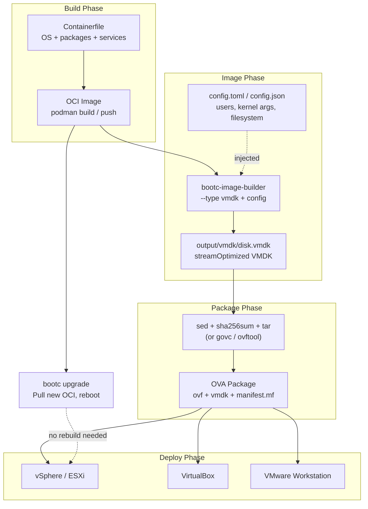

# Manual VM Deployments

The CI pipeline generates disk images (AMI, QCOW2, VMDK, etc.) and packages them into OCI containers on GitHub Container Registry (GHCR). This document explains how to get those disk images and deploy them to your cloud environment.

You have **two options** for every deployment target:

- **Option A** — Build the disk image locally from the bootc OCI image (you control the config)
- **Option B** — Pull a pre-built disk image from GHCR (built by CI)

Currently tested end-to-end: **AWS EC2** and **Google Cloud Platform**. VMware and bare metal sections are included for reference but not yet validated.

### Local build prerequisites (Option A)

Option A requires a bootc OCI image built from this repo. If you have not built one yet, do it first. You can use Make **or** podman directly:

**Using Make (recommended):**

```bash
make base                    # Layer 1: base OS image
make build                   # Layer 2: app image (Containerfile)
```

**Using podman directly:**

```bash
# Layer 1: base image
podman build -f base/centos/stream9/Containerfile \
    -t ghcr.io/duyhenryer/bootc-testboot-base:centos-stream9-latest .

# Layer 2: app image
podman build \
    --build-arg BASE_DISTRO=centos-stream9 \
    -t ghcr.io/duyhenryer/bootc-testboot:latest \
    -f Containerfile .
```

Change `centos/stream9` to your target distro (`centos/stream10`, `fedora/40`, `fedora/41`). See [Makefile](../../Makefile) for all variables.

After building, verify with `podman images | grep bootc-testboot`. Then proceed to the deployment section for your target (AWS, GCE, VMware).

---

## 1. How Artifacts Work

### What is an OCI artifact?

When CI runs `bootc-image-builder`, it produces a disk file (e.g. `disk.raw`, `disk.qcow2`). That file is then packaged into a minimal container image (`FROM scratch` + `COPY . /`) and pushed to GHCR. This means you can use normal `podman pull` to download disk images, just like pulling any container image.

### Image naming and tags

Pattern: `ghcr.io/duyhenryer/bootc-testboot-{distro}-{format}:{tag}`

Tags follow this scheme:

| Tag | Meaning |
|-----|---------|
| `latest-amd64` | Latest build for x86_64 |
| `latest-arm64` | Latest build for aarch64 |
| `latest` | Multi-arch manifest (auto-selects your platform) |
| `v3-amd64` | Version 3 for x86_64 |
| `v3` | Multi-arch manifest for version 3 |

### Artifact path reference

The disk file path **inside** the OCI container depends on the format. These paths have been verified against the actual CI output:

| Format | OCI image suffix | Path inside container | Example image |
|--------|-----------------|----------------------|---------------|
| AMI | `-ami` | `/image/disk.raw` | `*-centos-stream9-ami:latest-amd64` |
| QCOW2 | `-qcow2` | `/qcow2/disk.qcow2` | `*-centos-stream9-qcow2:latest-amd64` |
| Raw (for GCE) | `-raw` | `/image/disk.raw` | `*-centos-stream9-raw:latest-amd64` |
| VMDK | `-vmdk` | `/vmdk/disk.vmdk` | `*-centos-stream9-vmdk:latest-amd64` |
| OVA | `-ova` | `/*.ova` | `*-centos-stream9-ova:latest-amd64` |
| Anaconda ISO | `-anaconda-iso` | `/bootiso/disk.iso` | `*-centos-stream9-anaconda-iso:latest-amd64` |

To verify all published images and these paths automatically, run [010-ghcr-audit.md](010-ghcr-audit.md) (`./scripts/verify-ghcr-packages.sh` or `make verify-ghcr`).

### How to extract a disk file (generic steps)

This 3-step pattern works for any format:

```bash
# 1. Pull the artifact image
podman pull ghcr.io/duyhenryer/bootc-testboot-centos-stream9-qcow2:latest-amd64

# 2. Create a temporary container (the image has no OS, so we use /bin/true as a dummy command)
ctr=$(podman create ghcr.io/duyhenryer/bootc-testboot-centos-stream9-qcow2:latest-amd64 /bin/true)

# 3. Copy the disk file out of the container
podman cp "$ctr":/qcow2/disk.qcow2 ./disk.qcow2

# 4. Clean up
podman rm "$ctr"
```

Change the image name and path to match your format (see the table above).

> **Why `/bin/true`?** These are `FROM scratch` images with no operating system inside. `podman create` requires an entrypoint, but we never actually run the container -- we just use it to access the filesystem layer. `/bin/true` is a dummy value that satisfies the requirement.

### Auditing an artifact image

To see everything inside an artifact image without extracting:

```bash
ctr=$(podman create ghcr.io/duyhenryer/bootc-testboot-centos-stream9-ami:latest-amd64 /bin/true)
podman export "$ctr" | tar -t
podman rm "$ctr"
```

---

## 2. bootc-image-builder Reference

bootc-image-builder is a **container** that converts bootc OCI images into disk images. You run it with podman; it uses [osbuild](https://osbuild.org/docs/bootc/) under the hood to produce QCOW2, AMI, VMDK, raw, and other formats.

**Sources:**
- [bootc-image-builder (GitHub)](https://github.com/osbuild/bootc-image-builder)
- [osbuild: bootc-image-builder](https://osbuild.org/docs/bootc/)

### Tool prerequisites

| Requirement | Notes |
|-------------|-------|
| **podman** | Required. Use package manager on Linux or Podman Desktop on macOS/Windows |
| **--privileged** | Required. Cannot run in ECS/Fargate or other restricted environments |
| **osbuild-selinux** | Required on SELinux-enforced systems (e.g. Fedora, RHEL) |
| **Rootful podman** | On macOS, run `podman machine set --rootful` before starting |

### Supported flags

Reference: [osbuild.org/docs/bootc](https://osbuild.org/docs/bootc/)

| Flag | Description | Default |
|------|-------------|---------|
| `--type` | Image type (can be passed multiple times) | qcow2 |
| `--rootfs` | Root filesystem type: ext4, xfs, btrfs | from source image |
| `--config` | Path to config.toml or config.json inside the container | /config.toml |
| `--chown` | chown output directory to UID:GID | (none) |
| `--target-arch` | Build for a different architecture (experimental) | host arch |
| `--output` | Artifact output directory | `.` |
| `--progress` | Progress bar: verbose, term, debug | auto |
| `--use-librepo` | Use librepo for RPM downloads (faster) | false |
| `--log-level` | Logging level: debug, info, error | error |
| `-v, --verbose` | Verbose output (implies --log-level=info) | false |

> **Note:** There is no `--size` flag. Disk sizing is controlled via `[[customizations.filesystem]]` in config.toml. See [Build config](#build-config-configtoml) below.

### Image types

| Type | Target |
|------|--------|
| `ami` | Amazon Machine Image |
| `qcow2` (default) | QEMU/KVM |
| `vmdk` | vSphere, VMware |
| `vhd` | Virtual PC, Hyper-V |
| `gce` | Google Compute Engine |
| `raw` | Raw disk |
| `bootc-installer` | Installer ISO |
| `anaconda-iso` | Anaconda installer ISO |

Pass multiple types: `--type qcow2 --type ami` (comma/space separation does not work).

### Volumes

| Volume | Purpose | Required |
|--------|----------|----------|
| `/output` | Artifact output directory | Yes (unless AMI auto-upload) |
| `/var/lib/containers/storage` | Container storage for image cache | Yes |
| `/store` | osbuild store cache | No |
| `/rpmmd` | DNF cache | No |

You must mount `/var/lib/containers/storage` so the builder can pull and reuse your bootc image.

### Build config (config.toml)

The config file is mounted at `/config.toml` (or `/config/config.toml` when mounting a directory). It follows the [Blueprint schema](https://github.com/osbuild/blueprint); bootc-image-builder supports a subset.

**Users:**

```toml
[[customizations.user]]
name = "devops"
password = "optional-plaintext"
key = "ssh-rsa AAAA... devops@company.com"
groups = ["wheel"]
```

Fields: `name` (required), `password`, `key`, `groups`.

**Filesystem (disk sizing and partitions):**

Disk sizing is controlled via `[[customizations.filesystem]]` in config.toml. There is no `--size` CLI flag.

```toml
[[customizations.filesystem]]
mountpoint = "/"
minsize = "10 GiB"

[[customizations.filesystem]]
mountpoint = "/var/data"
minsize = "50 GiB"
```

Rules:
- `/` -- root filesystem (mounted at `/sysroot` when booted)
- `/boot` -- boot partition
- Subdirectories of `/var` supported, e.g. `/var/data`
- `/var` itself cannot be a mountpoint
- Symlinks in `/var` (e.g. `/var/home`, `/var/run`) cannot be mountpoints

**Kernel arguments:**

```toml
[customizations.kernel]
append = "console=tty0 console=ttyS0,115200n8"
```

### Target architecture

Use `--target-arch` to build for a different architecture (e.g. amd64 from arm64 Mac):

```bash
--target-arch amd64
```

The bootc OCI image and bootc-image-builder image must support the target arch. Check [Quay](https://quay.io/repository/centos-bootc/bootc-image-builder?tab=tags) for supported architectures.

For builder configs per format, see [builder/README.md](../../builder/README.md).

---

## 3. Deploying to AWS EC2 (AMI)

**Status: Tested**

The flow: bootc OCI image → raw disk → S3 → AMI → EC2 instance.

The image includes nginx, MongoDB 8.0, Redis, and the hello app. RabbitMQ is included on x86_64 only (no upstream arm64 packages).

### Prerequisites

| Requirement | Notes |
|-------------|-------|
| **AWS CLI v2** | Installed and configured (`aws configure`) |
| **IAM permissions** | `s3:PutObject`, `s3:CreateBucket`, `ec2:RunInstances` + Method A: `ec2:ImportImage`, `ec2:DescribeImportImageTasks` + Method B: `ec2:ImportSnapshot`, `ec2:DescribeImportSnapshotTasks`, `ec2:RegisterImage` |
| **VM Import role** | The `vmimport` service role must exist -- see setup below |
| **podman** | Required for Option A (local build) and Option B (pulling from GHCR) |

### Setup: vmimport role and S3 policy

AWS requires a `vmimport` service role to import disk images. If you already have this role, skip to the policy step.

**Create the vmimport role** (one-time, per AWS account):

```bash
aws iam create-role --role-name vmimport --assume-role-policy-document '{
  "Version": "2012-10-17",
  "Statement": [
    {
      "Effect": "Allow",
      "Principal": { "Service": "vmie.amazonaws.com" },
      "Action": "sts:AssumeRole",
      "Condition": {
        "StringEquals": { "sts:ExternalId": "vmimport" }
      }
    }
  ]
}'
```

**Attach S3 access policy** (update the bucket name to match yours):

```bash
export BUCKET=bootc-testboot   # or your bucket name

aws iam put-role-policy \
  --role-name vmimport \
  --policy-name vmimport-s3-access \
  --policy-document "{
    \"Version\": \"2012-10-17\",
    \"Statement\": [
      {
        \"Effect\": \"Allow\",
        \"Action\": [
          \"s3:GetBucketLocation\",
          \"s3:GetObject\",
          \"s3:ListBucket\"
        ],
        \"Resource\": [
          \"arn:aws:s3:::${BUCKET}\",
          \"arn:aws:s3:::${BUCKET}/*\"
        ]
      },
      {
        \"Effect\": \"Allow\",
        \"Action\": [
          \"ec2:ModifySnapshotAttribute\",
          \"ec2:CopySnapshot\",
          \"ec2:RegisterImage\",
          \"ec2:Describe*\"
        ],
        \"Resource\": \"*\"
      }
    ]
  }"
```

**Verify:**

```bash
aws iam get-role --role-name vmimport
aws iam get-role-policy --role-name vmimport --policy-name vmimport-s3-access
```

Reference: [AWS VM Import Service Role](https://docs.aws.amazon.com/vm-import/latest/userguide/required-permissions.html)

### Option A: Build locally (A to Z)

This builds everything on your machine -- from Containerfile to deployable disk image.

**Step 1: Build the bootc OCI image**

If you have not built the image yet, follow [Local build prerequisites](#local-build-prerequisites-option-a) at the top of this document. Verify the image exists:

```bash
podman images | grep bootc-testboot
```

**Step 2: Copy to root podman storage**

`bootc-image-builder` runs with `sudo` and uses root's container storage, not your user storage. Copy the image across:

```bash
podman save ghcr.io/duyhenryer/bootc-testboot:latest | sudo podman load
```

**Step 3: Build the raw disk**

Run from the **repository root**. Use `$(pwd)` so paths resolve correctly with `sudo`:

```bash
mkdir -p output/ami
sudo podman run --rm --privileged \
    --security-opt label=type:unconfined_t \
    -v /var/lib/containers/storage:/var/lib/containers/storage \
    -v "$(pwd)/builder/ami":/config:ro \
    -v "$(pwd)/output/ami":/output \
    quay.io/centos-bootc/bootc-image-builder:latest \
    --type ami --rootfs ext4 \
    --chown $(id -u):$(id -g) \
    --config /config/config.toml \
    ghcr.io/duyhenryer/bootc-testboot:latest
```

Output: `output/ami/image/disk.raw`

> Disk size is controlled by `[[customizations.filesystem]]` in `builder/ami/config.toml`. For AWS, keep the root volume small and attach EBS volumes for data (e.g. `/var/lib/mongodb`).
>
> **`--chown`** makes output files owned by your user instead of root.
>
> **Gotcha:** `builder/ami/config.toml` must be a **regular file**, not a symlink. If it's a symlink, the container can't follow it (the symlink target is outside the mounted volume). The config includes AWS-tuned kernel args: `nvme_core.io_timeout=4294967295` for Nitro NVMe and `console=ttyS0` for EC2 serial console.

### Option B: Pull from GHCR

If CI has already built the AMI artifact, pull and extract it:

```bash
podman pull ghcr.io/duyhenryer/bootc-testboot-centos-stream9-ami:latest-amd64

ctr=$(podman create ghcr.io/duyhenryer/bootc-testboot-centos-stream9-ami:latest-amd64 /bin/true)
podman cp "$ctr":/image/disk.raw ./disk.raw
podman rm "$ctr"
```

### Upload and deploy

AWS offers two ways to turn a disk image in S3 into a launchable AMI:

| | import-snapshot (recommended for bootc) | import-image (standard Linux only) |
|---|---|---|
| **Result** | EBS snapshot → register as AMI | AMI created directly |
| **AWS commands** | 6: `s3 cp` → `import-snapshot` → `describe-import-snapshot-tasks` → `register-image` → `run-instances` | 4: `s3 cp` → `import-image` → `describe-import-image-tasks` → `run-instances` |
| **Disk formats** | raw, VMDK, VHD, VHDX | raw, VMDK, VHD, VHDX, OVA |
| **OS detection** | None -- you specify architecture and boot mode manually | Yes -- AWS scans the disk to detect the OS |
| **When to use** | **bootc/ostree images (required).** Also useful when you need fine control over AMI flags | Standard Linux VMs (Fedora, RHEL, Ubuntu) with conventional filesystem. **Does NOT work with bootc/ostree images.** |

> **Why does import-image fail with bootc?**
>
> The disk image IS bootable -- `bootc-image-builder --type ami` produces a proper GPT partition table, EFI System Partition with GRUB, and kernel + initramfs. The EC2 instance boots fine once the AMI exists.
>
> The problem is AWS's **OS detection during import**:
>
> 1. `import-image` mounts the root filesystem and scans for OS markers (`/etc/os-release`, standard directory layout, bootloader config)
> 2. bootc/ostree images mount the real root at `/sysroot`, then bind-mount a specific deployment to `/` -- there is no traditional `/boot` with GRUB config in the expected location
> 3. AWS scanner sees the ostree layout and reports: `CLIENT_ERROR: Unknown OS / Missing OS files`
>
> `import-snapshot` bypasses this entirely. It imports the raw disk as an EBS snapshot without any OS detection. You then register the AMI yourself via `register-image`, specifying `--boot-mode uefi` -- and the VM boots normally because the disk IS properly bootable.

Reference: [AWS VM Import/Export comparison](https://docs.aws.amazon.com/vm-import/latest/userguide/vmimport-differences.html)

#### Method A: import-snapshot (recommended for bootc)

This is the recommended method for bootc images. It bypasses AWS OS detection (which fails on ostree-based filesystems) and gives you full control over AMI registration flags (`--boot-mode`, `--architecture`, etc.).

```bash
# Step 1: Set your region and create an S3 bucket
export AWS_REGION=ap-southeast-1
export BUCKET=bootc-testboot
aws s3 mb "s3://${BUCKET}" --region "$AWS_REGION"   # skip if bucket already exists

# Step 2: Upload the raw disk to S3
# If you used Option A (local build), the file is at output/ami/image/disk.raw
# If you used Option B (pull from GHCR), the file is at ./disk.raw
aws s3 cp output/ami/image/disk.raw "s3://${BUCKET}/bootc-testboot.raw"

# Step 3: Import as EBS snapshot (bypasses OS detection)
aws ec2 import-snapshot \
    --region "$AWS_REGION" \
    --description "bootc-testboot CentOS Stream 9" \
    --disk-container "Format=raw,UserBucket={S3Bucket=${BUCKET},S3Key=bootc-testboot.raw}"
# Output contains ImportTaskId, e.g. "import-snap-0123456789abcdef0"

# Step 4: Wait for the import to finish (5-15 minutes)
# Re-run this command until Status shows "completed":
aws ec2 describe-import-snapshot-tasks \
    --region "$AWS_REGION" \
    --import-task-ids import-snap-XXXXX
# When done, note the SnapshotId from SnapshotTaskDetail (e.g. "snap-0123456789abcdef0")

# Step 5: Register the snapshot as an AMI
aws ec2 register-image \
    --region "$AWS_REGION" \
    --name "bootc-testboot-centos9-$(date +%Y%m%d)" \
    --description "bootc CentOS Stream 9 - hello + nginx + MongoDB + Redis" \
    --architecture x86_64 \
    --root-device-name /dev/xvda \
    --virtualization-type hvm \
    --ena-support \
    --boot-mode uefi \
    --block-device-mappings "DeviceName=/dev/xvda,Ebs={SnapshotId=snap-XXXXX,VolumeType=gp3}"
# Output contains ImageId (e.g. "ami-0123456789abcdef0")

# Step 6: Launch an EC2 instance
aws ec2 run-instances \
    --region "$AWS_REGION" \
    --image-id ami-XXXXX \
    --instance-type t3.medium \
    --key-name YOUR_KEY_PAIR \
    --security-group-ids sg-XXXXX \
    --subnet-id subnet-XXXXX \
    --iam-instance-profile Arn=arn:aws:iam::ACCOUNT_ID:instance-profile/AmazonSSMManagedInstanceCore \
    --block-device-mappings "DeviceName=/dev/xvda,Ebs={VolumeSize=20,VolumeType=gp3}" \
    --tag-specifications 'ResourceType=instance,Tags=[{Key=Name,Value=bootc-testboot}]'
```

Replace `XXXXX` placeholders with the actual IDs from the output of each previous step.

| Flag | Why |
|------|-----|
| `--key-name` | SSH key pair for direct SSH access |
| `--iam-instance-profile` | Attach SSM role so you can connect via AWS Systems Manager Session Manager (no public IP needed). Remove if not using SSM. |
| `--block-device-mappings VolumeSize=20` | Override root EBS volume to 20 GiB. The AMI's snapshot is ~12 GiB; this gives headroom for MongoDB data, logs, etc. Adjust as needed. |

> **VMDK format also works.** If you built with `--type vmdk` instead of `--type ami`, change `"Format":"raw"` to `"Format":"vmdk"` and the S3 key accordingly.

**For aarch64 (arm64) builds:** use `--architecture arm64` in `register-image` and a Graviton instance type (e.g. `t4g.medium`). RabbitMQ is not available on arm64.

#### Method B: import-image (standard Linux only)

> **Warning:** `import-image` does **NOT work** with bootc/ostree images. It will fail with `CLIENT_ERROR: Unknown OS / Missing OS files`. Use **Method A: import-snapshot** above instead. This method is documented for reference only -- it works for traditional Linux VMs with conventional filesystem layout.

This is the simpler path for standard Linux images. One command creates the AMI directly -- no `register-image` needed.

```bash
# Step 1: Set your region and create an S3 bucket
export AWS_REGION=ap-southeast-1
export BUCKET=bootc-testboot-$(date +%Y%m%d)
aws s3 mb "s3://${BUCKET}" --region "$AWS_REGION"

# Step 2: Upload the raw disk to S3
aws s3 cp output/ami/image/disk.raw "s3://${BUCKET}/bootc-testboot.raw"

# Step 3: Import directly as AMI
aws ec2 import-image \
    --region "$AWS_REGION" \
    --description "bootc-testboot CentOS Stream 9" \
    --license-type BYOL \
    --disk-containers "[{\"Format\":\"raw\",\"UserBucket\":{\"S3Bucket\":\"${BUCKET}\",\"S3Key\":\"bootc-testboot.raw\"}}]"
# Output contains ImportTaskId, e.g. "import-ami-0123456789abcdef0"

# Step 4: Wait for the import to finish
aws ec2 describe-import-image-tasks \
    --region "$AWS_REGION" \
    --import-task-ids import-ami-XXXXX
# When done, the output contains ImageId (e.g. "ami-0123456789abcdef0")

# Step 5: Launch an EC2 instance
aws ec2 run-instances \
    --region "$AWS_REGION" \
    --image-id ami-XXXXX \
    --instance-type t3.medium \
    --key-name YOUR_KEY_PAIR \
    --security-group-ids sg-XXXXX \
    --subnet-id subnet-XXXXX \
    --iam-instance-profile Arn=arn:aws:iam::ACCOUNT_ID:instance-profile/AmazonSSMManagedInstanceCore \
    --block-device-mappings "DeviceName=/dev/xvda,Ebs={VolumeSize=20,VolumeType=gp3}" \
    --tag-specifications 'ResourceType=instance,Tags=[{Key=Name,Value=bootc-testboot}]'
```

**For aarch64 (arm64) builds:** use a Graviton instance type (e.g. `t4g.medium`). `import-image` detects the architecture automatically.

### Connect and verify

**Via SSM** (private subnet, no public IP needed):

```bash
aws ssm start-session --target i-XXXXX --region "$AWS_REGION"
```

**Via SSH** (public subnet with public IP):

```bash
ssh -i ~/.ssh/YOUR_KEY.pem devops@EC2_PUBLIC_IP

systemctl status hello nginx mongod redis
curl -sf http://127.0.0.1:8080/health
```

If the security group allows inbound HTTP (port 80), nginx reverse-proxies to the hello app:

```bash
curl -sf http://EC2_PUBLIC_IP/
```

### Alternative: AMI auto-upload (skip S3 manually)

bootc-image-builder can upload the AMI directly to AWS if you pass `--aws-ami-name`, `--aws-bucket`, and `--aws-region` **together**. When all three are set, no `/output` mount is needed -- the image goes straight to AWS.

The S3 bucket must already exist, and the [vmimport service role](https://docs.aws.amazon.com/vm-import/latest/userguide/required-permissions.html) must be configured.

**Credentials via `$HOME/.aws`:**

```bash
sudo podman run \
  --rm --privileged \
  --security-opt label=type:unconfined_t \
  -v $HOME/.aws:/root/.aws:ro \
  -v /var/lib/containers/storage:/var/lib/containers/storage \
  --env AWS_PROFILE=default \
  quay.io/centos-bootc/bootc-image-builder:latest \
  --type ami --rootfs ext4 \
  --aws-ami-name bootc-testboot-ami \
  --aws-bucket YOUR_BOOTC_IMPORT_BUCKET \
  --aws-region us-east-1 \
  ghcr.io/duyhenryer/bootc-testboot:latest
```

**Credentials via env-file (recommended for CI):**

Never pass secrets via `--env AWS_ACCESS_KEY_ID=xxx` -- they leak in process lists. Use `--env-file` instead:

```bash
# aws.secrets (chmod 600, add to .gitignore)
AWS_ACCESS_KEY_ID=AKIA...
AWS_SECRET_ACCESS_KEY=...

sudo podman run \
  --rm --privileged \
  --security-opt label=type:unconfined_t \
  -v /var/lib/containers/storage:/var/lib/containers/storage \
  --env-file=aws.secrets \
  quay.io/centos-bootc/bootc-image-builder:latest \
  --type ami --rootfs ext4 \
  --aws-ami-name bootc-testboot-ami \
  --aws-bucket YOUR_BOOTC_IMPORT_BUCKET \
  --aws-region us-east-1 \
  ghcr.io/duyhenryer/bootc-testboot:latest
```

---

## 4. Deploying to Google Cloud Platform (GCE)

**Status: Tested**

GCP requires a `.tar.gz` containing exactly one file named `disk.raw`. The flow: bootc OCI image → raw disk → tar.gz → GCS → GCE image → VM instance.

### Prerequisites

| Requirement | Notes |
|-------------|-------|
| **gcloud CLI** | Installed and authenticated (`gcloud auth login`) |
| **gsutil** | Included with gcloud SDK |
| **GCS bucket** | Must exist in your project |
| **IAM permissions** | `roles/compute.imageAdmin` + `roles/storage.objectAdmin` |
| **podman** | Required for building and extracting |

### Option A: Build locally (A to Z)

**Step 1: Build the bootc OCI image**

If you have not built the image yet, follow [Local build prerequisites](#local-build-prerequisites-option-a) at the top of this document.

**Step 2: Copy to root podman storage**

```bash
podman save ghcr.io/duyhenryer/bootc-testboot:latest | sudo podman load
```

**Step 3: Build the raw disk and package for GCE**

```bash
mkdir -p output/gce
sudo podman run --rm --privileged \
    --security-opt label=type:unconfined_t \
    -v /var/lib/containers/storage:/var/lib/containers/storage \
    -v "$(pwd)/builder/gce":/config:ro \
    -v "$(pwd)/output/gce":/output \
    quay.io/centos-bootc/bootc-image-builder:latest \
    --type raw --rootfs ext4 \
    --chown $(id -u):$(id -g) \
    --config /config/config.toml \
    ghcr.io/duyhenryer/bootc-testboot:latest

# Package for GCE (the tar.gz must contain exactly "disk.raw")
cd output/gce/image
tar -Szcf ../bootc-centos9.tar.gz disk.raw
```

### Option B: Pull from GHCR

```bash
podman pull ghcr.io/duyhenryer/bootc-testboot-centos-stream9-raw:latest-amd64

ctr=$(podman create ghcr.io/duyhenryer/bootc-testboot-centos-stream9-raw:latest-amd64 /bin/true)
podman cp "$ctr":/image/disk.raw ./disk.raw
podman rm "$ctr"

tar -Szcf bootc-centos9.tar.gz disk.raw
```

### Upload and deploy

```bash
# Upload to GCS
gsutil cp ./output/gce/bootc-centos9.tar.gz \
    gs://bootc-testboot-drive/bootc-centos9.tar.gz

# Create GCE custom image
gcloud compute images create "bootc-centos9-v4" \
    --project="skilled-box-481815-k8" \
    --source-uri="gs://bootc-testboot-drive/bootc-centos9.tar.gz" \
    --guest-os-features=UEFI_COMPATIBLE,VIRTIO_SCSI_MULTIQUEUE \
    --description="bootc CentOS Stream 9 - hello app + nginx + MongoDB 8.0 + Redis + RabbitMQ"

# Create VM instance
gcloud compute instances create "vm-bootc-test" \
    --project="skilled-box-481815-k8" \
    --zone="asia-southeast1-a" \
    --machine-type="e2-small" \
    --image="bootc-centos9-v4" \
    --boot-disk-size=20GB \
    --tags=http-server,https-server
```

### SSH in and verify

```bash
gcloud compute ssh devops@vm-bootc-test \
    --project=skilled-box-481815-k8 \
    --zone=asia-southeast1-a \
    --command="systemctl status hello nginx mongod redis rabbitmq-server && curl -sf http://127.0.0.1:8080/health"
```

### Bugs found and fixed

Issues discovered during GCE deployment:

| Bug | Fix |
|-----|-----|
| sudoers files had 664 permissions (must be 0440) | `chmod 0440` on sudoers.d files |
| MongoDB 8.0 removed `storage.journal.enabled` option | Removed obsolete config from `mongod.conf` |
| Redis SELinux: `redis_t` cannot read `usr_t` (config in `/usr/share/`) | systemd override reads Redis config from `/usr/share/` directly instead of symlink |

---

## 5. Deploying to VMware (VMDK / OVA)

**Status: Tested in CI (build + package). vSphere import tested via govc and vSphere UI.**

The flow: bootc OCI image → VMDK disk → OVA package (OVF + VMDK + manifest) → vSphere / Workstation / VirtualBox.

`bootc-image-builder` does **not** have a `--type ova`. It builds a VMDK, and a second step packages that VMDK into an OVA archive. The CI pipeline does this automatically; the steps below show how to do it locally.

### What is an OVA?

An OVA is a tar archive containing three files:

| File | Purpose |
|------|---------|
| `*.ovf` | XML descriptor: VM name, CPU, RAM, disk size, SCSI controller, network, firmware (EFI) |
| `*.vmdk` | The actual disk image (streamOptimized format for network transfer) |
| `*.mf` | SHA256 checksums of the OVF and VMDK files |

The OVF template lives at [`builder/ova/bootc-testboot.ovf`](../../builder/ova/bootc-testboot.ovf). It uses placeholders (`CPU_COUNT`, `MEMORY_MB`, `DISK_SIZE_GB`, `VMDK_FILENAME`, `VMDK_SIZE`) that are filled in during packaging. See [`builder/README.md`](../../builder/README.md) for details on the OVF settings (EFI firmware, SCSI controller, hardware version).

### OVA build flow



### Prerequisites

| Requirement | Notes |
|-------------|-------|
| **podman** | Required for building and extracting |
| **vSphere access** | vCenter or ESXi host (for production deployment) |
| **govc** (optional) | Open-source Go CLI for vSphere. Install: `go install github.com/vmware/govmomi/govc@latest` or download from [GitHub releases](https://github.com/vmware/govmomi/releases) |
| **ovftool** (optional) | VMware proprietary CLI. Download from [VMware Developer](https://developer.broadcom.com/tools/open-virtualization-format-ovf-tool/latest) |

### Option A: Build locally (A to Z)

**Step 1: Build the bootc OCI image**

If you have not built the image yet, follow [Local build prerequisites](#local-build-prerequisites-option-a) at the top of this document.

**Step 2: Copy to root podman storage**

```bash
podman save ghcr.io/duyhenryer/bootc-testboot:latest | sudo podman load
```

**Step 3: Build the VMDK**

Run from the **repository root**. Use `$(pwd)` so paths resolve correctly with `sudo`:

```bash
mkdir -p output/vmdk
sudo podman run --rm --privileged \
    --security-opt label=type:unconfined_t \
    -v /var/lib/containers/storage:/var/lib/containers/storage \
    -v "$(pwd)/builder/vmdk":/config:ro \
    -v "$(pwd)/output/vmdk":/output \
    quay.io/centos-bootc/bootc-image-builder:latest \
    --type vmdk --rootfs ext4 \
    --chown $(id -u):$(id -g) \
    --config /config/config.toml \
    ghcr.io/duyhenryer/bootc-testboot:latest
```

Output: `output/vmdk/vmdk/disk.vmdk`

**Step 4: Package the VMDK into an OVA**

This is the same process the CI uses. You need the OVF template from this repo and standard Linux tools (`sed`, `sha256sum`, `tar`):

```bash
# Configurable VM specs (adjust as needed)
CPU_COUNT=2
MEMORY_MB=4096
DISK_SIZE_GB=20
OVA_NAME="bootc-testboot"

# Locate the VMDK
VMDK_FILE=$(find output/vmdk -name '*.vmdk' | head -1)
VMDK_BASENAME=$(basename "$VMDK_FILE")
VMDK_SIZE=$(stat -c%s "$VMDK_FILE")

# Fill the OVF template placeholders
mkdir -p output/ova
sed -e "s/VMDK_FILENAME/${VMDK_BASENAME}/" \
    -e "s/VMDK_SIZE/${VMDK_SIZE}/" \
    -e "s/DISK_SIZE_GB/${DISK_SIZE_GB}/" \
    -e "s/CPU_COUNT/${CPU_COUNT}/g" \
    -e "s/MEMORY_MB/${MEMORY_MB}/g" \
    builder/ova/bootc-testboot.ovf > output/ova/${OVA_NAME}.ovf

# Copy the VMDK alongside the OVF
cp "$VMDK_FILE" output/ova/${VMDK_BASENAME}

# Create OVF-compliant manifest (SHA256)
cd output/ova
for f in ${OVA_NAME}.ovf ${VMDK_BASENAME}; do
  echo "SHA256($f)= $(sha256sum "$f" | awk '{print $1}')"
done > ${OVA_NAME}.mf

# Package into OVA (tar archive, no compression -- OVA spec requires plain tar)
tar cf ${OVA_NAME}.ova ${OVA_NAME}.ovf ${VMDK_BASENAME} ${OVA_NAME}.mf
echo "OVA created: ${OVA_NAME}.ova ($(du -h ${OVA_NAME}.ova | cut -f1))"
```

Output: `output/ova/bootc-testboot.ova`

### Option B: Pull from GHCR

If CI has already built the artifacts, pull and extract:

```bash
# Option 1: Pull the ready-made OVA
mkdir -p output/ova
podman pull ghcr.io/duyhenryer/bootc-testboot-centos-stream9-ova:latest-amd64
ctr=$(podman create ghcr.io/duyhenryer/bootc-testboot-centos-stream9-ova:latest-amd64 /bin/true)
podman export "$ctr" | tar -xf - -C ./output/ova/
podman rm "$ctr"
# The .ova file is inside output/ova/

# Option 2: Pull just the VMDK (if you want to customize the OVF or skip OVA)
podman pull ghcr.io/duyhenryer/bootc-testboot-centos-stream9-vmdk:latest-amd64
ctr=$(podman create ghcr.io/duyhenryer/bootc-testboot-centos-stream9-vmdk:latest-amd64 /bin/true)
podman cp "$ctr":/vmdk/disk.vmdk ./disk.vmdk
podman rm "$ctr"
```

### Deploy to vSphere

Three methods are available. Use whichever fits your environment.

#### Method 1: vSphere Web Client (UI)

1. Log in to vSphere Client (https://your-vcenter/ui)
2. Navigate to **Hosts and Clusters**
3. Right-click the target host or cluster > **Deploy OVF Template**
4. **Select an OVF template**: choose "Local file" and browse to the `.ova` file
5. **Select a name and folder**: enter a VM name (e.g. `bootc-testboot`)
6. **Select a compute resource**: pick the target host or resource pool
7. **Review details**: verify vCPU, RAM, disk size from the OVF
8. **Select storage**: choose a datastore; thin provisioning is recommended
9. **Select networks**: map "VM Network" to your port group
10. **Ready to complete**: review and click **Finish**
11. Wait for the deployment task to complete, then right-click the VM > **Power On**

#### Method 2: govc (open-source CLI)

```bash
# Set vSphere connection (add to ~/.bashrc or use env-file)
export GOVC_URL=https://vcenter.example.com/sdk
export GOVC_USERNAME=administrator@vsphere.local
export GOVC_PASSWORD='your-password'
export GOVC_INSECURE=true    # skip TLS verify for self-signed certs
export GOVC_DATASTORE=datastore1
export GOVC_NETWORK="VM Network"
export GOVC_RESOURCE_POOL=/datacenter/host/cluster/Resources

# Import the OVA
govc import.ova -name=bootc-testboot output/ova/bootc-testboot.ova

# Power on
govc vm.power -on bootc-testboot

# Get the VM IP (wait a few seconds for DHCP)
govc vm.ip bootc-testboot
```

To customize CPU/RAM at import time:

```bash
govc import.ova \
    -name=bootc-testboot \
    -options=<(echo '{"DiskProvisioning":"thin","NetworkMapping":[{"Name":"VM Network","Network":"your-portgroup"}]}') \
    output/ova/bootc-testboot.ova

govc vm.change -vm bootc-testboot -c 4 -m 8192
govc vm.power -on bootc-testboot
```

#### Method 3: ovftool (VMware proprietary)

```bash
# Deploy to vSphere
ovftool \
    --name=bootc-testboot \
    --net:"VM Network"="your-portgroup" \
    --datastore=datastore1 \
    --diskMode=thin \
    --powerOn \
    output/ova/bootc-testboot.ova \
    'vi://administrator@vsphere.local:password@vcenter.example.com/datacenter/host/cluster'

# Deploy to VMware Workstation (local)
ovftool output/ova/bootc-testboot.ova ~/vmware/bootc-testboot/bootc-testboot.vmx
```

### SSH in and verify

```bash
ssh -i ~/.ssh/YOUR_KEY.pem devops@VM_IP_ADDRESS

systemctl status hello nginx mongod redis
curl -sf http://127.0.0.1:8080/health
```

> **Tip:** If the VM has no IP, check that the network adapter is connected and the port group has DHCP. Use `govc vm.ip -wait 60s bootc-testboot` to wait for the IP.

### Recommendation: open-vm-tools

For production VMware deployments, consider adding `open-vm-tools` and `cloud-init` to your Containerfile. These provide guest OS heartbeat reporting, graceful shutdown from vSphere, and VM customization (hostname, network) at first boot.

This project does **not** include them by default (they are unnecessary for AWS/GCE/bare metal). If your target is exclusively VMware, add them in a derived layer:

```dockerfile
FROM ghcr.io/duyhenryer/bootc-testboot:latest

RUN dnf -y install open-vm-tools cloud-init && \
    ln -s ../cloud-init.target /usr/lib/systemd/system/default.target.wants/cloud-init.target && \
    systemctl enable vmtoolsd.service && \
    dnf clean all && rm -rf /var/cache/{dnf,ldconfig,libdnf5} /var/log/{dnf*,hawkey*} /var/lib/dnf
```

Then build your VMDK/OVA from this derived image instead of the base.

---

## 6. Bare Metal (Anaconda ISO)

**Status: Not yet tested end-to-end.** The CI builds Anaconda ISO artifacts.

### Pull from GHCR

```bash
podman pull ghcr.io/duyhenryer/bootc-testboot-centos-stream9-anaconda-iso:latest-amd64
ctr=$(podman create ghcr.io/duyhenryer/bootc-testboot-centos-stream9-anaconda-iso:latest-amd64 /bin/true)
podman cp "$ctr":/bootiso/disk.iso ./bootc-installer.iso
podman rm "$ctr"
```

### Flash and boot

```bash
sudo dd if=./bootc-installer.iso of=/dev/sdX bs=4M status=progress
```

Boot the physical machine from the USB drive. The Anaconda installer automatically lays down the bootc image onto the hard drive.

---

## 7. Adding New Deployment Targets

All deployment targets follow the same two-option pattern:

1. **Option A (local):** `bootc-image-builder --type <format>` with a `builder/<format>/config.toml`
2. **Option B (CI):** Pull from `ghcr.io/duyhenryer/bootc-testboot-{distro}-{format}:{tag}` and extract using `podman cp`

For builder configs per format, see [builder/README.md](../../builder/README.md).

---

## 8. Running QCOW2 Locally

If you built a QCOW2 image (via `--type qcow2`), you can boot it locally without deploying to any cloud.

**With QEMU:**

```bash
qemu-system-x86_64 \
  -M accel=kvm \
  -cpu host \
  -smp 2 \
  -m 4096 \
  -bios /usr/share/OVMF/OVMF_CODE.fd \
  -serial stdio \
  -snapshot output/qcow2/disk.qcow2
```

**With virt-install:**

```bash
sudo virt-install \
  --name fedora-bootc \
  --cpu host \
  --vcpus 4 \
  --memory 4096 \
  --import --disk ./output/qcow2/disk.qcow2,format=qcow2 \
  --os-variant fedora-eln
```

---

## 9. Tips and Checklist

### Passwordless sudo

Base images may not enable passwordless sudo. Add to your derived bootc Containerfile:

```dockerfile
ADD wheel-passwordless-sudo /etc/sudoers.d/wheel-passwordless-sudo
```

Content of `wheel-passwordless-sudo`:

```
%wheel ALL=(ALL) NOPASSWD: ALL
```

### Pre-flight checklist

- [ ] Install podman and osbuild-selinux (if SELinux)
- [ ] Use `--privileged`; not suitable for ECS/Fargate
- [ ] Mount `/var/lib/containers/storage`
- [ ] Mount config as `/config.toml` or `/config/config.toml`
- [ ] For AWS: prefer `import-image` (creates AMI directly) over `import-snapshot` + `register-image`
- [ ] For AMI auto-upload: all of `--aws-ami-name`, `--aws-bucket`, `--aws-region`
- [ ] Use `--env-file` for AWS secrets, never plain `--env`
- [ ] Add vmimport role and S3 permissions for AMI (required for both `import-image` and `import-snapshot`)
- [ ] Always `podman pull` the target image before running bootc-image-builder
- [ ] Always pass `--rootfs ext4` to avoid "no default fs set" errors
- [ ] Set disk sizes via `[[customizations.filesystem]]` in config.toml (there is no `--size` CLI flag)
- [ ] Use `--chown $(id -u):$(id -g)` for local builds so output files are not owned by root
- [ ] Do not use `-it` flags -- they break CI/non-interactive builds
- [ ] For VMDK: mount `./output:/output` for local output
- [ ] For OVA: CI auto-packages from VMDK when `vmdk` is in `formats` input
- [ ] For OVA: OVF template declares `vmw:firmware="efi"` -- do not override to BIOS in vSphere
- [ ] For VMware production: consider adding `open-vm-tools` + `cloud-init` to your Containerfile (see Section 5)
- [ ] For VMware govc: set `GOVC_URL`, `GOVC_USERNAME`, `GOVC_PASSWORD`, `GOVC_INSECURE`
- [ ] For GCE: `--type raw` then tar.gz, or `--type gce` for direct tar.gz output
- [ ] For GCE: IAM `roles/compute.imageAdmin` + `roles/storage.objectAdmin`
- [ ] Filesystem: only `/`, `/boot`, and `/var/*` subdirs (no `/var` itself, no symlinks)
