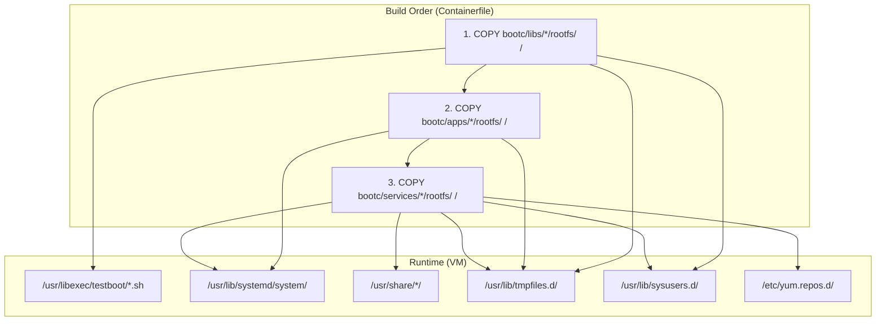
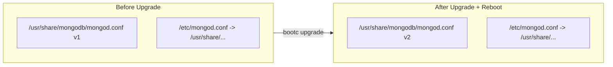

# Rootfs Overlay Guide

How source files in the repository map to their final locations inside a running bootc VM. This is the single reference for understanding "where does this file end up at runtime?"

## Newbie: `/usr` vs `/etc` vs `/var` (and symlinks)

On a bootc host, treat the layers like this:

- **`/usr` (including `/usr/share/...`)** — Shipped **inside the image**. At runtime it is **read-only** in the usual bootc model; OS and app files you bake in the Containerfile live here.
- **`/etc/...`** — **Mutable** machine configuration. Software often hard-codes paths under `/etc`. This repo keeps the **real** config under `/usr/share/<service>/` and puts a **symlink** in `/etc` so services still see the path they expect, while the content stays part of the immutable image tree.
- **`/var/...`** — **Persistent state**: databases, logs, secrets generated on first boot, etc.

Quick check on a running VM:

```bash
ls -la /etc/nginx/nginx.conf
readlink -f /etc/nginx/nginx.conf
```

You should see a symlink into `/usr/share/nginx/`.

**`mongodb-init.service`** runs `/usr/libexec/testboot/mongodb-init.sh`, which calls **`mongosh`** to `mongodb://127.0.0.1:27017/` without TLS (`preferTLS` allows localhost plain). The app image installs the **`mongodb-mongosh`** package alongside `mongodb-org-server` so replica-set init and admin user creation can succeed.

---

## 1. The rootfs/ Convention

Every component under `bootc/` has a `rootfs/` directory. Files inside `rootfs/` mirror the target filesystem root (`/`). When the Containerfile runs `COPY bootc/libs/*/rootfs/ /`, Docker/podman strips everything up to and including `rootfs/` and copies the rest directly into `/`.

**Example:**

```
Source (in repo):     bootc/libs/common/rootfs/usr/libexec/testboot/log.sh
                      ├── bootc/libs/common/rootfs  ← stripped by COPY
                      └── /usr/libexec/testboot/log.sh  ← lands here in image

Source (in repo):     bootc/services/mongodb/rootfs/usr/share/mongodb/mongod.conf
                      ├── bootc/services/mongodb/rootfs  ← stripped by COPY
                      └── /usr/share/mongodb/mongod.conf  ← lands here in image
```

The three COPY instructions in the [Containerfile](../../Containerfile) (lines 19-21):

```dockerfile
COPY bootc/libs/*/rootfs/ /
COPY bootc/apps/*/rootfs/ /
COPY bootc/services/*/rootfs/ /
```

Order matters: libs are copied first so shared scripts are available when services and apps reference them. The wildcard `*` means every subdirectory is included automatically -- adding a new component requires no Containerfile changes.

---

## 2. Build-time to Runtime Mapping

Every file in `bootc/` and its runtime destination. The "Zone" column indicates the filesystem behavior at runtime (see [003-filesystem-layout.md](../bootc/003-filesystem-layout.md) for details).

### libs/common

Shared utility scripts and system definitions used by all services and apps.

| Source Path | Runtime Path | Zone | Purpose |
|-------------|-------------|------|---------|
| `bootc/libs/common/rootfs/usr/libexec/testboot/log.sh` | `/usr/libexec/testboot/log.sh` | Read-only | Structured logging library (sourced by other scripts) |
| `bootc/libs/common/rootfs/usr/libexec/testboot/gen-password.sh` | `/usr/libexec/testboot/gen-password.sh` | Read-only | Atomic random password generation (idempotent) |
| `bootc/libs/common/rootfs/usr/libexec/testboot/wait-for-service.sh` | `/usr/libexec/testboot/wait-for-service.sh` | Read-only | TCP readiness probe (polls host:port) |
| `bootc/libs/common/rootfs/usr/libexec/testboot/healthcheck.sh` | `/usr/libexec/testboot/healthcheck.sh` | Read-only | HTTP health endpoint check |
| `bootc/libs/common/rootfs/usr/libexec/testboot/gen-tls-cert.sh` | `/usr/libexec/testboot/gen-tls-cert.sh` | Read-only | Self-signed TLS cert generator (CA + server) |
| `bootc/libs/common/rootfs/usr/lib/sysusers.d/appuser.conf` | `/usr/lib/sysusers.d/appuser.conf` | Read-only | Creates `appuser` user/group at boot |
| `bootc/libs/common/rootfs/usr/lib/tmpfiles.d/testboot-common.conf` | `/usr/lib/tmpfiles.d/testboot-common.conf` | Read-only | Creates shared `/var` directories at boot |
| `bootc/libs/common/rootfs/etc/sysconfig/arptables` | `/etc/sysconfig/arptables` | Mutable | Minimal ARP rules so `arptables.service` is not `NOTCONFIGURED` if enabled; image ships the unit **disabled** by default |
| `bootc/libs/common/rootfs/usr/lib/systemd/system-preset/99-bootc-testboot.preset` | `/usr/lib/systemd/system-preset/99-bootc-testboot.preset` | Read-only | Preset: `disable` `arptables.service` and `rdisc.service` (cloud-friendly defaults) |

### services/mongodb

| Source Path | Runtime Path | Zone | Purpose |
|-------------|-------------|------|---------|
| `bootc/services/mongodb/rootfs/etc/yum.repos.d/mongodb-org-8.0.repo` | `/etc/yum.repos.d/mongodb-org-8.0.repo` | Mutable | MongoDB 8.0 package repository (needed at build time for `dnf install`) |
| `bootc/services/mongodb/rootfs/usr/share/mongodb/mongod.conf` | `/usr/share/mongodb/mongod.conf` | Read-only | Immutable MongoDB config (rs0 + auth + TLS) |
| `bootc/services/mongodb/rootfs/usr/lib/systemd/system/mongod.service.d/override.conf` | `/usr/lib/systemd/system/mongod.service.d/override.conf` | Read-only | systemd drop-in: `StateDirectory=`, `LogsDirectory=`, `After=mongodb-setup.service` |
| `bootc/services/mongodb/rootfs/usr/lib/systemd/system/mongodb-setup.service` | `/usr/lib/systemd/system/mongodb-setup.service` | Read-only | Oneshot (Before=mongod): generates TLS certs, keyFile, admin password |
| `bootc/services/mongodb/rootfs/usr/lib/systemd/system/mongodb-init.service` | `/usr/lib/systemd/system/mongodb-init.service` | Read-only | Oneshot (After=mongod): rs.initiate() + create admin user |
| `bootc/services/mongodb/rootfs/usr/libexec/testboot/mongodb-init.sh` | `/usr/libexec/testboot/mongodb-init.sh` | Read-only | Script for replica set init and admin user creation (requires **`mongosh`** from **`mongodb-mongosh`**, installed in the Containerfile) |
| `bootc/services/mongodb/rootfs/usr/lib/sysusers.d/mongod.conf` | `/usr/lib/sysusers.d/mongod.conf` | Read-only | Creates `mongod` user/group for `bootc container lint` |
| `bootc/services/mongodb/rootfs/usr/lib/tmpfiles.d/mongodb.conf` | `/usr/lib/tmpfiles.d/mongodb.conf` | Read-only | Creates `/var/lib/mongodb`, `/var/lib/mongodb/tls`, `/var/log/mongodb` at boot |

Plus a symlink created in the Containerfile: `/etc/mongod.conf` -> `/usr/share/mongodb/mongod.conf`

### services/valkey

| Source Path | Runtime Path | Zone | Purpose |
|-------------|-------------|------|---------|
| `bootc/services/valkey/rootfs/usr/share/valkey/valkey.conf` | `/usr/share/valkey/valkey.conf` | Read-only | Immutable Valkey config |
| `bootc/services/valkey/rootfs/usr/lib/systemd/system/valkey.service.d/override.conf` | `/usr/lib/systemd/system/valkey.service.d/override.conf` | Read-only | systemd drop-in override |
| `bootc/services/valkey/rootfs/usr/lib/tmpfiles.d/valkey.conf` | `/usr/lib/tmpfiles.d/valkey.conf` | Read-only | Creates Valkey `/var` dirs at boot |

Plus a symlink: `/etc/valkey/valkey.conf` -> `/usr/share/valkey/valkey.conf`

### services/nginx

| Source Path | Runtime Path | Zone | Purpose |
|-------------|-------------|------|---------|
| `bootc/services/nginx/rootfs/usr/share/nginx/nginx.conf` | `/usr/share/nginx/nginx.conf` | Read-only | Immutable main nginx config |
| `bootc/services/nginx/rootfs/usr/lib/tmpfiles.d/nginx.conf` | `/usr/lib/tmpfiles.d/nginx.conf` | Read-only | Creates nginx `/var` dirs at boot |

Plus symlinks: `/etc/nginx/nginx.conf` -> `/usr/share/nginx/nginx.conf`, `/etc/nginx/conf.d` -> `/usr/share/nginx/conf.d`

### services/rabbitmq

| Source Path | Runtime Path | Zone | Purpose |
|-------------|-------------|------|---------|
| `bootc/services/rabbitmq/rootfs/etc/yum.repos.d/rabbitmq.repo` | `/etc/yum.repos.d/rabbitmq.repo` | Mutable | RabbitMQ + Erlang package repository (x86_64 only) |
| `bootc/services/rabbitmq/rootfs/usr/share/rabbitmq/rabbitmq.conf` | `/usr/share/rabbitmq/rabbitmq.conf` | Read-only | Immutable RabbitMQ config |
| `bootc/services/rabbitmq/rootfs/usr/lib/systemd/system/rabbitmq-server.service.d/override.conf` | `/usr/lib/systemd/system/rabbitmq-server.service.d/override.conf` | Read-only | systemd drop-in override |
| `bootc/services/rabbitmq/rootfs/usr/lib/sysusers.d/rabbitmq.conf` | `/usr/lib/sysusers.d/rabbitmq.conf` | Read-only | Creates `rabbitmq` user/group |
| `bootc/services/rabbitmq/rootfs/usr/lib/tmpfiles.d/rabbitmq.conf` | `/usr/lib/tmpfiles.d/rabbitmq.conf` | Read-only | Creates RabbitMQ `/var` dirs at boot |

Plus a symlink: `/etc/rabbitmq/rabbitmq.conf` -> `/usr/share/rabbitmq/rabbitmq.conf`

### apps/hello

| Source Path | Runtime Path | Zone | Purpose |
|-------------|-------------|------|---------|
| `bootc/apps/hello/rootfs/usr/lib/systemd/system/hello.service` | `/usr/lib/systemd/system/hello.service` | Read-only | systemd unit: `LOG_FILE` → `/var/log/bootc-testboot/hello/hello.log` + journal; healthcheck → `/var/log/bootc-testboot/hello/healthcheck.log` |
| `bootc/apps/hello/rootfs/etc/logrotate.d/hello` | `/etc/logrotate.d/hello` | Read-only | Weekly rotate for `/var/log/bootc-testboot/hello/*.log` (`copytruncate`, `su hello hello`) |
| `bootc/apps/hello/rootfs/usr/lib/tmpfiles.d/hello.conf` | `/usr/lib/tmpfiles.d/hello.conf` | Read-only | Optional extra tmpfiles; `StateDirectory`/`LogsDirectory` create `/var/lib`/`/var/log` paths |
| `bootc/apps/hello/rootfs/usr/share/nginx/conf.d/hello.conf` | `/usr/share/nginx/conf.d/hello.conf` | Read-only | nginx vhost reverse proxy config |

The hello binary itself comes from a separate COPY: `COPY output/bin/ /usr/bin/` (built by `make apps` from `repos/hello/`).

---

## 3. The Three Layers



### libs -- Shared utilities

**Directory:** `bootc/libs/common/`

Scripts that any service or app can use at runtime. They live in `/usr/libexec/testboot/` (the [FHS](https://refspecs.linuxfoundation.org/FHS_3.0/fhs/ch04s07.html)-standard location for internal executables not meant to be called directly by users).

Services reference these scripts in their systemd units:

```ini
ExecStartPre=/usr/libexec/testboot/gen-password.sh /var/lib/mongodb/password 48
ExecStartPre=/usr/libexec/testboot/wait-for-service.sh 127.0.0.1 27017 30
```

Also includes `sysusers.d` (user definitions) and `tmpfiles.d` (directory definitions) for shared resources like the `appuser` account.

### services -- Middleware daemons

**Directories:** `bootc/services/mongodb/`, `bootc/services/valkey/`, `bootc/services/nginx/`, `bootc/services/rabbitmq/`

Each service provides:

| File Type | Location Pattern | Purpose |
|-----------|-----------------|---------|
| Immutable config | `usr/share/<name>/<name>.conf` | Service configuration (read-only at runtime) |
| systemd override | `usr/lib/systemd/system/<unit>.d/override.conf` | Customize service startup (StateDirectory, ExecStartPre, etc.) |
| tmpfiles.d | `usr/lib/tmpfiles.d/<name>.conf` | Declare `/var` directories created at boot |
| sysusers.d | `usr/lib/sysusers.d/<name>.conf` | Declare system users/groups |
| yum repo | `etc/yum.repos.d/<name>.repo` | External RPM repository (needed for `dnf install` at build time) |

Services are installed via `dnf install` in the Containerfile. The rootfs overlay only provides configuration and system definitions -- the actual binaries come from the RPM packages.

### apps -- Custom applications

**Directories:** `bootc/apps/hello/`

Each app provides:

| File Type | Location Pattern | Purpose |
|-----------|-----------------|---------|
| systemd unit | `usr/lib/systemd/system/<name>.service` | Defines how the app runs |
| tmpfiles.d | `usr/lib/tmpfiles.d/<name>.conf` | Any `/var` directories the app needs |
| nginx vhost | `usr/share/nginx/conf.d/<name>.conf` | Reverse proxy config (if web-facing) |

App binaries are compiled separately (`make apps` from `repos/<name>/`) and copied via `COPY output/bin/ /usr/bin/` -- they do not go through the rootfs overlay.

---

## 4. Immutable Config Pattern

bootc makes `/usr` **read-only** at runtime. This is by design: immutable OS, atomic upgrades, no configuration drift.

The problem: services like MongoDB expect their config at `/etc/mongod.conf`, which is in the mutable `/etc` zone. If we put the config directly in `/etc`, customers could edit it, and upgrades would need 3-way merges.

The solution: **store configs in `/usr/share/`, symlink from `/etc/`**.

```
Build time (Containerfile):
  ln -sf /usr/share/mongodb/mongod.conf /etc/mongod.conf

Runtime filesystem:
  /usr/share/mongodb/mongod.conf  ← actual config (read-only, replaced on upgrade)
  /etc/mongod.conf                ← symlink → /usr/share/mongodb/mongod.conf
```

### What happens on upgrade



- `/usr/share/mongodb/mongod.conf` is replaced atomically (new OSTree deployment).
- `/etc/mongod.conf` is a symlink -- it survives the 3-way merge and points to the new config automatically.
- No manual intervention. No merge conflicts. The customer cannot edit the config (read-only target).

### When customers need overrides

If a customer needs custom settings (e.g., different MongoDB bind address), they should use systemd drop-in overrides or environment files in `/etc`, not edit the config directly. This is documented in [005-production-upgrade-scenarios.md](005-production-upgrade-scenarios.md).

---

## 5. How to Add New Components

Detailed instructions for adding new libs, services, and apps are in [bootc/README.md](../../bootc/README.md) under "How to Extend". The key steps:

**New utility script:** Create at `bootc/libs/common/rootfs/usr/libexec/testboot/<name>.sh`. It's automatically included by the `COPY bootc/libs/*/rootfs/ /` wildcard.

**New service (middleware):** Create `bootc/services/<name>/rootfs/` with configs, systemd overrides, tmpfiles.d, and sysusers.d. Add `dnf install` and `ln -sf` lines to the Containerfile. The auto-enable loop picks up services with `WantedBy=` automatically.

**New app:** Create `bootc/apps/<name>/rootfs/` with a systemd unit and optional nginx vhost. Add the source to `repos/<name>/` -- `make apps` auto-discovers it.

In all cases, the wildcard COPY means no Containerfile edits are needed for the rootfs overlay -- only for `dnf install` and symlink creation.

---

## References

- [001-architecture-overview.md](001-architecture-overview.md) -- Build pipeline and filesystem model diagrams
- [bootc/README.md](../../bootc/README.md) -- Layer roles, file placement rules, extension guide
- [003-filesystem-layout.md](../bootc/003-filesystem-layout.md) -- Deep dive into `/usr`, `/etc`, `/var` at runtime
- [005-production-upgrade-scenarios.md](005-production-upgrade-scenarios.md) -- What happens to each zone during upgrades
