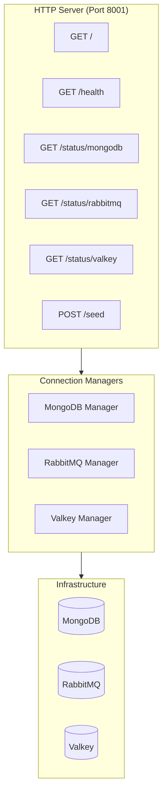

# Apps reference: hello and worker

Per-app reference for application units shipped in the bootc-testboot image. For runtime concerns shared by all apps (systemd targets, user/group identity, healthcheck pattern, log layout, logrotate), see [008-services-runtime.md](008-services-runtime.md).

## Table of contents

- [hello](#hello) — minimal HTTP service behind nginx
- [worker](#worker) — data seeding + infrastructure verification

---

## hello

A minimal Go HTTP server used as a smoke target and nginx-proxied example.

### Endpoints

| Method | Path | Purpose | Response |
|--------|------|---------|----------|
| `GET` | `/` | Greeting | JSON `{message, hostname, version}` |
| `GET` | `/health` | Liveness probe | JSON `{status:"ok"}` (HTTP 200) |

Listens on `:8000` (all interfaces by default; nginx upstream on the same host). Source: [`repos/hello/`](../../repos/hello/).

### Systemd unit

Unit: [`hello.service`](../../bootc/apps/hello/rootfs/usr/lib/systemd/system/hello.service).

```systemd
[Service]
Type=simple
User=hello
Group=hello
StateDirectory=bootc-testboot/hello
LogsDirectory=bootc-testboot/hello
Environment=LOG_FILE=/var/log/bootc-testboot/hello/hello.log
EnvironmentFile=/usr/share/bootc-testboot/hello/hello.env
EnvironmentFile=-/var/lib/bootc-testboot/shared/env/mongodb.env
EnvironmentFile=-/var/lib/bootc-testboot/shared/env/valkey.env
EnvironmentFile=-/var/lib/bootc-testboot/shared/env/rabbitmq.env
EnvironmentFile=-/var/lib/bootc-testboot/hello/hello.secrets.overrides
ExecStart=/usr/bin/hello
ExecStartPost=… /usr/libexec/testboot/healthcheck.sh http://127.0.0.1:8000/health 10
Restart=always
RestartSec=5
```

Healthcheck pattern (`ExecStartPost` smoke + periodic timer) is documented in [008 §3](008-services-runtime.md#3-healthcheck-pattern).

### Configuration (3-tier)

| Tier | Path | Purpose |
|------|------|---------|
| 1 (immutable) | [`/usr/share/bootc-testboot/hello/hello.env`](../../bootc/apps/hello/rootfs/usr/share/bootc-testboot/hello/hello.env) | Image defaults: `LISTEN_ADDR`, `LOG_LEVEL`, `LOG_FORMAT` |
| 2 (generated, optional) | `/var/lib/bootc-testboot/shared/env/{mongodb,valkey,rabbitmq}.env` | Shared infra creds (declared but not currently consumed by the binary) |
| 3 (operator, optional) | `/var/lib/bootc-testboot/hello/hello.secrets.overrides` | Per-host overrides |

### nginx vhost

A vhost in [`bootc/apps/hello/rootfs/usr/share/nginx/conf.d/hello.conf`](../../bootc/apps/hello/rootfs/usr/share/nginx/conf.d/hello.conf) proxies external traffic to `127.0.0.1:8000`.

### Quick checks

```bash
systemctl status hello
journalctl -u hello -b --no-pager
curl -sf http://127.0.0.1:8000/health
tail -f /var/log/bootc-testboot/hello/hello.log
```

---

## worker

A Go HTTP service that provides infrastructure health verification and data seeding for MongoDB.

### Use cases

- **CI/CD pipelines**: verify infra connectivity before deploying other services
- **Monitoring**: external health endpoints for load balancers
- **Testing**: seed test data for integration tests
- **Operations**: quick infra validation during deployments

### Architecture



Each connection manager has connection pooling, ping/check operations with timeouts, graceful shutdown, and detailed error reporting.

### Endpoints

| Method | Path | Description | Response |
|--------|------|-------------|----------|
| `GET` | `/` | Service info | JSON `{service, version, status, mode}` |
| `GET` | `/health` | Aggregate readiness — `200` OK / `503` if Mongo+RabbitMQ+Valkey not all up | JSON `{status, mongodb, rabbitmq, valkey, timestamp}` |
| `GET` | `/status/mongodb` | Mongo connection + per-collection counts | JSON status object |
| `GET` | `/status/rabbitmq` | RabbitMQ connection + queue info | JSON status object |
| `GET` | `/status/valkey` | Valkey ping | JSON status object |
| `POST` | `/seed` | Seed data into Mongo (legacy `count` mode or MB-target mode) | JSON `{inserted, collection, status, duration_ms}` |

**Sample responses:**

```jsonc
// GET /status/mongodb
{ "status": "connected", "database": "testboot_db", "collections": {"users": 100}, "document_count": 100 }

// GET /status/rabbitmq
{ "status": "connected", "queue": "worker_queue", "consumer_count": 0, "message_count": 0 }

// GET /status/valkey
{ "status": "connected", "database": 0, "ping": "PONG" }

// POST /seed   body: {"count": 100}
{ "inserted": 100, "collection": "users", "status": "success", "duration_ms": 482 }

// POST /seed   body: {"target_size_mb": 100, "collections": ["users","orders"]}
{ "status": "success", "inserted": 12345, "by_collection": {"users": 6000, "orders": 6345}, "duration_ms": 9821, "target_size_mb": 100 }
```

All status endpoints perform real connectivity checks (Mongo: `Count` per default seed collection; RabbitMQ: connection liveness; Valkey: `PING` with 2s timeout).

### Systemd unit

Unit: [`worker.service`](../../bootc/apps/worker/rootfs/usr/lib/systemd/system/worker.service).

```systemd
[Service]
Type=simple
User=worker
Group=worker
StateDirectory=bootc-testboot/worker
LogsDirectory=bootc-testboot/worker
Environment=LOG_FILE=/var/log/bootc-testboot/worker/worker.log
EnvironmentFile=/usr/share/bootc-testboot/worker/worker.env
EnvironmentFile=-/var/lib/bootc-testboot/shared/env/mongodb.env
EnvironmentFile=-/var/lib/bootc-testboot/shared/env/rabbitmq.env
EnvironmentFile=-/var/lib/bootc-testboot/shared/env/valkey.env
EnvironmentFile=-/var/lib/bootc-testboot/worker/worker.secrets.overrides
ExecStart=/usr/bin/worker
ExecStartPost=… /usr/libexec/testboot/healthcheck.sh http://127.0.0.1:8001/ 5 200 30 1
```

The boot smoke probes `/` (liveness — `200` once the listener is up); the periodic timer probes `/health` (readiness — may report `503` until backends connect). See [008 §3.5](008-services-runtime.md#35-interpreting-http-000-vs-503-worker) for `000` vs `503` interpretation.

### Configuration (3-tier)

#### Tier 1 — immutable defaults

[`/usr/share/bootc-testboot/worker/worker.env`](../../bootc/apps/worker/rootfs/usr/share/bootc-testboot/worker/worker.env):

```bash
# Service
LISTEN_ADDR=127.0.0.1:8001
LOG_LEVEL=INFO

# MongoDB (URI built automatically from individual vars)
MONGODB_HOST=127.0.0.1
MONGODB_PORT=27017
MONGODB_USERNAME=admin
MONGODB_PASSWORD=your_password_here
MONGODB_DB=testboot
MONGODB_REPLICA_SET=rs0

# RabbitMQ (AMQP URI built from individual vars)
RABBITMQ_HOST=127.0.0.1
RABBITMQ_PORT=5672
RABBITMQ_USERNAME=guest
RABBITMQ_PASSWORD=guest
RABBITMQ_VHOST=/
RABBITMQ_QUEUE=worker_queue

# Valkey
VALKEY_ADDR=localhost:6379
VALKEY_DB=0
```

#### Tier 2 — shared infra secrets

`/var/lib/bootc-testboot/shared/env/`:

- `mongodb.env` — `MONGODB_{HOST,PORT,USERNAME,PASSWORD,DB,REPLICA_SET}`
- `rabbitmq.env` — `RABBITMQ_{HOST,PORT,USERNAME,PASSWORD,VHOST}`
- `valkey.env` — Valkey credentials

The worker auto-builds Mongo and RabbitMQ URIs from these individual variables and URL-encodes credentials to handle special characters. **No manual URI construction is needed.**

#### Tier 3 — per-app overrides

`/var/lib/bootc-testboot/worker/worker.secrets.overrides` — operator overrides for tiers 1–2.

### Data seeding

`POST /seed` supports two modes:

- **Legacy count mode** (default): `{"count": 100}` inserts N mock users into the `users` collection.
- **MB-target mode**: `{"target_size_mb": 100, "collections": ["users","orders"], "parallel": true}` seeds across multiple collections until the target on-disk size is reached.

Validates Mongo connectivity first; defaults `count=100` if neither mode hint is provided.

```bash
# Seed 50 test users
curl -X POST http://localhost:8001/seed \
  -H 'Content-Type: application/json' \
  -d '{"count": 50}'
```

Generated user record shape:

```json
{
  "id": "uuid",
  "name": "Generated Name",
  "email": "user@example.com",
  "created_at": "2024-01-01T00:00:00Z"
}
```

### Testing

```bash
# Unit tests
cd repos/worker && go test -v

# Integration (against a running VM)
curl http://localhost:8001/status/mongodb
curl http://localhost:8001/status/rabbitmq
curl http://localhost:8001/status/valkey
curl -X POST http://localhost:8001/seed -d '{"count": 10}'

# Project-wide smoke
make test-smoke
```

### Troubleshooting

#### MongoDB connection issues

```
systemctl status mongod
cat /var/lib/bootc-testboot/shared/env/mongodb.env
mongosh --host $MONGODB_HOST --port $MONGODB_PORT \
  --username $MONGODB_USERNAME --password $MONGODB_PASSWORD
```

#### RabbitMQ connection issues

```
systemctl status rabbitmq-server
cat /var/lib/bootc-testboot/shared/env/rabbitmq.env
rabbitmqctl status
```

#### Valkey connection issues

```
systemctl status valkey
cat /var/lib/bootc-testboot/shared/env/valkey.env
redis-cli ping     # works (Valkey is wire-compatible) — prefer `valkey-cli ping`
valkey-cli ping
```

#### Service not starting

```bash
systemctl status worker
journalctl -u worker -f
tail -f /var/log/bootc-testboot/worker/worker.log
```

#### Healthcheck failures

```bash
curl -v http://127.0.0.1:8001/health
tail -f /var/log/bootc-testboot/worker/healthcheck.log
tail -f /var/log/bootc-testboot/worker/healthcheck-periodic.log
```

See [008 §3.5](008-services-runtime.md#35-interpreting-http-000-vs-503-worker) for `HTTP 000` vs `HTTP 503` semantics.

### Log analysis

Worker logs are structured JSON; filter with `jq`:

```bash
# Errors only
jq 'select(.level == "ERROR")' /var/log/bootc-testboot/worker/worker.log

# Connection events
jq 'select(.msg | contains("connect"))' /var/log/bootc-testboot/worker/worker.log

# Response time check
time curl http://localhost:8001/status/mongodb
```

---

## References

- [008-services-runtime.md](008-services-runtime.md) — targets, identity, healthcheck pattern, logs, logrotate
- [`repos/hello/`](../../repos/hello/) / [`repos/worker/`](../../repos/worker/) — Go source
- [`bootc/apps/hello/`](../../bootc/apps/hello/) / [`bootc/apps/worker/`](../../bootc/apps/worker/) — rootfs overlays
- [AGENTS.md "Adding a New App"](../../AGENTS.md) — checklist for new apps
